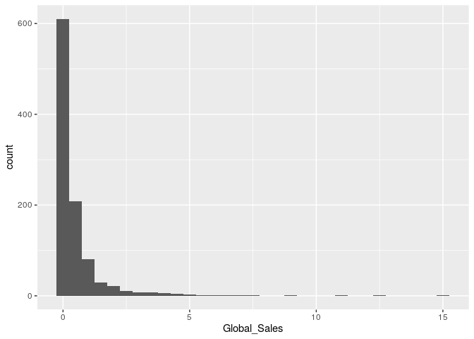
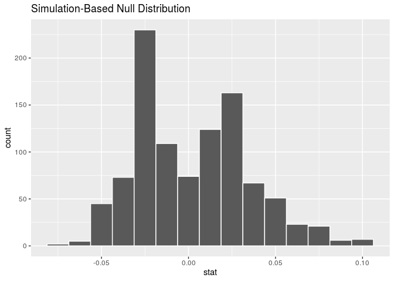
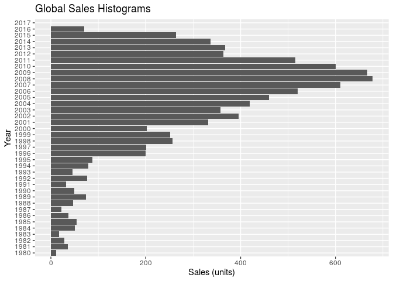
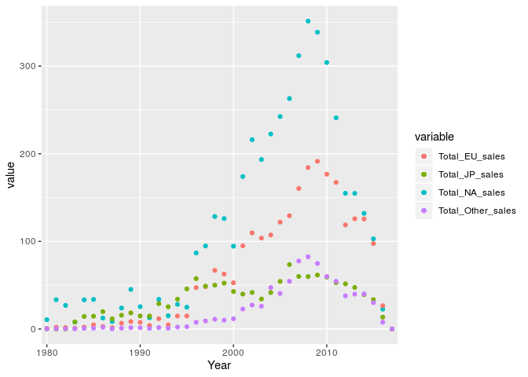
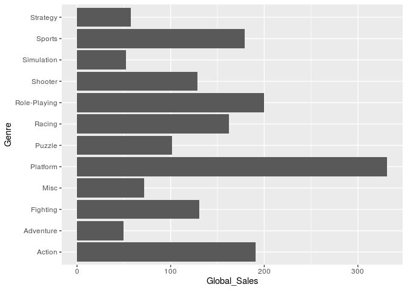
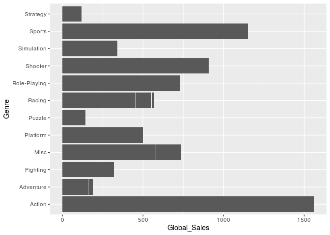

Video Game Sales
================
Team Octopi
11/21/19

``` r
library(tidyverse)
library(broom)
library(knitr)
library(modelr)
library(infer)
library(dplyr)
```

``` r
set.seed(24601)
vgsales <- read_csv("/cloud/project/data/vgsales.csv")
```

    ## Parsed with column specification:
    ## cols(
    ##   Rank = col_double(),
    ##   Name = col_character(),
    ##   Platform = col_character(),
    ##   Year = col_character(),
    ##   Genre = col_character(),
    ##   Publisher = col_character(),
    ##   NA_Sales = col_double(),
    ##   EU_Sales = col_double(),
    ##   JP_Sales = col_double(),
    ##   Other_Sales = col_double(),
    ##   Global_Sales = col_double()
    ## )

    ## Warning: 1 parsing failure.
    ##   row col   expected    actual                              file
    ## 16036  -- 11 columns 2 columns '/cloud/project/data/vgsales.csv'

``` r
vgsales_top_100 <- vgsales %>%
  head(100)
vgsales_random_1000 <- sample_n(vgsales, 1000)

vgsales
```

    ## # A tibble: 16,036 x 11
    ##     Rank Name  Platform Year  Genre Publisher NA_Sales EU_Sales JP_Sales
    ##    <dbl> <chr> <chr>    <chr> <chr> <chr>        <dbl>    <dbl>    <dbl>
    ##  1     1 Wii … Wii      2006  Spor… Nintendo      41.5    29.0      3.77
    ##  2     2 Supe… NES      1985  Plat… Nintendo      29.1     3.58     6.81
    ##  3     3 Mari… Wii      2008  Raci… Nintendo      15.8    12.9      3.79
    ##  4     4 Wii … Wii      2009  Spor… Nintendo      15.8    11.0      3.28
    ##  5     5 Poke… GB       1996  Role… Nintendo      11.3     8.89    10.2 
    ##  6     6 Tetr… GB       1989  Puzz… Nintendo      23.2     2.26     4.22
    ##  7     7 New … DS       2006  Plat… Nintendo      11.4     9.23     6.5 
    ##  8     8 Wii … Wii      2006  Misc  Nintendo      14.0     9.2      2.93
    ##  9     9 New … Wii      2009  Plat… Nintendo      14.6     7.06     4.7 
    ## 10    10 Duck… NES      1984  Shoo… Nintendo      26.9     0.63     0.28
    ## # … with 16,026 more rows, and 2 more variables: Other_Sales <dbl>,
    ## #   Global_Sales <dbl>

``` r
vgsales_top_100
```

    ## # A tibble: 100 x 11
    ##     Rank Name  Platform Year  Genre Publisher NA_Sales EU_Sales JP_Sales
    ##    <dbl> <chr> <chr>    <chr> <chr> <chr>        <dbl>    <dbl>    <dbl>
    ##  1     1 Wii … Wii      2006  Spor… Nintendo      41.5    29.0      3.77
    ##  2     2 Supe… NES      1985  Plat… Nintendo      29.1     3.58     6.81
    ##  3     3 Mari… Wii      2008  Raci… Nintendo      15.8    12.9      3.79
    ##  4     4 Wii … Wii      2009  Spor… Nintendo      15.8    11.0      3.28
    ##  5     5 Poke… GB       1996  Role… Nintendo      11.3     8.89    10.2 
    ##  6     6 Tetr… GB       1989  Puzz… Nintendo      23.2     2.26     4.22
    ##  7     7 New … DS       2006  Plat… Nintendo      11.4     9.23     6.5 
    ##  8     8 Wii … Wii      2006  Misc  Nintendo      14.0     9.2      2.93
    ##  9     9 New … Wii      2009  Plat… Nintendo      14.6     7.06     4.7 
    ## 10    10 Duck… NES      1984  Shoo… Nintendo      26.9     0.63     0.28
    ## # … with 90 more rows, and 2 more variables: Other_Sales <dbl>,
    ## #   Global_Sales <dbl>

``` r
vgsales_random_1000
```

    ## # A tibble: 1,000 x 11
    ##     Rank Name  Platform Year  Genre Publisher NA_Sales EU_Sales JP_Sales
    ##    <dbl> <chr> <chr>    <chr> <chr> <chr>        <dbl>    <dbl>    <dbl>
    ##  1  9761 Body… PS3      2011  Shoo… Codemast…     0.05     0.06     0   
    ##  2  5821 LEGO… 3DS      2013  Adve… Warner B…     0.18     0.1      0   
    ##  3 14435 Alia… PSV      2015  Adve… dramatic…     0        0        0.03
    ##  4 15671 Free… GC       2003  Raci… Midway G…     0.01     0        0   
    ##  5 11934 Vamp… DS       2009  Adve… D3Publis…     0        0        0.07
    ##  6  3306 New … Wii      2008  Plat… Nintendo      0.24     0.17     0.14
    ##  7  1980 The … XB       2001  Raci… Electron…     0.78     0.26     0   
    ##  8 11886 Kido… PS2      2009  Stra… Namco Ba…     0        0        0.07
    ##  9  9302 Vamp… PS2      2001  Shoo… Sony Com…     0.07     0.05     0   
    ## 10 10842 Pac-… GC       2005  Plat… Namco Ba…     0.07     0.02     0   
    ## # … with 990 more rows, and 2 more variables: Other_Sales <dbl>,
    ## #   Global_Sales <dbl>

### Main Research Questions

1.  What criteria (publishers, plaftorms, etc) make for successful video
    games in terms of global sales? What criteria make for successful
    video game publishers in terms of global sales?

2.  What are the overall trends of sales through time and space
    (geographic region) for video games released after 1980?

### 1A: Does the year of a game’s release affect its success?

``` r
vgsales_random_1000 <- vgsales_random_1000 %>%
  mutate(centurygame = case_when(Year > 1999 ~ "21st",
                                 Year > 1900 | Year <= 1999 ~ "20th"))

ggplot(data = vgsales_random_1000, mapping = aes(x = Global_Sales))+
  geom_histogram(binwidth = 0.5)
```

<!-- -->

``` r
vgsales_random_1000 %>%
  filter(centurygame == "20th") %>%
  summarise(median_global = median(Global_Sales))
```

    ## # A tibble: 1 x 1
    ##   median_global
    ##           <dbl>
    ## 1          0.27

``` r
vgsales_random_1000 %>%
  filter(centurygame == "21st") %>%
  summarise(median_global = median(Global_Sales))
```

    ## # A tibble: 1 x 1
    ##   median_global
    ##           <dbl>
    ## 1          0.15

We wanted to know whether or not older games have a higher median global
sales than newer games to test whether a game’s release year affects
it’s success (as success is generally mapped to the amount of global
sales a game recieves). For this test, we chose to use a randomly
sampled vgsales data set of size 1000 to represent the entire game
“population”. We chose to analyze the median global sales rather than
the mean of global sales because our data is highly skewed-right (as
seen in the histogram above). Above, we separated our games by release
in the 20th and 21st century in order to see whether or not newer games
yield more sales than older games. We then calculated the median global
sales for games made in the 21st and 20th century and found that our
older (20th century) games have a higher mean sales of 0.27 versus a
median sales of 21st century games, valued at 0.15. Our initial
impression of this was to say that “21st century games on average have a
higher global sales then 20th century games in the top 100 game sales,”
but we wanted to explore this a little deeper. We decided to conduct a
hypothesis test to see whether or not there was a significant difference
in median global sales of older (20th) vs newer (21st) games that might
suggest dependence between a game’s global sales and the year it was
released. This is done below:

H0: Our null hypothesis is that there is no difference in our median
global sales between 20th and 21st century games zero (meaning that year
of release and global sales are independent).

HA: Our alternative hypothesis is that the difference in the median
global sales between 20th and 21st century games is more extreme than
our observed difference (meaning that year of release and global sales
are dependent).

``` r
set.seed(24601)
vgsales_20th_median <- vgsales_random_1000 %>%
  filter(centurygame == "20th") %>%
  summarise(median_global = median(Global_Sales))

vgsales_21st_median <- vgsales_random_1000 %>%
  filter(centurygame == "21st") %>%
  summarise(median_global = median(Global_Sales))

vgsales_median_difference <- vgsales_20th_median - vgsales_21st_median

median_diff_null_dist <- vgsales_random_1000 %>%
  specify(response = Global_Sales, explanatory = centurygame) %>%
  hypothesize(null = "independence") %>%
  generate(reps = 1000, type = "permute") %>%
  calculate(stat = "diff in medians", order = c("20th", "21st"))

get_p_value(median_diff_null_dist, obs_stat = vgsales_median_difference,
            direction = "both")
```

    ## # A tibble: 1 x 1
    ##   p_value
    ##     <dbl>
    ## 1       0

``` r
visualise(median_diff_null_dist)
```

<!-- -->

Above we conducted a hypothesis test by generating a permutation of 1000
reps calculating for the difference in medians. Our null distribution is
visualized above. We then calculated a two-tailed p-value represented as
the proportion of our calculated differences that were more extreme than
our observed difference both in the negative and positive directions.
(0.12 for the positive and -0.12 for the negative direction). Our
two-tailed p-value was 0, which is greater than our alpha value of .05,
meaning that we fail to reject the null hypothesis that there is no
significant difference in the mean global sales of 20th and 21st century
games. Unfortunately, this means that our data does not provide us with
enough evidence to determine whether or not the century in which the
game was released affects the amount of global sales it
recieves.

### 1B: What are the qualities of a popular videogame, as measured by ranking being lower in number (closer to 1)?

First, we will fit a full model predicting rank (new\_rankings) from
Platform, Year, Genre (Popular), Publisher (Publisher\_Nintendo),
NA\_Sales, EU\_Sales, JP\_Sales, Other\_Sales, and Global\_Sales. We
also included an interaction variable between Global\_Sales and
Publisher\_Nintendo. The dataset vgsale\_top\_100 was used because we
are trying to determine the factors that make a higher ranked videogame.

For this model, *new\_rankings* is a newly created variable that
reverses the rankings so that 1 is the best and 100 is the worst.
*Genre* from the original dataset was modified to *Popular* due to the
high volume of genres. If the genre of the videogame was greater than or
equal to 10 on the ranking list, it is considered “Popular.” If it was
any lower in ranking, it was “Not Popular.” The *Publisher* variable was
also modified due to high numbers of publishers. Because Nintendo had
the most top ranked video games by a landslide, *Publisher* was
categorized into “Nintendo” or “Not Nintendo” by the new
*Publisher\_Nintendo* variable created. We should do random sampling for
the linear model.

``` r
top_n <- vgsales_top_100 %>%
  count(Genre)%>%
  arrange(desc(n)) %>%
  filter(n >= 10)
top_genres <- top_n$Genre

vgsales_top_100 %>%
  count(Publisher) %>%
  arrange(desc(n))
```

    ## # A tibble: 11 x 2
    ##    Publisher                       n
    ##    <chr>                       <int>
    ##  1 Nintendo                       52
    ##  2 Activision                     14
    ##  3 Take-Two Interactive            9
    ##  4 Sony Computer Entertainment     8
    ##  5 Microsoft Game Studios          6
    ##  6 Electronic Arts                 5
    ##  7 Ubisoft                         2
    ##  8 Atari                           1
    ##  9 Bethesda Softworks              1
    ## 10 Sega                            1
    ## 11 SquareSoft                      1

``` r
vgsales_top_Genres <- vgsales_top_100 %>%
  mutate(Popular = ifelse(Genre == top_genres, "Popular", "Not Popular"),
         Year = as.numeric(Year), 
Publisher_Nintendo = case_when(
  Publisher == "Nintendo" ~ "Nintendo",
  TRUE ~ "Not Nintendo"
))
```

``` r
m_full <- lm(Rank ~ Platform + Year + Popular + Publisher_Nintendo + NA_Sales +
               EU_Sales + JP_Sales + Other_Sales + Global_Sales + Global_Sales*Publisher_Nintendo,
 data = vgsales_top_Genres)

m_full
```

    ## 
    ## Call:
    ## lm(formula = Rank ~ Platform + Year + Popular + Publisher_Nintendo + 
    ##     NA_Sales + EU_Sales + JP_Sales + Other_Sales + Global_Sales + 
    ##     Global_Sales * Publisher_Nintendo, data = vgsales_top_Genres)
    ## 
    ## Coefficients:
    ##                                 (Intercept)  
    ##                                  -4091.7263  
    ##                                 Platform3DS  
    ##                                    -65.5634  
    ##                                  PlatformDS  
    ##                                    -62.2963  
    ##                                  PlatformGB  
    ##                                    -39.0789  
    ##                                 PlatformGBA  
    ##                                    -52.8601  
    ##                                 PlatformN64  
    ##                                    -28.3311  
    ##                                 PlatformNES  
    ##                                    -19.5892  
    ##                                  PlatformPC  
    ##                                    -62.1884  
    ##                                  PlatformPS  
    ##                                    -28.5507  
    ##                                 PlatformPS2  
    ##                                    -49.2312  
    ##                                 PlatformPS3  
    ##                                    -71.5733  
    ##                                 PlatformPS4  
    ##                                    -77.3011  
    ##                                 PlatformPSP  
    ##                                    -49.1921  
    ##                                PlatformSNES  
    ##                                    -23.4550  
    ##                                 PlatformWii  
    ##                                    -66.2772  
    ##                                PlatformX360  
    ##                                    -69.2608  
    ##                                  PlatformXB  
    ##                                    -50.8458  
    ##                                        Year  
    ##                                      2.1095  
    ##                              PopularPopular  
    ##                                     -0.4617  
    ##              Publisher_NintendoNot Nintendo  
    ##                                     51.4260  
    ##                                    NA_Sales  
    ##                                     97.8339  
    ##                                    EU_Sales  
    ##                                     97.9019  
    ##                                    JP_Sales  
    ##                                     93.1114  
    ##                                 Other_Sales  
    ##                                     99.0679  
    ##                                Global_Sales  
    ##                                    -99.2220  
    ## Publisher_NintendoNot Nintendo:Global_Sales  
    ##                                     -5.1140

Backward selection using AIC as the decision criterion was used to
determine the “best” model:

``` r
model_sel <- step(m_full, direction = "backward")
```

    ## Start:  AIC=573.79
    ## Rank ~ Platform + Year + Popular + Publisher_Nintendo + NA_Sales + 
    ##     EU_Sales + JP_Sales + Other_Sales + Global_Sales + Global_Sales * 
    ##     Publisher_Nintendo
    ## 
    ##                                   Df Sum of Sq   RSS    AIC
    ## - Platform                        16    3216.6 21672 557.86
    ## - Popular                          1       2.8 18458 571.81
    ## - JP_Sales                         1      27.1 18482 571.94
    ## - NA_Sales                         1      30.0 18485 571.96
    ## - EU_Sales                         1      30.0 18485 571.96
    ## - Other_Sales                      1      30.7 18486 571.96
    ## <none>                                         18455 573.79
    ## - Year                             1    1186.4 19642 578.02
    ## - Publisher_Nintendo:Global_Sales  1   10259.8 28715 616.00
    ## 
    ## Step:  AIC=557.86
    ## Rank ~ Year + Popular + Publisher_Nintendo + NA_Sales + EU_Sales + 
    ##     JP_Sales + Other_Sales + Global_Sales + Publisher_Nintendo:Global_Sales
    ## 
    ##                                   Df Sum of Sq   RSS    AIC
    ## - Popular                          1       2.7 21675 555.87
    ## - JP_Sales                         1       7.7 21680 555.90
    ## - NA_Sales                         1       9.2 21681 555.90
    ## - EU_Sales                         1       9.4 21681 555.90
    ## - Other_Sales                      1       9.9 21682 555.91
    ## - Year                             1      60.0 21732 556.14
    ## <none>                                         21672 557.86
    ## - Publisher_Nintendo:Global_Sales  1   12370.6 34043 601.02
    ## 
    ## Step:  AIC=555.87
    ## Rank ~ Year + Publisher_Nintendo + NA_Sales + EU_Sales + JP_Sales + 
    ##     Other_Sales + Global_Sales + Publisher_Nintendo:Global_Sales
    ## 
    ##                                   Df Sum of Sq   RSS    AIC
    ## - JP_Sales                         1       8.2 21683 553.91
    ## - NA_Sales                         1       9.7 21684 553.92
    ## - EU_Sales                         1       9.9 21684 553.92
    ## - Other_Sales                      1      10.4 21685 553.92
    ## - Year                             1      62.7 21737 554.16
    ## <none>                                         21675 555.87
    ## - Publisher_Nintendo:Global_Sales  1   12398.2 34073 599.11
    ## 
    ## Step:  AIC=553.91
    ## Rank ~ Year + Publisher_Nintendo + NA_Sales + EU_Sales + Other_Sales + 
    ##     Global_Sales + Publisher_Nintendo:Global_Sales
    ## 
    ##                                   Df Sum of Sq   RSS    AIC
    ## - Year                             1      60.1 21743 552.19
    ## <none>                                         21683 553.91
    ## - EU_Sales                         1    2438.7 24122 562.57
    ## - Other_Sales                      1    2868.2 24551 564.33
    ## - NA_Sales                         1    3180.0 24863 565.60
    ## - Publisher_Nintendo:Global_Sales  1   12391.4 34074 597.11
    ## 
    ## Step:  AIC=552.19
    ## Rank ~ Publisher_Nintendo + NA_Sales + EU_Sales + Other_Sales + 
    ##     Global_Sales + Publisher_Nintendo:Global_Sales
    ## 
    ##                                   Df Sum of Sq   RSS    AIC
    ## <none>                                         21743 552.19
    ## - EU_Sales                         1    2553.7 24297 561.29
    ## - Other_Sales                      1    2824.2 24567 562.40
    ## - NA_Sales                         1    3148.3 24891 563.71
    ## - Publisher_Nintendo:Global_Sales  1   12791.8 34535 596.45

``` r
model_sel %>%
 tidy() %>%
 select(term, estimate) %>%
 mutate(estimate = round(estimate, 3))
```

    ## # A tibble: 7 x 2
    ##   term                                        estimate
    ##   <chr>                                          <dbl>
    ## 1 (Intercept)                                    84.5 
    ## 2 Publisher_NintendoNot Nintendo                 51.0 
    ## 3 NA_Sales                                        4.12
    ## 4 EU_Sales                                        4.35
    ## 5 Other_Sales                                     5.79
    ## 6 Global_Sales                                   -5.88
    ## 7 Publisher_NintendoNot Nintendo:Global_Sales    -5.07

`new_rankings-hat` = 84.490 + 51.037\* `Publisher_NintendoNot Nintendo`
+ 4.117\* `NA_Sales` + 4.351\* `EU_Sales` + 5.787\* `Other_Sales` -
5.883\* `Global_Sales` - 5.065\* `Publisher_NintendoNot
Nintendo:Global_Sales`

For games that are Not Published by Nintendo, the ranking is expected to
increase (become worse) by an average of approximately 51 rankings
holding all else constant, compared to the baseline which is the
Publisher being Nintendo.

The interaction variable tells us that given the publisher is not
nintendo, as global sales increases by one unit, ranking is expected to
lower (get better) by 5.065.

The final model found in the previous question included the variables
Publisher\_NintendoNot Nintendo, NA\_Sales, EU\_Sales, Other\_Sales,
Global\_Sales, and the interaction between Publisher\_NintendoNot
Nintendo and Global\_Sales. All of these variables have an effect on the
ranking of a videogame.

A videogame that is published by Nintendo and reaches global sales is
predicted to have the highest rankings (be rated closer to 1).

``` r
glance(model_sel)$r.squared
```

    ## [1] 0.7390596

R-squared value: 0.7390596

The R-squared value shows that roughly 73.91% of the variablility in
videogame ranking can be explained by the final selected model.

Because in this dataset the rankings are made off of the global sales,
it makes sense that the global sales are in the final model and have an
effect on the ranking. A more surprising result is that the publisher
has such a profound affect on the rating. Nintendo seems to be making
the most global unit sales, which is making them ranked higher on the
list.

## 1C: How does the publisher affect global sales?

``` r
vgsales_top_100 %>%
    group_by(Year, Publisher) %>%
    summarize(Sales = sum(Global_Sales)) %>%
  arrange(desc(Sales)) %>%
  head(10)
```

    ## # A tibble: 10 x 3
    ## # Groups:   Year [10]
    ##    Year  Publisher              Sales
    ##    <chr> <chr>                  <dbl>
    ##  1 2006  Nintendo               160. 
    ##  2 2005  Nintendo                96.0
    ##  3 2009  Nintendo                95.5
    ##  4 2008  Nintendo                56.7
    ##  5 1996  Nintendo                53.1
    ##  6 2007  Nintendo                51.7
    ##  7 1989  Nintendo                48.4
    ##  8 1985  Nintendo                40.2
    ##  9 2013  Take-Two Interactive    37.8
    ## 10 2010  Microsoft Game Studios  31.7

The data shows the top ten video publishers based on global video game
sales. Nintendo holds 8/10 positions.

``` r
vgsales_top_100 %>%
    group_by(Year, Publisher) %>%
    summarize(Sales = sum(Global_Sales)) %>%
  group_by(Publisher) %>%
  summarise(n = sum(Sales)) %>%
  arrange(desc(n)) %>%
  head(5)
```

    ## # A tibble: 5 x 2
    ##   Publisher                       n
    ##   <chr>                       <dbl>
    ## 1 Nintendo                    920. 
    ## 2 Activision                  166. 
    ## 3 Take-Two Interactive        129. 
    ## 4 Sony Computer Entertainment  83.2
    ## 5 Microsoft Game Studios       71.3

Top 5 publishers: Nintendo, Activision, Take-Two Interactive, Sony
Computer Entertainment, Microsoft Game Studios.

``` r
lm <- lm(Global_Sales ~ Publisher, data = vgsales_top_100)
lm
```

    ## 
    ## Call:
    ## lm(formula = Global_Sales ~ Publisher, data = vgsales_top_100)
    ## 
    ## Coefficients:
    ##                          (Intercept)  
    ##                              11.8486  
    ##                       PublisherAtari  
    ##                              -4.0386  
    ##          PublisherBethesda Softworks  
    ##                              -3.0086  
    ##             PublisherElectronic Arts  
    ##                              -3.8786  
    ##      PublisherMicrosoft Game Studios  
    ##                               0.0331  
    ##                    PublisherNintendo  
    ##                               5.8491  
    ##                        PublisherSega  
    ##                              -3.7886  
    ## PublisherSony Computer Entertainment  
    ##                              -1.4486  
    ##                  PublisherSquareSoft  
    ##                              -3.9886  
    ##        PublisherTake-Two Interactive  
    ##                               2.4992  
    ##                     PublisherUbisoft  
    ##                              -1.9586

``` r
glance(lm)$r.squared
```

    ## [1] 0.1250877

Since the model has too many categorical variables, it will not be
written out. However, since the r-squared value is 12.5%, this model can
only predict 12.5% of the variability of global sales of games based on
publisher, publisher is therefore not a good indicator of global sales
of a video
game.

### 2 What are the overall trends of sales through time and space (geographic region) for video games released after 1980?

Below is the visualization for Global Video Games based on the Year of
Release.

``` r
vgsales %>%
  filter(Year <= 2019) %>%
    group_by(Year) %>%
    summarize(Sales = sum(Global_Sales, na.rm = TRUE)) %>%
    ggplot(aes(x = Year, y = Sales)) +
    geom_col() +
  coord_flip() +
    labs(title = "Global Sales Histograms", x = "Year", y = "Sales (units)")
```

<!-- -->

We can see that there was a large peak of sales for video games released
in the late 2000’s and early 2010’s. Total sales of video games rose
from 1980 to around 2010, with games being released in those years
gaining more sales than games released in years previous to it. However,
after around 2010, games released did not perform as well as games
released around 2010.

``` r
vgsales_yearly <- vgsales %>%
  filter(!Year >= 2019) %>%
  group_by(Year) %>%
  summarize(Total_NA_sales = sum(NA_Sales, na.rm = TRUE), Total_EU_sales = sum(EU_Sales, na.rm = TRUE), Total_JP_sales = sum(JP_Sales, na.rm = TRUE), Total_Other_sales = sum(Other_Sales, na.rm = TRUE)) 

ggplot(vgsales_yearly, aes(x = Year, y = value, color = variable)) +
  geom_point(aes(y = Total_NA_sales, col = "Total_NA_sales")) +
  geom_point(aes(y = Total_EU_sales, col = "Total_EU_sales")) +
  geom_point(aes(y = Total_JP_sales, col = "Total_JP_sales")) +
  geom_point(aes(y = Total_Other_sales, col = "Total_Other_sales")) +
  scale_x_discrete(breaks=seq(1970, 2025 , 10))
```

<!-- -->

From this graph, we can see that sales by region were around the same
from 1980 to 1995. However, after 1995, total sales from North American
increased much more than total sales in other regions. We can also see
the overall trend of sales peaking in 2010 before dropping after 2010.

``` r
vgsales20th <- vgsales %>%
  filter(Year < 2000)

vgsales21st <- vgsales %>%
  filter(Year >= 2000)
```

``` r
ggplot(vgsales20th, aes(x = Genre, y = Global_Sales)) +
  geom_col() +
  coord_flip()
```

<!-- -->

``` r
ggplot(vgsales21st, aes(x = Genre, y = Global_Sales)) +
  geom_col() +
  coord_flip()
```

<!-- -->

Above are two graphs showing the breakdown of genre for total global
sales for the 20th and 21st century. We can see that there are some
drastic differences in popular genres, with some genres outperforming
others based on global sales. We can also see that the popular genres
changed between centuries. One particular genre, action, will be
explored.

``` r
vgsales %>%
  group_by(Genre) %>%
  summarise(Total_Global_sales = sum(Global_Sales, na.rm = TRUE)) %>%
  mutate(prop = Total_Global_sales / sum(Total_Global_sales)) %>%
  arrange(desc(prop))
```

    ## # A tibble: 13 x 3
    ##    Genre        Total_Global_sales   prop
    ##    <chr>                     <dbl>  <dbl>
    ##  1 Action                    1750. 0.196 
    ##  2 Sports                    1330. 0.149 
    ##  3 Shooter                   1037. 0.116 
    ##  4 Role-Playing               927. 0.104 
    ##  5 Platform                   831. 0.0932
    ##  6 Misc                       809. 0.0908
    ##  7 Racing                     732. 0.0821
    ##  8 Fighting                   449. 0.0503
    ##  9 Simulation                 392. 0.0440
    ## 10 Puzzle                     245. 0.0274
    ## 11 Adventure                  238. 0.0267
    ## 12 Strategy                   175. 0.0196
    ## 13 <NA>                         0  0

``` r
vgsales20th %>%
  group_by(Genre) %>%
  summarise(Total_Global_sales = sum(Global_Sales, na.rm = TRUE)) %>%
  mutate(prop = Total_Global_sales / sum(Total_Global_sales)) %>%
  arrange(desc(prop))
```

    ## # A tibble: 12 x 3
    ##    Genre        Total_Global_sales   prop
    ##    <chr>                     <dbl>  <dbl>
    ##  1 Platform                  331.  0.200 
    ##  2 Role-Playing              200.  0.121 
    ##  3 Action                    190.  0.115 
    ##  4 Sports                    179.  0.108 
    ##  5 Racing                    162.  0.0982
    ##  6 Fighting                  131.  0.0789
    ##  7 Shooter                   129.  0.0778
    ##  8 Puzzle                    102.  0.0614
    ##  9 Misc                       72.0 0.0435
    ## 10 Strategy                   57.4 0.0347
    ## 11 Simulation                 52.6 0.0318
    ## 12 Adventure                  49.6 0.0300

``` r
vgsales21st %>%
  group_by(Genre) %>%
  summarise(Total_Global_sales = sum(Global_Sales, na.rm = TRUE)) %>%
  mutate(prop = Total_Global_sales / sum(Total_Global_sales)) %>%
  arrange(desc(prop))
```

    ## # A tibble: 12 x 3
    ##    Genre        Total_Global_sales   prop
    ##    <chr>                     <dbl>  <dbl>
    ##  1 Action                    1560. 0.215 
    ##  2 Sports                    1152. 0.159 
    ##  3 Shooter                    908. 0.125 
    ##  4 Misc                       737. 0.102 
    ##  5 Role-Playing               727. 0.100 
    ##  6 Racing                     569. 0.0784
    ##  7 Platform                   500. 0.0689
    ##  8 Simulation                 339. 0.0468
    ##  9 Fighting                   318. 0.0438
    ## 10 Adventure                  188. 0.0259
    ## 11 Puzzle                     143. 0.0197
    ## 12 Strategy                   117. 0.0162

``` r
vgsales_action <- vgsales %>%
 filter(!is.na(Genre), !is.na(Year)) %>%
 mutate(Genre = case_when(
    Genre == "Action" ~ "Action",
    Genre != "Action" ~ "Not Action")) %>%
  mutate(Century = case_when(
    Year < 2000 ~ "20th",
    Year >= 2000 ~ "21st"))
vgsales_action %>%
 count(Genre, Century) %>%
 group_by(Century) %>%
 mutate(p_hat = n / sum(n))
```

    ## # A tibble: 4 x 4
    ## # Groups:   Century [2]
    ##   Genre      Century     n p_hat
    ##   <chr>      <chr>   <int> <dbl>
    ## 1 Action     20th      226 0.115
    ## 2 Action     21st     2991 0.213
    ## 3 Not Action 20th     1735 0.885
    ## 4 Not Action 21st    11083 0.787

We will conduct a hypothesis test of the difference in proportions.

H0: There is no difference in the proportions of video game sales which
are action between the 21st and 20th Century

HA: There is a difference in the proportions of video game sales which
are action between the 21st and 20th Century

``` r
null_dist_action <- vgsales_action %>%
 specify(response = Genre, 
         explanatory = Century, 
         success = "Action") %>%
  hypothesize(null="independence") %>%
  generate(reps=1000, type="permute") %>%
 calculate(stat="diff in props", order=c("21st","20th"))
ggplot(null_dist_action, aes(x=stat)) +
  geom_histogram() + 
  labs(title = "Distribution of Differences in Action Video Games",
       subtitle = "by Year")
```

The code above has eval = FALSE because I talked to Salvador after this
particular chunk would not knit, but it would run in the rmd file.
Salvador told me to put that and say that it would not knit after
waiting for 10 minutes, but that I got the results.

``` r
(diff_prop = 0.2125 - 0.1152)
```

    ## [1] 0.0973

``` r
null_dist_action %>%
 filter(stat >= diff_prop | stat <= -1*diff_prop) %>%
 summarise(p_val=n()/nrow(null_dist_action))
```

Although this cannot knit, when I ran it in the rmd, it showed a p value
of 0. Looking back at the distribution, we can confirm that 0 of the
null distribution had values as extreme as the difference in proportion
of 0.09 observed. Since this value is below 0.05, we can reject the null
that there is no difference in the proportions of video game sales which
are action between the 21st and 20th Century. We have enough evidence to
suggest that there is a difference in the proportions of video game
sales which are action between the 21st and 20th Century.

### 2B: Do qualities of a popular video game vary by country?

In order to answer this question, we chose to create a linear model of
total sales by country using all the relevant variables (`Publisher`,
`centurygame`, `Genre`, `Platform`) as well as an interaction between
`Genre and Platform`. We then used backwards selection with AIC to see
whether or not countries prioritize some qualities over
others.

``` r
kable(tidy(lm_NA <- lm(NA_Sales ~ Publisher + centurygame + Genre + Platform +
                         Genre*Platform, data = vgsales_random_1000)) %>%
  select(term, estimate), format = "html")
```

<table>

<thead>

<tr>

<th style="text-align:left;">

term

</th>

<th style="text-align:right;">

estimate

</th>

</tr>

</thead>

<tbody>

<tr>

<td style="text-align:left;">

(Intercept)

</td>

<td style="text-align:right;">

0.7400000

</td>

</tr>

<tr>

<td style="text-align:left;">

Publisher3DO

</td>

<td style="text-align:right;">

\-0.8705090

</td>

</tr>

<tr>

<td style="text-align:left;">

Publisher505 Games

</td>

<td style="text-align:right;">

\-0.5960692

</td>

</tr>

<tr>

<td style="text-align:left;">

Publisher5pb

</td>

<td style="text-align:right;">

\-0.7120830

</td>

</tr>

<tr>

<td style="text-align:left;">

Publisher989 Studios

</td>

<td style="text-align:right;">

\-1.2084604

</td>

</tr>

<tr>

<td style="text-align:left;">

PublisherAcclaim Entertainment

</td>

<td style="text-align:right;">

\-0.7339493

</td>

</tr>

<tr>

<td style="text-align:left;">

PublisherAckkstudios

</td>

<td style="text-align:right;">

\-0.7766635

</td>

</tr>

<tr>

<td style="text-align:left;">

PublisherActivision

</td>

<td style="text-align:right;">

\-0.2746208

</td>

</tr>

<tr>

<td style="text-align:left;">

PublisherActivision Value

</td>

<td style="text-align:right;">

\-0.7508791

</td>

</tr>

<tr>

<td style="text-align:left;">

PublisherAksys Games

</td>

<td style="text-align:right;">

\-0.6922997

</td>

</tr>

<tr>

<td style="text-align:left;">

PublisherAlchemist

</td>

<td style="text-align:right;">

\-0.8241715

</td>

</tr>

<tr>

<td style="text-align:left;">

PublisherAlternative Software

</td>

<td style="text-align:right;">

\-0.7528710

</td>

</tr>

<tr>

<td style="text-align:left;">

PublisherArc System Works

</td>

<td style="text-align:right;">

\-0.7190576

</td>

</tr>

<tr>

<td style="text-align:left;">

PublisherArtDink

</td>

<td style="text-align:right;">

\-0.9969283

</td>

</tr>

<tr>

<td style="text-align:left;">

PublisherASCII Entertainment

</td>

<td style="text-align:right;">

0.0361682

</td>

</tr>

<tr>

<td style="text-align:left;">

PublisherAsgard

</td>

<td style="text-align:right;">

\-0.6748597

</td>

</tr>

<tr>

<td style="text-align:left;">

PublisherAtari

</td>

<td style="text-align:right;">

\-0.7342946

</td>

</tr>

<tr>

<td style="text-align:left;">

PublisherAtlus

</td>

<td style="text-align:right;">

\-0.6233003

</td>

</tr>

<tr>

<td style="text-align:left;">

PublisherAvanquest

</td>

<td style="text-align:right;">

\-0.6542704

</td>

</tr>

<tr>

<td style="text-align:left;">

PublisherBAM\! Entertainment

</td>

<td style="text-align:right;">

\-0.8687277

</td>

</tr>

<tr>

<td style="text-align:left;">

PublisherBanpresto

</td>

<td style="text-align:right;">

\-1.1953064

</td>

</tr>

<tr>

<td style="text-align:left;">

PublisherBenesse

</td>

<td style="text-align:right;">

\-0.6086532

</td>

</tr>

<tr>

<td style="text-align:left;">

PublisherBethesda Softworks

</td>

<td style="text-align:right;">

\-0.3025599

</td>

</tr>

<tr>

<td style="text-align:left;">

PublisherBig Ben Interactive

</td>

<td style="text-align:right;">

\-0.6878530

</td>

</tr>

<tr>

<td style="text-align:left;">

PublisherBlack Bean Games

</td>

<td style="text-align:right;">

\-0.9272786

</td>

</tr>

<tr>

<td style="text-align:left;">

PublisherBMG Interactive Entertainment

</td>

<td style="text-align:right;">

\-0.3977452

</td>

</tr>

<tr>

<td style="text-align:left;">

PublisherBroccoli

</td>

<td style="text-align:right;">

\-0.7602442

</td>

</tr>

<tr>

<td style="text-align:left;">

PublisherCapcom

</td>

<td style="text-align:right;">

\-0.7770742

</td>

</tr>

<tr>

<td style="text-align:left;">

PublisherCity Interactive

</td>

<td style="text-align:right;">

\-0.6548424

</td>

</tr>

<tr>

<td style="text-align:left;">

PublisherCodemasters

</td>

<td style="text-align:right;">

\-0.8637024

</td>

</tr>

<tr>

<td style="text-align:left;">

PublisherCodemasters Online

</td>

<td style="text-align:right;">

\-0.6725784

</td>

</tr>

<tr>

<td style="text-align:left;">

PublisherColeco

</td>

<td style="text-align:right;">

0.4300000

</td>

</tr>

<tr>

<td style="text-align:left;">

PublisherCompile Heart

</td>

<td style="text-align:right;">

\-0.7657881

</td>

</tr>

<tr>

<td style="text-align:left;">

PublisherConspiracy Entertainment

</td>

<td style="text-align:right;">

\-0.7760918

</td>

</tr>

<tr>

<td style="text-align:left;">

PublisherCrave Entertainment

</td>

<td style="text-align:right;">

\-0.7863362

</td>

</tr>

<tr>

<td style="text-align:left;">

PublisherD3Publisher

</td>

<td style="text-align:right;">

\-0.8351878

</td>

</tr>

<tr>

<td style="text-align:left;">

PublisherDeep Silver

</td>

<td style="text-align:right;">

\-0.9170432

</td>

</tr>

<tr>

<td style="text-align:left;">

PublisherDestination Software, Inc

</td>

<td style="text-align:right;">

\-0.7739339

</td>

</tr>

<tr>

<td style="text-align:left;">

PublisherDestineer

</td>

<td style="text-align:right;">

\-0.5524645

</td>

</tr>

<tr>

<td style="text-align:left;">

PublisherDisney Interactive Studios

</td>

<td style="text-align:right;">

\-0.3965221

</td>

</tr>

<tr>

<td style="text-align:left;">

Publisherdramatic create

</td>

<td style="text-align:right;">

\-0.6644614

</td>

</tr>

<tr>

<td style="text-align:left;">

PublisherDTP Entertainment

</td>

<td style="text-align:right;">

\-0.9233027

</td>

</tr>

<tr>

<td style="text-align:left;">

PublisherEidos Interactive

</td>

<td style="text-align:right;">

\-0.6115985

</td>

</tr>

<tr>

<td style="text-align:left;">

PublisherElectronic Arts

</td>

<td style="text-align:right;">

\-0.4177452

</td>

</tr>

<tr>

<td style="text-align:left;">

PublisherEmpire Interactive

</td>

<td style="text-align:right;">

\-0.9250534

</td>

</tr>

<tr>

<td style="text-align:left;">

PublisherEnix Corporation

</td>

<td style="text-align:right;">

\-0.8380591

</td>

</tr>

<tr>

<td style="text-align:left;">

PublisherEnterbrain

</td>

<td style="text-align:right;">

\-0.9459546

</td>

</tr>

<tr>

<td style="text-align:left;">

PublisherEvolution Games

</td>

<td style="text-align:right;">

\-0.7871765

</td>

</tr>

<tr>

<td style="text-align:left;">

PublisherFocus Home Interactive

</td>

<td style="text-align:right;">

\-0.6112308

</td>

</tr>

<tr>

<td style="text-align:left;">

PublisherForeign Media Games

</td>

<td style="text-align:right;">

\-0.5897130

</td>

</tr>

<tr>

<td style="text-align:left;">

PublisherFox Interactive

</td>

<td style="text-align:right;">

\-0.5519307

</td>

</tr>

<tr>

<td style="text-align:left;">

PublisherFrom Software

</td>

<td style="text-align:right;">

\-0.6768915

</td>

</tr>

<tr>

<td style="text-align:left;">

PublisherFunbox Media

</td>

<td style="text-align:right;">

\-0.3412324

</td>

</tr>

<tr>

<td style="text-align:left;">

PublisherFunsta

</td>

<td style="text-align:right;">

\-1.5537833

</td>

</tr>

<tr>

<td style="text-align:left;">

PublisherFuRyu

</td>

<td style="text-align:right;">

\-0.7197839

</td>

</tr>

<tr>

<td style="text-align:left;">

PublisherGame Factory

</td>

<td style="text-align:right;">

\-0.7071866

</td>

</tr>

<tr>

<td style="text-align:left;">

PublisherGhostlight

</td>

<td style="text-align:right;">

\-0.7305232

</td>

</tr>

<tr>

<td style="text-align:left;">

PublisherGiga

</td>

<td style="text-align:right;">

\-0.6644614

</td>

</tr>

<tr>

<td style="text-align:left;">

PublisherGlobal Star

</td>

<td style="text-align:right;">

\-0.6308112

</td>

</tr>

<tr>

<td style="text-align:left;">

PublisherGotham Games

</td>

<td style="text-align:right;">

\-0.0187277

</td>

</tr>

<tr>

<td style="text-align:left;">

PublisherGraphsim Entertainment

</td>

<td style="text-align:right;">

\-0.6681687

</td>

</tr>

<tr>

<td style="text-align:left;">

PublisherGSP

</td>

<td style="text-align:right;">

\-0.6197130

</td>

</tr>

<tr>

<td style="text-align:left;">

PublisherGT Interactive

</td>

<td style="text-align:right;">

\-0.6731344

</td>

</tr>

<tr>

<td style="text-align:left;">

PublisherGungHo

</td>

<td style="text-align:right;">

\-0.6857881

</td>

</tr>

<tr>

<td style="text-align:left;">

PublisherHackberry

</td>

<td style="text-align:right;">

\-0.8849267

</td>

</tr>

<tr>

<td style="text-align:left;">

PublisherHarmonix Music Systems

</td>

<td style="text-align:right;">

\-0.4158801

</td>

</tr>

<tr>

<td style="text-align:left;">

PublisherHasbro Interactive

</td>

<td style="text-align:right;">

\-1.3173758

</td>

</tr>

<tr>

<td style="text-align:left;">

PublisherHavas Interactive

</td>

<td style="text-align:right;">

\-0.6625784

</td>

</tr>

<tr>

<td style="text-align:left;">

PublisherHello Games

</td>

<td style="text-align:right;">

\-0.1341455

</td>

</tr>

<tr>

<td style="text-align:left;">

PublisherHome Entertainment Suppliers

</td>

<td style="text-align:right;">

\-0.8058791

</td>

</tr>

<tr>

<td style="text-align:left;">

PublisherHudson Soft

</td>

<td style="text-align:right;">

\-0.8220176

</td>

</tr>

<tr>

<td style="text-align:left;">

PublisherHuman Entertainment

</td>

<td style="text-align:right;">

\-1.2307786

</td>

</tr>

<tr>

<td style="text-align:left;">

PublisherIdea Factory

</td>

<td style="text-align:right;">

\-0.7515456

</td>

</tr>

<tr>

<td style="text-align:left;">

PublisherIgnition Entertainment

</td>

<td style="text-align:right;">

\-0.6504141

</td>

</tr>

<tr>

<td style="text-align:left;">

PublisherImagineer

</td>

<td style="text-align:right;">

\-0.9142072

</td>

</tr>

<tr>

<td style="text-align:left;">

PublisherInfogrames

</td>

<td style="text-align:right;">

\-1.1265152

</td>

</tr>

<tr>

<td style="text-align:left;">

PublisherInterplay

</td>

<td style="text-align:right;">

\-0.5754079

</td>

</tr>

<tr>

<td style="text-align:left;">

PublisherIrem Software Engineering

</td>

<td style="text-align:right;">

\-0.7197839

</td>

</tr>

<tr>

<td style="text-align:left;">

PublisherJaleco

</td>

<td style="text-align:right;">

\-0.8120387

</td>

</tr>

<tr>

<td style="text-align:left;">

PublisherJoWood Productions

</td>

<td style="text-align:right;">

\-0.8500064

</td>

</tr>

<tr>

<td style="text-align:left;">

PublisherKadokawa Shoten

</td>

<td style="text-align:right;">

\-0.6927163

</td>

</tr>

<tr>

<td style="text-align:left;">

PublisherKalypso Media

</td>

<td style="text-align:right;">

\-0.5756000

</td>

</tr>

<tr>

<td style="text-align:left;">

PublisherKemco

</td>

<td style="text-align:right;">

\-0.4268731

</td>

</tr>

<tr>

<td style="text-align:left;">

PublisherKonami Digital Entertainment

</td>

<td style="text-align:right;">

\-0.7847696

</td>

</tr>

<tr>

<td style="text-align:left;">

PublisherLevel 5

</td>

<td style="text-align:right;">

\-0.7549678

</td>

</tr>

<tr>

<td style="text-align:left;">

PublisherLexicon Entertainment

</td>

<td style="text-align:right;">

\-0.9398017

</td>

</tr>

<tr>

<td style="text-align:left;">

PublisherLittle Orbit

</td>

<td style="text-align:right;">

\-0.8560035

</td>

</tr>

<tr>

<td style="text-align:left;">

PublisherLucasArts

</td>

<td style="text-align:right;">

\-0.5237833

</td>

</tr>

<tr>

<td style="text-align:left;">

PublisherMajesco Entertainment

</td>

<td style="text-align:right;">

\-0.8163345

</td>

</tr>

<tr>

<td style="text-align:left;">

PublisherMarvelous Entertainment

</td>

<td style="text-align:right;">

\-0.6649678

</td>

</tr>

<tr>

<td style="text-align:left;">

PublisherMarvelous Interactive

</td>

<td style="text-align:right;">

\-0.6909643

</td>

</tr>

<tr>

<td style="text-align:left;">

PublisherMastertronic

</td>

<td style="text-align:right;">

\-0.7571866

</td>

</tr>

<tr>

<td style="text-align:left;">

PublisherMastiff

</td>

<td style="text-align:right;">

\-0.5133027

</td>

</tr>

<tr>

<td style="text-align:left;">

PublisherMattel Interactive

</td>

<td style="text-align:right;">

\-1.0707597

</td>

</tr>

<tr>

<td style="text-align:left;">

PublisherMaximum Family Games

</td>

<td style="text-align:right;">

\-0.7249678

</td>

</tr>

<tr>

<td style="text-align:left;">

PublisherMedia Works

</td>

<td style="text-align:right;">

\-0.7138100

</td>

</tr>

<tr>

<td style="text-align:left;">

PublisherMercury Games

</td>

<td style="text-align:right;">

\-0.6697839

</td>

</tr>

<tr>

<td style="text-align:left;">

PublisherMetro 3D

</td>

<td style="text-align:right;">

\-0.7152948

</td>

</tr>

<tr>

<td style="text-align:left;">

PublisherMicroids

</td>

<td style="text-align:right;">

\-0.6838100

</td>

</tr>

<tr>

<td style="text-align:left;">

PublisherMicroprose

</td>

<td style="text-align:right;">

\-0.5556000

</td>

</tr>

<tr>

<td style="text-align:left;">

PublisherMicrosoft Game Studios

</td>

<td style="text-align:right;">

\-0.3461932

</td>

</tr>

<tr>

<td style="text-align:left;">

PublisherMidas Interactive Entertainment

</td>

<td style="text-align:right;">

\-0.7959546

</td>

</tr>

<tr>

<td style="text-align:left;">

PublisherMidway Games

</td>

<td style="text-align:right;">

\-0.6259675

</td>

</tr>

<tr>

<td style="text-align:left;">

PublisherMinato Station

</td>

<td style="text-align:right;">

\-0.7138100

</td>

</tr>

<tr>

<td style="text-align:left;">

PublisherMindscape

</td>

<td style="text-align:right;">

\-0.4054695

</td>

</tr>

<tr>

<td style="text-align:left;">

PublisherMojang

</td>

<td style="text-align:right;">

\-1.8088044

</td>

</tr>

<tr>

<td style="text-align:left;">

PublisherMTO

</td>

<td style="text-align:right;">

\-0.8206813

</td>

</tr>

<tr>

<td style="text-align:left;">

PublisherMTV Games

</td>

<td style="text-align:right;">

\-0.6564193

</td>

</tr>

<tr>

<td style="text-align:left;">

PublisherMumbo Jumbo

</td>

<td style="text-align:right;">

\-0.5656000

</td>

</tr>

<tr>

<td style="text-align:left;">

PublisherMyelin Media

</td>

<td style="text-align:right;">

\-0.6448597

</td>

</tr>

<tr>

<td style="text-align:left;">

PublisherN/A

</td>

<td style="text-align:right;">

\-0.4060897

</td>

</tr>

<tr>

<td style="text-align:left;">

PublisherNamco Bandai Games

</td>

<td style="text-align:right;">

\-0.8578623

</td>

</tr>

<tr>

<td style="text-align:left;">

PublisherNatsume

</td>

<td style="text-align:right;">

\-1.1796751

</td>

</tr>

<tr>

<td style="text-align:left;">

PublisherNeko Entertainment

</td>

<td style="text-align:right;">

\-0.5702254

</td>

</tr>

<tr>

<td style="text-align:left;">

PublisherNihon Falcom Corporation

</td>

<td style="text-align:right;">

\-0.5522997

</td>

</tr>

<tr>

<td style="text-align:left;">

PublisherNintendo

</td>

<td style="text-align:right;">

\-0.0539479

</td>

</tr>

<tr>

<td style="text-align:left;">

PublisherNippon Ichi Software

</td>

<td style="text-align:right;">

\-0.6568635

</td>

</tr>

<tr>

<td style="text-align:left;">

PublisherNordic Games

</td>

<td style="text-align:right;">

\-0.8292532

</td>

</tr>

<tr>

<td style="text-align:left;">

PublisherO-Games

</td>

<td style="text-align:right;">

\-0.8958791

</td>

</tr>

<tr>

<td style="text-align:left;">

PublisherOcean

</td>

<td style="text-align:right;">

\-0.3366941

</td>

</tr>

<tr>

<td style="text-align:left;">

PublisherOxygen Interactive

</td>

<td style="text-align:right;">

\-0.5548597

</td>

</tr>

<tr>

<td style="text-align:left;">

PublisherParadox Interactive

</td>

<td style="text-align:right;">

\-0.6581687

</td>

</tr>

<tr>

<td style="text-align:left;">

PublisherParker Bros.

</td>

<td style="text-align:right;">

\-0.4300000

</td>

</tr>

<tr>

<td style="text-align:left;">

PublisherPhenomedia

</td>

<td style="text-align:right;">

\-0.7571866

</td>

</tr>

<tr>

<td style="text-align:left;">

PublisherPioneer LDC

</td>

<td style="text-align:right;">

\-0.6841432

</td>

</tr>

<tr>

<td style="text-align:left;">

PublisherPlay It

</td>

<td style="text-align:right;">

\-0.9333247

</td>

</tr>

<tr>

<td style="text-align:left;">

PublisherPopCap Games

</td>

<td style="text-align:right;">

\-0.9701624

</td>

</tr>

<tr>

<td style="text-align:left;">

PublisherPQube

</td>

<td style="text-align:right;">

\-0.8438028

</td>

</tr>

<tr>

<td style="text-align:left;">

PublisherPrototype

</td>

<td style="text-align:right;">

\-0.7359657

</td>

</tr>

<tr>

<td style="text-align:left;">

PublisherPsygnosis

</td>

<td style="text-align:right;">

\-0.7571765

</td>

</tr>

<tr>

<td style="text-align:left;">

PublisherQuest

</td>

<td style="text-align:right;">

\-0.8291438

</td>

</tr>

<tr>

<td style="text-align:left;">

PublisherRage Software

</td>

<td style="text-align:right;">

\-0.7794194

</td>

</tr>

<tr>

<td style="text-align:left;">

PublisherRevolution (Japan)

</td>

<td style="text-align:right;">

\-0.7138100

</td>

</tr>

<tr>

<td style="text-align:left;">

PublisherRising Star Games

</td>

<td style="text-align:right;">

\-0.7585683

</td>

</tr>

<tr>

<td style="text-align:left;">

PublisherRocket Company

</td>

<td style="text-align:right;">

\-0.6186532

</td>

</tr>

<tr>

<td style="text-align:left;">

PublisherRondomedia

</td>

<td style="text-align:right;">

\-0.9851624

</td>

</tr>

<tr>

<td style="text-align:left;">

PublisherRTL

</td>

<td style="text-align:right;">

\-1.0694058

</td>

</tr>

<tr>

<td style="text-align:left;">

PublisherSammy Corporation

</td>

<td style="text-align:right;">

\-0.8849267

</td>

</tr>

<tr>

<td style="text-align:left;">

PublisherScholastic Inc.

</td>

<td style="text-align:right;">

\-0.4706813

</td>

</tr>

<tr>

<td style="text-align:left;">

PublisherSega

</td>

<td style="text-align:right;">

\-0.6271123

</td>

</tr>

<tr>

<td style="text-align:left;">

PublisherShogakukan

</td>

<td style="text-align:right;">

\-0.9142072

</td>

</tr>

<tr>

<td style="text-align:left;">

PublisherSNK

</td>

<td style="text-align:right;">

\-1.6892230

</td>

</tr>

<tr>

<td style="text-align:left;">

PublisherSNK Playmore

</td>

<td style="text-align:right;">

0.6025615

</td>

</tr>

<tr>

<td style="text-align:left;">

PublisherSony Computer Entertainment

</td>

<td style="text-align:right;">

\-0.5507271

</td>

</tr>

<tr>

<td style="text-align:left;">

PublisherSony Computer Entertainment America

</td>

<td style="text-align:right;">

\-0.5181232

</td>

</tr>

<tr>

<td style="text-align:left;">

PublisherSouthPeak Games

</td>

<td style="text-align:right;">

\-2.1133030

</td>

</tr>

<tr>

<td style="text-align:left;">

PublisherSpike

</td>

<td style="text-align:right;">

\-0.6781620

</td>

</tr>

<tr>

<td style="text-align:left;">

PublisherSquare Enix

</td>

<td style="text-align:right;">

\-0.6432156

</td>

</tr>

<tr>

<td style="text-align:left;">

PublisherSquareSoft

</td>

<td style="text-align:right;">

0.0308562

</td>

</tr>

<tr>

<td style="text-align:left;">

PublisherSSI

</td>

<td style="text-align:right;">

\-0.4018888

</td>

</tr>

<tr>

<td style="text-align:left;">

PublisherStorm City Games

</td>

<td style="text-align:right;">

\-0.6911866

</td>

</tr>

<tr>

<td style="text-align:left;">

PublisherSwing\! Entertainment

</td>

<td style="text-align:right;">

\-0.9687277

</td>

</tr>

<tr>

<td style="text-align:left;">

PublisherSyscom

</td>

<td style="text-align:right;">

\-1.3384604

</td>

</tr>

<tr>

<td style="text-align:left;">

PublisherSystem 3 Arcade Software

</td>

<td style="text-align:right;">

\-0.5112324

</td>

</tr>

<tr>

<td style="text-align:left;">

PublisherTake-Two Interactive

</td>

<td style="text-align:right;">

\-0.4521469

</td>

</tr>

<tr>

<td style="text-align:left;">

PublisherTalonSoft

</td>

<td style="text-align:right;">

\-0.1066605

</td>

</tr>

<tr>

<td style="text-align:left;">

PublisherTDK Core

</td>

<td style="text-align:right;">

\-0.6186532

</td>

</tr>

<tr>

<td style="text-align:left;">

PublisherTDK Mediactive

</td>

<td style="text-align:right;">

\-0.9057034

</td>

</tr>

<tr>

<td style="text-align:left;">

PublisherTecmo Koei

</td>

<td style="text-align:right;">

\-0.8308667

</td>

</tr>

<tr>

<td style="text-align:left;">

PublisherTelltale Games

</td>

<td style="text-align:right;">

\-1.9838044

</td>

</tr>

<tr>

<td style="text-align:left;">

PublisherTetris Online

</td>

<td style="text-align:right;">

\-0.5976166

</td>

</tr>

<tr>

<td style="text-align:left;">

PublisherTHQ

</td>

<td style="text-align:right;">

\-0.5781287

</td>

</tr>

<tr>

<td style="text-align:left;">

PublisherTigervision

</td>

<td style="text-align:right;">

\-0.4800000

</td>

</tr>

<tr>

<td style="text-align:left;">

PublisherTitus

</td>

<td style="text-align:right;">

0.2504627

</td>

</tr>

<tr>

<td style="text-align:left;">

PublisherTomy Corporation

</td>

<td style="text-align:right;">

\-0.9005232

</td>

</tr>

<tr>

<td style="text-align:left;">

PublisherTru Blu Entertainment

</td>

<td style="text-align:right;">

\-0.9862574

</td>

</tr>

<tr>

<td style="text-align:left;">

PublisherUbisoft

</td>

<td style="text-align:right;">

\-0.4858801

</td>

</tr>

<tr>

<td style="text-align:left;">

PublisherUltravision

</td>

<td style="text-align:right;">

\-0.6935361

</td>

</tr>

<tr>

<td style="text-align:left;">

PublisherUniversal Interactive

</td>

<td style="text-align:right;">

\-0.3449710

</td>

</tr>

<tr>

<td style="text-align:left;">

PublisherUnknown

</td>

<td style="text-align:right;">

\-0.7441962

</td>

</tr>

<tr>

<td style="text-align:left;">

PublisherVivendi Games

</td>

<td style="text-align:right;">

\-0.5646008

</td>

</tr>

<tr>

<td style="text-align:left;">

PublisherWarner Bros. Interactive Entertainment

</td>

<td style="text-align:right;">

\-0.5184255

</td>

</tr>

<tr>

<td style="text-align:left;">

PublisherXS Games

</td>

<td style="text-align:right;">

\-1.0233247

</td>

</tr>

<tr>

<td style="text-align:left;">

PublisherYeti

</td>

<td style="text-align:right;">

\-0.7602442

</td>

</tr>

<tr>

<td style="text-align:left;">

PublisherZoo Digital Publishing

</td>

<td style="text-align:right;">

\-0.7885908

</td>

</tr>

<tr>

<td style="text-align:left;">

PublisherZoo Games

</td>

<td style="text-align:right;">

\-0.3159049

</td>

</tr>

<tr>

<td style="text-align:left;">

PublisherZushi
Games

</td>

<td style="text-align:right;">

\-0.8206813

</td>

</tr>

<tr>

<td style="text-align:left;">

centurygame21st

</td>

<td style="text-align:right;">

0.1389153

</td>

</tr>

<tr>

<td style="text-align:left;">

GenreAdventure

</td>

<td style="text-align:right;">

0.0961232

</td>

</tr>

<tr>

<td style="text-align:left;">

GenreFighting

</td>

<td style="text-align:right;">

0.2546208

</td>

</tr>

<tr>

<td style="text-align:left;">

GenreMisc

</td>

<td style="text-align:right;">

0.2142946

</td>

</tr>

<tr>

<td style="text-align:left;">

GenrePlatform

</td>

<td style="text-align:right;">

0.1900000

</td>

</tr>

<tr>

<td style="text-align:left;">

GenrePuzzle

</td>

<td style="text-align:right;">

0.3752995

</td>

</tr>

<tr>

<td style="text-align:left;">

GenreRacing

</td>

<td style="text-align:right;">

0.1086297

</td>

</tr>

<tr>

<td style="text-align:left;">

GenreRole-Playing

</td>

<td style="text-align:right;">

\-1.2337631

</td>

</tr>

<tr>

<td style="text-align:left;">

GenreShooter

</td>

<td style="text-align:right;">

1.4842946

</td>

</tr>

<tr>

<td style="text-align:left;">

GenreSimulation

</td>

<td style="text-align:right;">

0.4500815

</td>

</tr>

<tr>

<td style="text-align:left;">

GenreSports

</td>

<td style="text-align:right;">

0.2342946

</td>

</tr>

<tr>

<td style="text-align:left;">

GenreStrategy

</td>

<td style="text-align:right;">

0.2196065

</td>

</tr>

<tr>

<td style="text-align:left;">

Platform3DS

</td>

<td style="text-align:right;">

\-0.1239475

</td>

</tr>

<tr>

<td style="text-align:left;">

PlatformDC

</td>

<td style="text-align:right;">

\-0.3564620

</td>

</tr>

<tr>

<td style="text-align:left;">

PlatformDS

</td>

<td style="text-align:right;">

\-0.0582341

</td>

</tr>

<tr>

<td style="text-align:left;">

PlatformGB

</td>

<td style="text-align:right;">

0.0950326

</td>

</tr>

<tr>

<td style="text-align:left;">

PlatformGBA

</td>

<td style="text-align:right;">

\-0.0526628

</td>

</tr>

<tr>

<td style="text-align:left;">

PlatformGC

</td>

<td style="text-align:right;">

\-0.1181737

</td>

</tr>

<tr>

<td style="text-align:left;">

PlatformGEN

</td>

<td style="text-align:right;">

4.1671123

</td>

</tr>

<tr>

<td style="text-align:left;">

PlatformN64

</td>

<td style="text-align:right;">

0.2365152

</td>

</tr>

<tr>

<td style="text-align:left;">

PlatformNES

</td>

<td style="text-align:right;">

1.4318222

</td>

</tr>

<tr>

<td style="text-align:left;">

PlatformPC

</td>

<td style="text-align:right;">

\-0.2690525

</td>

</tr>

<tr>

<td style="text-align:left;">

PlatformPS

</td>

<td style="text-align:right;">

0.0471765

</td>

</tr>

<tr>

<td style="text-align:left;">

PlatformPS2

</td>

<td style="text-align:right;">

\-0.0139444

</td>

</tr>

<tr>

<td style="text-align:left;">

PlatformPS3

</td>

<td style="text-align:right;">

0.0623331

</td>

</tr>

<tr>

<td style="text-align:left;">

PlatformPS4

</td>

<td style="text-align:right;">

\-0.1647698

</td>

</tr>

<tr>

<td style="text-align:left;">

PlatformPSP

</td>

<td style="text-align:right;">

\-0.0298587

</td>

</tr>

<tr>

<td style="text-align:left;">

PlatformPSV

</td>

<td style="text-align:right;">

\-0.1766157

</td>

</tr>

<tr>

<td style="text-align:left;">

PlatformSAT

</td>

<td style="text-align:right;">

\-1.5971823

</td>

</tr>

<tr>

<td style="text-align:left;">

PlatformSNES

</td>

<td style="text-align:right;">

\-0.9904627

</td>

</tr>

<tr>

<td style="text-align:left;">

PlatformTG16

</td>

<td style="text-align:right;">

\-1.4022770

</td>

</tr>

<tr>

<td style="text-align:left;">

PlatformWii

</td>

<td style="text-align:right;">

\-0.1746450

</td>

</tr>

<tr>

<td style="text-align:left;">

PlatformWiiU

</td>

<td style="text-align:right;">

\-0.2653634

</td>

</tr>

<tr>

<td style="text-align:left;">

PlatformX360

</td>

<td style="text-align:right;">

0.0781237

</td>

</tr>

<tr>

<td style="text-align:left;">

PlatformXB

</td>

<td style="text-align:right;">

\-0.2642273

</td>

</tr>

<tr>

<td style="text-align:left;">

PlatformXOne

</td>

<td style="text-align:right;">

1.0387659

</td>

</tr>

<tr>

<td style="text-align:left;">

GenreAdventure:Platform3DS

</td>

<td style="text-align:right;">

\-0.0729471

</td>

</tr>

<tr>

<td style="text-align:left;">

GenreFighting:Platform3DS

</td>

<td style="text-align:right;">

\-0.1517264

</td>

</tr>

<tr>

<td style="text-align:left;">

GenreMisc:Platform3DS

</td>

<td style="text-align:right;">

\-0.1282455

</td>

</tr>

<tr>

<td style="text-align:left;">

GenrePlatform:Platform3DS

</td>

<td style="text-align:right;">

1.2246730

</td>

</tr>

<tr>

<td style="text-align:left;">

GenrePuzzle:Platform3DS

</td>

<td style="text-align:right;">

\-0.3326507

</td>

</tr>

<tr>

<td style="text-align:left;">

GenreRacing:Platform3DS

</td>

<td style="text-align:right;">

\-0.4089768

</td>

</tr>

<tr>

<td style="text-align:left;">

GenreRole-Playing:Platform3DS

</td>

<td style="text-align:right;">

1.0435465

</td>

</tr>

<tr>

<td style="text-align:left;">

GenreSimulation:Platform3DS

</td>

<td style="text-align:right;">

0.1322319

</td>

</tr>

<tr>

<td style="text-align:left;">

GenreStrategy:Platform3DS

</td>

<td style="text-align:right;">

\-0.1437076

</td>

</tr>

<tr>

<td style="text-align:left;">

GenreAdventure:PlatformDC

</td>

<td style="text-align:right;">

0.6674510

</td>

</tr>

<tr>

<td style="text-align:left;">

GenreAdventure:PlatformDS

</td>

<td style="text-align:right;">

\-0.2470914

</td>

</tr>

<tr>

<td style="text-align:left;">

GenreFighting:PlatformDS

</td>

<td style="text-align:right;">

\-0.2174398

</td>

</tr>

<tr>

<td style="text-align:left;">

GenreMisc:PlatformDS

</td>

<td style="text-align:right;">

\-0.4163226

</td>

</tr>

<tr>

<td style="text-align:left;">

GenrePlatform:PlatformDS

</td>

<td style="text-align:right;">

\-0.3028283

</td>

</tr>

<tr>

<td style="text-align:left;">

GenrePuzzle:PlatformDS

</td>

<td style="text-align:right;">

\-0.3887942

</td>

</tr>

<tr>

<td style="text-align:left;">

GenreRacing:PlatformDS

</td>

<td style="text-align:right;">

\-0.3765497

</td>

</tr>

<tr>

<td style="text-align:left;">

GenreRole-Playing:PlatformDS

</td>

<td style="text-align:right;">

1.3136050

</td>

</tr>

<tr>

<td style="text-align:left;">

GenreShooter:PlatformDS

</td>

<td style="text-align:right;">

\-1.4847782

</td>

</tr>

<tr>

<td style="text-align:left;">

GenreSimulation:PlatformDS

</td>

<td style="text-align:right;">

\-0.1713570

</td>

</tr>

<tr>

<td style="text-align:left;">

GenreSports:PlatformDS

</td>

<td style="text-align:right;">

\-0.3379247

</td>

</tr>

<tr>

<td style="text-align:left;">

GenreStrategy:PlatformDS

</td>

<td style="text-align:right;">

\-0.1551012

</td>

</tr>

<tr>

<td style="text-align:left;">

GenreMisc:PlatformGB

</td>

<td style="text-align:right;">

\-0.9953792

</td>

</tr>

<tr>

<td style="text-align:left;">

GenrePlatform:PlatformGB

</td>

<td style="text-align:right;">

0.9989153

</td>

</tr>

<tr>

<td style="text-align:left;">

GenrePuzzle:PlatformGB

</td>

<td style="text-align:right;">

\-1.1563841

</td>

</tr>

<tr>

<td style="text-align:left;">

GenreSimulation:PlatformGB

</td>

<td style="text-align:right;">

\-0.4272518

</td>

</tr>

<tr>

<td style="text-align:left;">

GenreStrategy:PlatformGB

</td>

<td style="text-align:right;">

\-1.0006912

</td>

</tr>

<tr>

<td style="text-align:left;">

GenreAdventure:PlatformGBA

</td>

<td style="text-align:right;">

0.1763520

</td>

</tr>

<tr>

<td style="text-align:left;">

GenreFighting:PlatformGBA

</td>

<td style="text-align:right;">

\-0.3724512

</td>

</tr>

<tr>

<td style="text-align:left;">

GenreMisc:PlatformGBA

</td>

<td style="text-align:right;">

\-0.2253927

</td>

</tr>

<tr>

<td style="text-align:left;">

GenrePlatform:PlatformGBA

</td>

<td style="text-align:right;">

\-0.4022564

</td>

</tr>

<tr>

<td style="text-align:left;">

GenrePuzzle:PlatformGBA

</td>

<td style="text-align:right;">

\-0.6204955

</td>

</tr>

<tr>

<td style="text-align:left;">

GenreRacing:PlatformGBA

</td>

<td style="text-align:right;">

\-0.1350201

</td>

</tr>

<tr>

<td style="text-align:left;">

GenreRole-Playing:PlatformGBA

</td>

<td style="text-align:right;">

1.9751662

</td>

</tr>

<tr>

<td style="text-align:left;">

GenreShooter:PlatformGBA

</td>

<td style="text-align:right;">

\-1.3718194

</td>

</tr>

<tr>

<td style="text-align:left;">

GenreSimulation:PlatformGBA

</td>

<td style="text-align:right;">

\-0.5782054

</td>

</tr>

<tr>

<td style="text-align:left;">

GenreSports:PlatformGBA

</td>

<td style="text-align:right;">

\-0.4080371

</td>

</tr>

<tr>

<td style="text-align:left;">

GenreAdventure:PlatformGC

</td>

<td style="text-align:right;">

\-0.3694853

</td>

</tr>

<tr>

<td style="text-align:left;">

GenreFighting:PlatformGC

</td>

<td style="text-align:right;">

\-0.0710679

</td>

</tr>

<tr>

<td style="text-align:left;">

GenreMisc:PlatformGC

</td>

<td style="text-align:right;">

\-0.2359150

</td>

</tr>

<tr>

<td style="text-align:left;">

GenrePlatform:PlatformGC

</td>

<td style="text-align:right;">

\-0.0907353

</td>

</tr>

<tr>

<td style="text-align:left;">

GenreRacing:PlatformGC

</td>

<td style="text-align:right;">

\-0.1961250

</td>

</tr>

<tr>

<td style="text-align:left;">

GenreShooter:PlatformGC

</td>

<td style="text-align:right;">

\-1.5799570

</td>

</tr>

<tr>

<td style="text-align:left;">

GenreSports:PlatformGC

</td>

<td style="text-align:right;">

\-0.2277732

</td>

</tr>

<tr>

<td style="text-align:left;">

GenreAdventure:PlatformN64

</td>

<td style="text-align:right;">

\-0.2006207

</td>

</tr>

<tr>

<td style="text-align:left;">

GenreFighting:PlatformN64

</td>

<td style="text-align:right;">

\-0.4163664

</td>

</tr>

<tr>

<td style="text-align:left;">

GenrePuzzle:PlatformN64

</td>

<td style="text-align:right;">

\-1.0078667

</td>

</tr>

<tr>

<td style="text-align:left;">

GenreRacing:PlatformN64

</td>

<td style="text-align:right;">

\-0.5682718

</td>

</tr>

<tr>

<td style="text-align:left;">

GenreRole-Playing:PlatformN64

</td>

<td style="text-align:right;">

\-0.0921302

</td>

</tr>

<tr>

<td style="text-align:left;">

GenreShooter:PlatformN64

</td>

<td style="text-align:right;">

\-1.6003090

</td>

</tr>

<tr>

<td style="text-align:left;">

GenreSports:PlatformN64

</td>

<td style="text-align:right;">

\-0.2936449

</td>

</tr>

<tr>

<td style="text-align:left;">

GenreStrategy:PlatformN64

</td>

<td style="text-align:right;">

\-0.3382594

</td>

</tr>

<tr>

<td style="text-align:left;">

GenrePlatform:PlatformNES

</td>

<td style="text-align:right;">

\-1.7778742

</td>

</tr>

<tr>

<td style="text-align:left;">

GenrePuzzle:PlatformNES

</td>

<td style="text-align:right;">

\-2.0831737

</td>

</tr>

<tr>

<td style="text-align:left;">

GenreAdventure:PlatformPC

</td>

<td style="text-align:right;">

\-0.0945714

</td>

</tr>

<tr>

<td style="text-align:left;">

GenreFighting:PlatformPC

</td>

<td style="text-align:right;">

\-0.0874095

</td>

</tr>

<tr>

<td style="text-align:left;">

GenreMisc:PlatformPC

</td>

<td style="text-align:right;">

0.0928858

</td>

</tr>

<tr>

<td style="text-align:left;">

GenreRacing:PlatformPC

</td>

<td style="text-align:right;">

\-0.1424728

</td>

</tr>

<tr>

<td style="text-align:left;">

GenreRole-Playing:PlatformPC

</td>

<td style="text-align:right;">

1.2964786

</td>

</tr>

<tr>

<td style="text-align:left;">

GenreShooter:PlatformPC

</td>

<td style="text-align:right;">

\-1.6734407

</td>

</tr>

<tr>

<td style="text-align:left;">

GenreSimulation:PlatformPC

</td>

<td style="text-align:right;">

\-0.3917757

</td>

</tr>

<tr>

<td style="text-align:left;">

GenreSports:PlatformPC

</td>

<td style="text-align:right;">

\-0.4264122

</td>

</tr>

<tr>

<td style="text-align:left;">

GenreStrategy:PlatformPC

</td>

<td style="text-align:right;">

\-0.2538694

</td>

</tr>

<tr>

<td style="text-align:left;">

GenreAdventure:PlatformPS

</td>

<td style="text-align:right;">

\-0.1991564

</td>

</tr>

<tr>

<td style="text-align:left;">

GenreFighting:PlatformPS

</td>

<td style="text-align:right;">

0.5085104

</td>

</tr>

<tr>

<td style="text-align:left;">

GenreMisc:PlatformPS

</td>

<td style="text-align:right;">

\-0.2860631

</td>

</tr>

<tr>

<td style="text-align:left;">

GenrePlatform:PlatformPS

</td>

<td style="text-align:right;">

\-0.0152458

</td>

</tr>

<tr>

<td style="text-align:left;">

GenrePuzzle:PlatformPS

</td>

<td style="text-align:right;">

\-0.3777064

</td>

</tr>

<tr>

<td style="text-align:left;">

GenreRacing:PlatformPS

</td>

<td style="text-align:right;">

0.5026542

</td>

</tr>

<tr>

<td style="text-align:left;">

GenreRole-Playing:PlatformPS

</td>

<td style="text-align:right;">

1.3457303

</td>

</tr>

<tr>

<td style="text-align:left;">

GenreShooter:PlatformPS

</td>

<td style="text-align:right;">

\-1.8137258

</td>

</tr>

<tr>

<td style="text-align:left;">

GenreSimulation:PlatformPS

</td>

<td style="text-align:right;">

\-0.4903665

</td>

</tr>

<tr>

<td style="text-align:left;">

GenreSports:PlatformPS

</td>

<td style="text-align:right;">

0.1692887

</td>

</tr>

<tr>

<td style="text-align:left;">

GenreStrategy:PlatformPS

</td>

<td style="text-align:right;">

\-0.4948942

</td>

</tr>

<tr>

<td style="text-align:left;">

GenreAdventure:PlatformPS2

</td>

<td style="text-align:right;">

\-0.2472841

</td>

</tr>

<tr>

<td style="text-align:left;">

GenreFighting:PlatformPS2

</td>

<td style="text-align:right;">

0.1859292

</td>

</tr>

<tr>

<td style="text-align:left;">

GenreMisc:PlatformPS2

</td>

<td style="text-align:right;">

\-0.1943388

</td>

</tr>

<tr>

<td style="text-align:left;">

GenrePlatform:PlatformPS2

</td>

<td style="text-align:right;">

0.0383046

</td>

</tr>

<tr>

<td style="text-align:left;">

GenrePuzzle:PlatformPS2

</td>

<td style="text-align:right;">

\-0.7933973

</td>

</tr>

<tr>

<td style="text-align:left;">

GenreRacing:PlatformPS2

</td>

<td style="text-align:right;">

0.0597240

</td>

</tr>

<tr>

<td style="text-align:left;">

GenreRole-Playing:PlatformPS2

</td>

<td style="text-align:right;">

1.4696203

</td>

</tr>

<tr>

<td style="text-align:left;">

GenreShooter:PlatformPS2

</td>

<td style="text-align:right;">

\-1.3505378

</td>

</tr>

<tr>

<td style="text-align:left;">

GenreSimulation:PlatformPS2

</td>

<td style="text-align:right;">

\-0.1895981

</td>

</tr>

<tr>

<td style="text-align:left;">

GenreSports:PlatformPS2

</td>

<td style="text-align:right;">

\-0.1533110

</td>

</tr>

<tr>

<td style="text-align:left;">

GenreStrategy:PlatformPS2

</td>

<td style="text-align:right;">

\-0.2416205

</td>

</tr>

<tr>

<td style="text-align:left;">

GenreAdventure:PlatformPS3

</td>

<td style="text-align:right;">

\-0.2300455

</td>

</tr>

<tr>

<td style="text-align:left;">

GenreFighting:PlatformPS3

</td>

<td style="text-align:right;">

\-0.3706969

</td>

</tr>

<tr>

<td style="text-align:left;">

GenreMisc:PlatformPS3

</td>

<td style="text-align:right;">

\-0.1775640

</td>

</tr>

<tr>

<td style="text-align:left;">

GenrePlatform:PlatformPS3

</td>

<td style="text-align:right;">

\-0.4035032

</td>

</tr>

<tr>

<td style="text-align:left;">

GenreRacing:PlatformPS3

</td>

<td style="text-align:right;">

\-0.0874450

</td>

</tr>

<tr>

<td style="text-align:left;">

GenreRole-Playing:PlatformPS3

</td>

<td style="text-align:right;">

1.3720733

</td>

</tr>

<tr>

<td style="text-align:left;">

GenreShooter:PlatformPS3

</td>

<td style="text-align:right;">

\-1.5107006

</td>

</tr>

<tr>

<td style="text-align:left;">

GenreSimulation:PlatformPS3

</td>

<td style="text-align:right;">

\-0.4285816

</td>

</tr>

<tr>

<td style="text-align:left;">

GenreSports:PlatformPS3

</td>

<td style="text-align:right;">

\-0.3074198

</td>

</tr>

<tr>

<td style="text-align:left;">

GenreStrategy:PlatformPS3

</td>

<td style="text-align:right;">

\-0.4949749

</td>

</tr>

<tr>

<td style="text-align:left;">

GenreAdventure:PlatformPS4

</td>

<td style="text-align:right;">

1.2285358

</td>

</tr>

<tr>

<td style="text-align:left;">

GenreMisc:PlatformPS4

</td>

<td style="text-align:right;">

\-0.2625600

</td>

</tr>

<tr>

<td style="text-align:left;">

GenrePlatform:PlatformPS4

</td>

<td style="text-align:right;">

\-0.2082654

</td>

</tr>

<tr>

<td style="text-align:left;">

GenreRacing:PlatformPS4

</td>

<td style="text-align:right;">

\-0.2267061

</td>

</tr>

<tr>

<td style="text-align:left;">

GenreRole-Playing:PlatformPS4

</td>

<td style="text-align:right;">

1.2228332

</td>

</tr>

<tr>

<td style="text-align:left;">

GenreShooter:PlatformPS4

</td>

<td style="text-align:right;">

\-0.9593678

</td>

</tr>

<tr>

<td style="text-align:left;">

GenreSports:PlatformPS4

</td>

<td style="text-align:right;">

0.0478173

</td>

</tr>

<tr>

<td style="text-align:left;">

GenreAdventure:PlatformPSP

</td>

<td style="text-align:right;">

\-0.1849357

</td>

</tr>

<tr>

<td style="text-align:left;">

GenreFighting:PlatformPSP

</td>

<td style="text-align:right;">

\-0.4038263

</td>

</tr>

<tr>

<td style="text-align:left;">

GenreMisc:PlatformPSP

</td>

<td style="text-align:right;">

\-0.3884916

</td>

</tr>

<tr>

<td style="text-align:left;">

GenrePlatform:PlatformPSP

</td>

<td style="text-align:right;">

\-0.0836984

</td>

</tr>

<tr>

<td style="text-align:left;">

GenrePuzzle:PlatformPSP

</td>

<td style="text-align:right;">

\-0.3284163

</td>

</tr>

<tr>

<td style="text-align:left;">

GenreRacing:PlatformPSP

</td>

<td style="text-align:right;">

0.1115497

</td>

</tr>

<tr>

<td style="text-align:left;">

GenreRole-Playing:PlatformPSP

</td>

<td style="text-align:right;">

1.1044902

</td>

</tr>

<tr>

<td style="text-align:left;">

GenreShooter:PlatformPSP

</td>

<td style="text-align:right;">

\-0.7595680

</td>

</tr>

<tr>

<td style="text-align:left;">

GenreSports:PlatformPSP

</td>

<td style="text-align:right;">

\-0.3567950

</td>

</tr>

<tr>

<td style="text-align:left;">

GenreStrategy:PlatformPSP

</td>

<td style="text-align:right;">

\-0.1756348

</td>

</tr>

<tr>

<td style="text-align:left;">

GenreAdventure:PlatformPSV

</td>

<td style="text-align:right;">

\-0.1339614

</td>

</tr>

<tr>

<td style="text-align:left;">

GenreFighting:PlatformPSV

</td>

<td style="text-align:right;">

\-0.1805431

</td>

</tr>

<tr>

<td style="text-align:left;">

GenreMisc:PlatformPSV

</td>

<td style="text-align:right;">

\-0.2284503

</td>

</tr>

<tr>

<td style="text-align:left;">

GenrePlatform:PlatformPSV

</td>

<td style="text-align:right;">

\-0.1915726

</td>

</tr>

<tr>

<td style="text-align:left;">

GenreRole-Playing:PlatformPSV

</td>

<td style="text-align:right;">

1.2972515

</td>

</tr>

<tr>

<td style="text-align:left;">

GenreSports:PlatformPSV

</td>

<td style="text-align:right;">

\-0.1057275

</td>

</tr>

<tr>

<td style="text-align:left;">

GenreStrategy:PlatformPSV

</td>

<td style="text-align:right;">

\-0.1703606

</td>

</tr>

<tr>

<td style="text-align:left;">

GenreAdventure:PlatformSAT

</td>

<td style="text-align:right;">

1.6752663

</td>

</tr>

<tr>

<td style="text-align:left;">

GenrePlatform:PlatformSAT

</td>

<td style="text-align:right;">

1.2942946

</td>

</tr>

<tr>

<td style="text-align:left;">

GenreRole-Playing:PlatformSAT

</td>

<td style="text-align:right;">

2.7142456

</td>

</tr>

<tr>

<td style="text-align:left;">

GenrePuzzle:PlatformSNES

</td>

<td style="text-align:right;">

1.0704697

</td>

</tr>

<tr>

<td style="text-align:left;">

GenreRole-Playing:PlatformSNES

</td>

<td style="text-align:right;">

2.3133696

</td>

</tr>

<tr>

<td style="text-align:left;">

GenreShooter:PlatformSNES

</td>

<td style="text-align:right;">

\-1.1798839

</td>

</tr>

<tr>

<td style="text-align:left;">

GenreSimulation:PlatformSNES

</td>

<td style="text-align:right;">

0.3143291

</td>

</tr>

<tr>

<td style="text-align:left;">

GenreSports:PlatformSNES

</td>

<td style="text-align:right;">

0.9274178

</td>

</tr>

<tr>

<td style="text-align:left;">

GenreAdventure:PlatformWii

</td>

<td style="text-align:right;">

\-0.1536144

</td>

</tr>

<tr>

<td style="text-align:left;">

GenreFighting:PlatformWii

</td>

<td style="text-align:right;">

\-0.1889704

</td>

</tr>

<tr>

<td style="text-align:left;">

GenreMisc:PlatformWii

</td>

<td style="text-align:right;">

0.0126675

</td>

</tr>

<tr>

<td style="text-align:left;">

GenrePlatform:PlatformWii

</td>

<td style="text-align:right;">

\-0.2641090

</td>

</tr>

<tr>

<td style="text-align:left;">

GenreRacing:PlatformWii

</td>

<td style="text-align:right;">

\-0.0776053

</td>

</tr>

<tr>

<td style="text-align:left;">

GenreRole-Playing:PlatformWii

</td>

<td style="text-align:right;">

1.2844605

</td>

</tr>

<tr>

<td style="text-align:left;">

GenreShooter:PlatformWii

</td>

<td style="text-align:right;">

\-1.6167673

</td>

</tr>

<tr>

<td style="text-align:left;">

GenreSimulation:PlatformWii

</td>

<td style="text-align:right;">

\-0.3651520

</td>

</tr>

<tr>

<td style="text-align:left;">

GenreSports:PlatformWii

</td>

<td style="text-align:right;">

\-0.0152622

</td>

</tr>

<tr>

<td style="text-align:left;">

GenreStrategy:PlatformWii

</td>

<td style="text-align:right;">

\-0.0660146

</td>

</tr>

<tr>

<td style="text-align:left;">

GenreAdventure:PlatformWiiU

</td>

<td style="text-align:right;">

0.1863284

</td>

</tr>

<tr>

<td style="text-align:left;">

GenreMisc:PlatformWiiU

</td>

<td style="text-align:right;">

\-0.3929325

</td>

</tr>

<tr>

<td style="text-align:left;">

GenreShooter:PlatformWiiU

</td>

<td style="text-align:right;">

\-1.7532257

</td>

</tr>

<tr>

<td style="text-align:left;">

GenreAdventure:PlatformX360

</td>

<td style="text-align:right;">

\-0.3414751

</td>

</tr>

<tr>

<td style="text-align:left;">

GenreFighting:PlatformX360

</td>

<td style="text-align:right;">

\-0.3939147

</td>

</tr>

<tr>

<td style="text-align:left;">

GenreMisc:PlatformX360

</td>

<td style="text-align:right;">

\-0.5855574

</td>

</tr>

<tr>

<td style="text-align:left;">

GenrePlatform:PlatformX360

</td>

<td style="text-align:right;">

\-0.2255429

</td>

</tr>

<tr>

<td style="text-align:left;">

GenreRacing:PlatformX360

</td>

<td style="text-align:right;">

\-0.4095868

</td>

</tr>

<tr>

<td style="text-align:left;">

GenreRole-Playing:PlatformX360

</td>

<td style="text-align:right;">

2.2728255

</td>

</tr>

<tr>

<td style="text-align:left;">

GenreShooter:PlatformX360

</td>

<td style="text-align:right;">

\-0.1780306

</td>

</tr>

<tr>

<td style="text-align:left;">

GenreSimulation:PlatformX360

</td>

<td style="text-align:right;">

\-0.5367012

</td>

</tr>

<tr>

<td style="text-align:left;">

GenreSports:PlatformX360

</td>

<td style="text-align:right;">

\-0.2954545

</td>

</tr>

<tr>

<td style="text-align:left;">

GenreStrategy:PlatformX360

</td>

<td style="text-align:right;">

\-0.3972902

</td>

</tr>

<tr>

<td style="text-align:left;">

GenreFighting:PlatformXB

</td>

<td style="text-align:right;">

\-0.1636546

</td>

</tr>

<tr>

<td style="text-align:left;">

GenreMisc:PlatformXB

</td>

<td style="text-align:right;">

\-0.0859043

</td>

</tr>

<tr>

<td style="text-align:left;">

GenrePlatform:PlatformXB

</td>

<td style="text-align:right;">

0.3510154

</td>

</tr>

<tr>

<td style="text-align:left;">

GenreRole-Playing:PlatformXB

</td>

<td style="text-align:right;">

1.5430244

</td>

</tr>

<tr>

<td style="text-align:left;">

GenreShooter:PlatformXB

</td>

<td style="text-align:right;">

\-1.1747397

</td>

</tr>

<tr>

<td style="text-align:left;">

GenreSports:PlatformXB

</td>

<td style="text-align:right;">

0.1463977

</td>

</tr>

<tr>

<td style="text-align:left;">

GenreMisc:PlatformXOne

</td>

<td style="text-align:right;">

\-1.1456413

</td>

</tr>

<tr>

<td style="text-align:left;">

GenreShooter:PlatformXOne

</td>

<td style="text-align:right;">

\-1.7160957

</td>

</tr>

<tr>

<td style="text-align:left;">

GenreSports:PlatformXOne

</td>

<td style="text-align:right;">

\-1.2324745

</td>

</tr>

</tbody>

</table>

``` r
kable(tidy(lm_EU <- lm(EU_Sales ~ Publisher + centurygame + Genre + Platform +
                         Genre*Platform, data = vgsales_random_1000)) %>%
  select(term, estimate), format = "html")
```

<table>

<thead>

<tr>

<th style="text-align:left;">

term

</th>

<th style="text-align:right;">

estimate

</th>

</tr>

</thead>

<tbody>

<tr>

<td style="text-align:left;">

(Intercept)

</td>

<td style="text-align:right;">

0.0400000

</td>

</tr>

<tr>

<td style="text-align:left;">

Publisher3DO

</td>

<td style="text-align:right;">

\-0.1698884

</td>

</tr>

<tr>

<td style="text-align:left;">

Publisher505 Games

</td>

<td style="text-align:right;">

\-0.1267565

</td>

</tr>

<tr>

<td style="text-align:left;">

Publisher5pb

</td>

<td style="text-align:right;">

\-0.1443387

</td>

</tr>

<tr>

<td style="text-align:left;">

Publisher989 Studios

</td>

<td style="text-align:right;">

\-0.1397776

</td>

</tr>

<tr>

<td style="text-align:left;">

PublisherAcclaim Entertainment

</td>

<td style="text-align:right;">

\-0.1344263

</td>

</tr>

<tr>

<td style="text-align:left;">

PublisherAckkstudios

</td>

<td style="text-align:right;">

\-0.1826684

</td>

</tr>

<tr>

<td style="text-align:left;">

PublisherActivision

</td>

<td style="text-align:right;">

0.0423814

</td>

</tr>

<tr>

<td style="text-align:left;">

PublisherActivision Value

</td>

<td style="text-align:right;">

\-0.1295729

</td>

</tr>

<tr>

<td style="text-align:left;">

PublisherAksys Games

</td>

<td style="text-align:right;">

\-0.1693347

</td>

</tr>

<tr>

<td style="text-align:left;">

PublisherAlchemist

</td>

<td style="text-align:right;">

\-0.1952793

</td>

</tr>

<tr>

<td style="text-align:left;">

PublisherAlternative Software

</td>

<td style="text-align:right;">

\-0.1211304

</td>

</tr>

<tr>

<td style="text-align:left;">

PublisherArc System Works

</td>

<td style="text-align:right;">

\-0.1968503

</td>

</tr>

<tr>

<td style="text-align:left;">

PublisherArtDink

</td>

<td style="text-align:right;">

\-0.2477910

</td>

</tr>

<tr>

<td style="text-align:left;">

PublisherASCII Entertainment

</td>

<td style="text-align:right;">

\-0.1218228

</td>

</tr>

<tr>

<td style="text-align:left;">

PublisherAsgard

</td>

<td style="text-align:right;">

\-0.0874440

</td>

</tr>

<tr>

<td style="text-align:left;">

PublisherAtari

</td>

<td style="text-align:right;">

\-0.1712099

</td>

</tr>

<tr>

<td style="text-align:left;">

PublisherAtlus

</td>

<td style="text-align:right;">

\-0.1053342

</td>

</tr>

<tr>

<td style="text-align:left;">

PublisherAvanquest

</td>

<td style="text-align:right;">

\-0.0828956

</td>

</tr>

<tr>

<td style="text-align:left;">

PublisherBAM\! Entertainment

</td>

<td style="text-align:right;">

\-0.1595056

</td>

</tr>

<tr>

<td style="text-align:left;">

PublisherBanpresto

</td>

<td style="text-align:right;">

\-0.3916430

</td>

</tr>

<tr>

<td style="text-align:left;">

PublisherBenesse

</td>

<td style="text-align:right;">

\-0.0300941

</td>

</tr>

<tr>

<td style="text-align:left;">

PublisherBethesda Softworks

</td>

<td style="text-align:right;">

\-0.0175545

</td>

</tr>

<tr>

<td style="text-align:left;">

PublisherBig Ben Interactive

</td>

<td style="text-align:right;">

\-0.1130245

</td>

</tr>

<tr>

<td style="text-align:left;">

PublisherBlack Bean Games

</td>

<td style="text-align:right;">

\-0.2293343

</td>

</tr>

<tr>

<td style="text-align:left;">

PublisherBMG Interactive Entertainment

</td>

<td style="text-align:right;">

0.0387694

</td>

</tr>

<tr>

<td style="text-align:left;">

PublisherBroccoli

</td>

<td style="text-align:right;">

\-0.1730680

</td>

</tr>

<tr>

<td style="text-align:left;">

PublisherCapcom

</td>

<td style="text-align:right;">

\-0.2007443

</td>

</tr>

<tr>

<td style="text-align:left;">

PublisherCity Interactive

</td>

<td style="text-align:right;">

\-0.0137985

</td>

</tr>

<tr>

<td style="text-align:left;">

PublisherCodemasters

</td>

<td style="text-align:right;">

\-0.2414499

</td>

</tr>

<tr>

<td style="text-align:left;">

PublisherCodemasters Online

</td>

<td style="text-align:right;">

\-0.1135009

</td>

</tr>

<tr>

<td style="text-align:left;">

PublisherColeco

</td>

<td style="text-align:right;">

0.0300000

</td>

</tr>

<tr>

<td style="text-align:left;">

PublisherCompile Heart

</td>

<td style="text-align:right;">

\-0.1920923

</td>

</tr>

<tr>

<td style="text-align:left;">

PublisherConspiracy Entertainment

</td>

<td style="text-align:right;">

\-0.2462391

</td>

</tr>

<tr>

<td style="text-align:left;">

PublisherCrave Entertainment

</td>

<td style="text-align:right;">

\-0.1119410

</td>

</tr>

<tr>

<td style="text-align:left;">

PublisherD3Publisher

</td>

<td style="text-align:right;">

\-0.2122555

</td>

</tr>

<tr>

<td style="text-align:left;">

PublisherDeep Silver

</td>

<td style="text-align:right;">

\-0.2707149

</td>

</tr>

<tr>

<td style="text-align:left;">

PublisherDestination Software, Inc

</td>

<td style="text-align:right;">

\-0.1905880

</td>

</tr>

<tr>

<td style="text-align:left;">

PublisherDestineer

</td>

<td style="text-align:right;">

\-0.0273493

</td>

</tr>

<tr>

<td style="text-align:left;">

PublisherDisney Interactive Studios

</td>

<td style="text-align:right;">

0.0244689

</td>

</tr>

<tr>

<td style="text-align:left;">

Publisherdramatic create

</td>

<td style="text-align:right;">

\-0.1216988

</td>

</tr>

<tr>

<td style="text-align:left;">

PublisherDTP Entertainment

</td>

<td style="text-align:right;">

\-0.1909645

</td>

</tr>

<tr>

<td style="text-align:left;">

PublisherEidos Interactive

</td>

<td style="text-align:right;">

\-0.0826828

</td>

</tr>

<tr>

<td style="text-align:left;">

PublisherElectronic Arts

</td>

<td style="text-align:right;">

0.0287694

</td>

</tr>

<tr>

<td style="text-align:left;">

PublisherEmpire Interactive

</td>

<td style="text-align:right;">

\-0.1401843

</td>

</tr>

<tr>

<td style="text-align:left;">

PublisherEnix Corporation

</td>

<td style="text-align:right;">

\-0.1797330

</td>

</tr>

<tr>

<td style="text-align:left;">

PublisherEnterbrain

</td>

<td style="text-align:right;">

\-0.1821400

</td>

</tr>

<tr>

<td style="text-align:left;">

PublisherEvolution Games

</td>

<td style="text-align:right;">

\-0.2574106

</td>

</tr>

<tr>

<td style="text-align:left;">

PublisherFocus Home Interactive

</td>

<td style="text-align:right;">

0.1391517

</td>

</tr>

<tr>

<td style="text-align:left;">

PublisherForeign Media Games

</td>

<td style="text-align:right;">

\-0.1212906

</td>

</tr>

<tr>

<td style="text-align:left;">

PublisherFox Interactive

</td>

<td style="text-align:right;">

\-0.0328318

</td>

</tr>

<tr>

<td style="text-align:left;">

PublisherFrom Software

</td>

<td style="text-align:right;">

\-0.1372350

</td>

</tr>

<tr>

<td style="text-align:left;">

PublisherFunbox Media

</td>

<td style="text-align:right;">

\-0.1384075

</td>

</tr>

<tr>

<td style="text-align:left;">

PublisherFunsta

</td>

<td style="text-align:right;">

\-0.1183781

</td>

</tr>

<tr>

<td style="text-align:left;">

PublisherFuRyu

</td>

<td style="text-align:right;">

\-0.1435208

</td>

</tr>

<tr>

<td style="text-align:left;">

PublisherGame Factory

</td>

<td style="text-align:right;">

\-0.2127691

</td>

</tr>

<tr>

<td style="text-align:left;">

PublisherGhostlight

</td>

<td style="text-align:right;">

0.0778440

</td>

</tr>

<tr>

<td style="text-align:left;">

PublisherGiga

</td>

<td style="text-align:right;">

\-0.1216988

</td>

</tr>

<tr>

<td style="text-align:left;">

PublisherGlobal Star

</td>

<td style="text-align:right;">

\-0.0058709

</td>

</tr>

<tr>

<td style="text-align:left;">

PublisherGotham Games

</td>

<td style="text-align:right;">

0.2704944

</td>

</tr>

<tr>

<td style="text-align:left;">

PublisherGraphsim Entertainment

</td>

<td style="text-align:right;">

\-0.2524712

</td>

</tr>

<tr>

<td style="text-align:left;">

PublisherGSP

</td>

<td style="text-align:right;">

\-0.1212906

</td>

</tr>

<tr>

<td style="text-align:left;">

PublisherGT Interactive

</td>

<td style="text-align:right;">

\-0.0613706

</td>

</tr>

<tr>

<td style="text-align:left;">

PublisherGungHo

</td>

<td style="text-align:right;">

\-0.1920923

</td>

</tr>

<tr>

<td style="text-align:left;">

PublisherHackberry

</td>

<td style="text-align:right;">

\-0.2195905

</td>

</tr>

<tr>

<td style="text-align:left;">

PublisherHarmonix Music Systems

</td>

<td style="text-align:right;">

\-0.1065444

</td>

</tr>

<tr>

<td style="text-align:left;">

PublisherHasbro Interactive

</td>

<td style="text-align:right;">

\-0.2086062

</td>

</tr>

<tr>

<td style="text-align:left;">

PublisherHavas Interactive

</td>

<td style="text-align:right;">

\-0.0435009

</td>

</tr>

<tr>

<td style="text-align:left;">

PublisherHello Games

</td>

<td style="text-align:right;">

0.4382014

</td>

</tr>

<tr>

<td style="text-align:left;">

PublisherHome Entertainment Suppliers

</td>

<td style="text-align:right;">

0.0804271

</td>

</tr>

<tr>

<td style="text-align:left;">

PublisherHudson Soft

</td>

<td style="text-align:right;">

\-0.2685513

</td>

</tr>

<tr>

<td style="text-align:left;">

PublisherHuman Entertainment

</td>

<td style="text-align:right;">

\-0.4820047

</td>

</tr>

<tr>

<td style="text-align:left;">

PublisherIdea Factory

</td>

<td style="text-align:right;">

\-0.1718157

</td>

</tr>

<tr>

<td style="text-align:left;">

PublisherIgnition Entertainment

</td>

<td style="text-align:right;">

\-0.1701085

</td>

</tr>

<tr>

<td style="text-align:left;">

PublisherImagineer

</td>

<td style="text-align:right;">

\-0.1779476

</td>

</tr>

<tr>

<td style="text-align:left;">

PublisherInfogrames

</td>

<td style="text-align:right;">

\-0.1825478

</td>

</tr>

<tr>

<td style="text-align:left;">

PublisherInterplay

</td>

<td style="text-align:right;">

\-0.0809182

</td>

</tr>

<tr>

<td style="text-align:left;">

PublisherIrem Software Engineering

</td>

<td style="text-align:right;">

\-0.1435208

</td>

</tr>

<tr>

<td style="text-align:left;">

PublisherJaleco

</td>

<td style="text-align:right;">

\-0.1739832

</td>

</tr>

<tr>

<td style="text-align:left;">

PublisherJoWood Productions

</td>

<td style="text-align:right;">

\-0.2081371

</td>

</tr>

<tr>

<td style="text-align:left;">

PublisherKadokawa Shoten

</td>

<td style="text-align:right;">

\-0.0865890

</td>

</tr>

<tr>

<td style="text-align:left;">

PublisherKalypso Media

</td>

<td style="text-align:right;">

\-0.1068991

</td>

</tr>

<tr>

<td style="text-align:left;">

PublisherKemco

</td>

<td style="text-align:right;">

0.0962384

</td>

</tr>

<tr>

<td style="text-align:left;">

PublisherKonami Digital Entertainment

</td>

<td style="text-align:right;">

\-0.1841686

</td>

</tr>

<tr>

<td style="text-align:left;">

PublisherLevel 5

</td>

<td style="text-align:right;">

\-0.2145175

</td>

</tr>

<tr>

<td style="text-align:left;">

PublisherLexicon Entertainment

</td>

<td style="text-align:right;">

\-0.4022157

</td>

</tr>

<tr>

<td style="text-align:left;">

PublisherLittle Orbit

</td>

<td style="text-align:right;">

\-0.2011890

</td>

</tr>

<tr>

<td style="text-align:left;">

PublisherLucasArts

</td>

<td style="text-align:right;">

\-0.0583781

</td>

</tr>

<tr>

<td style="text-align:left;">

PublisherMajesco Entertainment

</td>

<td style="text-align:right;">

\-0.1203427

</td>

</tr>

<tr>

<td style="text-align:left;">

PublisherMarvelous Entertainment

</td>

<td style="text-align:right;">

\-0.1845175

</td>

</tr>

<tr>

<td style="text-align:left;">

PublisherMarvelous Interactive

</td>

<td style="text-align:right;">

\-0.1620619

</td>

</tr>

<tr>

<td style="text-align:left;">

PublisherMastertronic

</td>

<td style="text-align:right;">

\-0.1827691

</td>

</tr>

<tr>

<td style="text-align:left;">

PublisherMastiff

</td>

<td style="text-align:right;">

\-0.2509645

</td>

</tr>

<tr>

<td style="text-align:left;">

PublisherMattel Interactive

</td>

<td style="text-align:right;">

\-0.3364873

</td>

</tr>

<tr>

<td style="text-align:left;">

PublisherMaximum Family Games

</td>

<td style="text-align:right;">

\-0.2145175

</td>

</tr>

<tr>

<td style="text-align:left;">

PublisherMedia Works

</td>

<td style="text-align:right;">

\-0.1652776

</td>

</tr>

<tr>

<td style="text-align:left;">

PublisherMercury Games

</td>

<td style="text-align:right;">

\-0.1435208

</td>

</tr>

<tr>

<td style="text-align:left;">

PublisherMetro 3D

</td>

<td style="text-align:right;">

\-0.2050437

</td>

</tr>

<tr>

<td style="text-align:left;">

PublisherMicroids

</td>

<td style="text-align:right;">

\-0.1352776

</td>

</tr>

<tr>

<td style="text-align:left;">

PublisherMicroprose

</td>

<td style="text-align:right;">

\-0.1018991

</td>

</tr>

<tr>

<td style="text-align:left;">

PublisherMicrosoft Game Studios

</td>

<td style="text-align:right;">

0.0093840

</td>

</tr>

<tr>

<td style="text-align:left;">

PublisherMidas Interactive Entertainment

</td>

<td style="text-align:right;">

\-0.0721400

</td>

</tr>

<tr>

<td style="text-align:left;">

PublisherMidway Games

</td>

<td style="text-align:right;">

\-0.0331970

</td>

</tr>

<tr>

<td style="text-align:left;">

PublisherMinato Station

</td>

<td style="text-align:right;">

\-0.1652776

</td>

</tr>

<tr>

<td style="text-align:left;">

PublisherMindscape

</td>

<td style="text-align:right;">

\-0.1483491

</td>

</tr>

<tr>

<td style="text-align:left;">

PublisherMojang

</td>

<td style="text-align:right;">

\-0.8962787

</td>

</tr>

<tr>

<td style="text-align:left;">

PublisherMTO

</td>

<td style="text-align:right;">

\-0.1584069

</td>

</tr>

<tr>

<td style="text-align:left;">

PublisherMTV Games

</td>

<td style="text-align:right;">

\-0.0972599

</td>

</tr>

<tr>

<td style="text-align:left;">

PublisherMumbo Jumbo

</td>

<td style="text-align:right;">

\-0.1218991

</td>

</tr>

<tr>

<td style="text-align:left;">

PublisherMyelin Media

</td>

<td style="text-align:right;">

\-0.0874440

</td>

</tr>

<tr>

<td style="text-align:left;">

PublisherN/A

</td>

<td style="text-align:right;">

0.0180129

</td>

</tr>

<tr>

<td style="text-align:left;">

PublisherNamco Bandai Games

</td>

<td style="text-align:right;">

\-0.2066008

</td>

</tr>

<tr>

<td style="text-align:left;">

PublisherNatsume

</td>

<td style="text-align:right;">

\-0.4053158

</td>

</tr>

<tr>

<td style="text-align:left;">

PublisherNeko Entertainment

</td>

<td style="text-align:right;">

\-0.0471966

</td>

</tr>

<tr>

<td style="text-align:left;">

PublisherNihon Falcom Corporation

</td>

<td style="text-align:right;">

\-0.1593347

</td>

</tr>

<tr>

<td style="text-align:left;">

PublisherNintendo

</td>

<td style="text-align:right;">

0.4041597

</td>

</tr>

<tr>

<td style="text-align:left;">

PublisherNippon Ichi Software

</td>

<td style="text-align:right;">

\-0.1255738

</td>

</tr>

<tr>

<td style="text-align:left;">

PublisherNordic Games

</td>

<td style="text-align:right;">

\-0.0672863

</td>

</tr>

<tr>

<td style="text-align:left;">

PublisherO-Games

</td>

<td style="text-align:right;">

\-0.1095729

</td>

</tr>

<tr>

<td style="text-align:left;">

PublisherOcean

</td>

<td style="text-align:right;">

0.1468453

</td>

</tr>

<tr>

<td style="text-align:left;">

PublisherOxygen Interactive

</td>

<td style="text-align:right;">

\-0.0874440

</td>

</tr>

<tr>

<td style="text-align:left;">

PublisherParadox Interactive

</td>

<td style="text-align:right;">

\-0.2724712

</td>

</tr>

<tr>

<td style="text-align:left;">

PublisherParker Bros.

</td>

<td style="text-align:right;">

\-0.0200000

</td>

</tr>

<tr>

<td style="text-align:left;">

PublisherPhenomedia

</td>

<td style="text-align:right;">

\-0.2227691

</td>

</tr>

<tr>

<td style="text-align:left;">

PublisherPioneer LDC

</td>

<td style="text-align:right;">

\-0.1357247

</td>

</tr>

<tr>

<td style="text-align:left;">

PublisherPlay It

</td>

<td style="text-align:right;">

\-0.2502610

</td>

</tr>

<tr>

<td style="text-align:left;">

PublisherPopCap Games

</td>

<td style="text-align:right;">

\-0.0059966

</td>

</tr>

<tr>

<td style="text-align:left;">

PublisherPQube

</td>

<td style="text-align:right;">

\-0.3237455

</td>

</tr>

<tr>

<td style="text-align:left;">

PublisherPrototype

</td>

<td style="text-align:right;">

\-0.2148684

</td>

</tr>

<tr>

<td style="text-align:left;">

PublisherPsygnosis

</td>

<td style="text-align:right;">

\-0.2374106

</td>

</tr>

<tr>

<td style="text-align:left;">

PublisherQuest

</td>

<td style="text-align:right;">

\-0.1109045

</td>

</tr>

<tr>

<td style="text-align:left;">

PublisherRage Software

</td>

<td style="text-align:right;">

\-0.0641068

</td>

</tr>

<tr>

<td style="text-align:left;">

PublisherRevolution (Japan)

</td>

<td style="text-align:right;">

\-0.1652776

</td>

</tr>

<tr>

<td style="text-align:left;">

PublisherRising Star Games

</td>

<td style="text-align:right;">

\-0.1744553

</td>

</tr>

<tr>

<td style="text-align:left;">

PublisherRocket Company

</td>

<td style="text-align:right;">

\-0.0300941

</td>

</tr>

<tr>

<td style="text-align:left;">

PublisherRondomedia

</td>

<td style="text-align:right;">

\-0.0309966

</td>

</tr>

<tr>

<td style="text-align:left;">

PublisherRTL

</td>

<td style="text-align:right;">

\-0.5827599

</td>

</tr>

<tr>

<td style="text-align:left;">

PublisherSammy Corporation

</td>

<td style="text-align:right;">

\-0.2195905

</td>

</tr>

<tr>

<td style="text-align:left;">

PublisherScholastic Inc.

</td>

<td style="text-align:right;">

\-0.1584069

</td>

</tr>

<tr>

<td style="text-align:left;">

PublisherSega

</td>

<td style="text-align:right;">

\-0.0009612

</td>

</tr>

<tr>

<td style="text-align:left;">

PublisherShogakukan

</td>

<td style="text-align:right;">

\-0.1779476

</td>

</tr>

<tr>

<td style="text-align:left;">

PublisherSNK

</td>

<td style="text-align:right;">

\-0.7985256

</td>

</tr>

<tr>

<td style="text-align:left;">

PublisherSNK Playmore

</td>

<td style="text-align:right;">

0.2676300

</td>

</tr>

<tr>

<td style="text-align:left;">

PublisherSony Computer Entertainment

</td>

<td style="text-align:right;">

\-0.0842930

</td>

</tr>

<tr>

<td style="text-align:left;">

PublisherSony Computer Entertainment America

</td>

<td style="text-align:right;">

\-0.7485143

</td>

</tr>

<tr>

<td style="text-align:left;">

PublisherSouthPeak Games

</td>

<td style="text-align:right;">

\-0.7586769

</td>

</tr>

<tr>

<td style="text-align:left;">

PublisherSpike

</td>

<td style="text-align:right;">

\-0.1303242

</td>

</tr>

<tr>

<td style="text-align:left;">

PublisherSquare Enix

</td>

<td style="text-align:right;">

\-0.2885938

</td>

</tr>

<tr>

<td style="text-align:left;">

PublisherSquareSoft

</td>

<td style="text-align:right;">

\-0.1109045

</td>

</tr>

<tr>

<td style="text-align:left;">

PublisherSSI

</td>

<td style="text-align:right;">

0.0086055

</td>

</tr>

<tr>

<td style="text-align:left;">

PublisherStorm City Games

</td>

<td style="text-align:right;">

\-0.1621426

</td>

</tr>

<tr>

<td style="text-align:left;">

PublisherSwing\! Entertainment

</td>

<td style="text-align:right;">

\-0.2295056

</td>

</tr>

<tr>

<td style="text-align:left;">

PublisherSyscom

</td>

<td style="text-align:right;">

\-0.2297776

</td>

</tr>

<tr>

<td style="text-align:left;">

PublisherSystem 3 Arcade Software

</td>

<td style="text-align:right;">

\-0.1484075

</td>

</tr>

<tr>

<td style="text-align:left;">

PublisherTake-Two Interactive

</td>

<td style="text-align:right;">

\-0.0640586

</td>

</tr>

<tr>

<td style="text-align:left;">

PublisherTalonSoft

</td>

<td style="text-align:right;">

0.2399409

</td>

</tr>

<tr>

<td style="text-align:left;">

PublisherTDK Core

</td>

<td style="text-align:right;">

\-0.0300941

</td>

</tr>

<tr>

<td style="text-align:left;">

PublisherTDK Mediactive

</td>

<td style="text-align:right;">

\-0.2810856

</td>

</tr>

<tr>

<td style="text-align:left;">

PublisherTecmo Koei

</td>

<td style="text-align:right;">

\-0.2286965

</td>

</tr>

<tr>

<td style="text-align:left;">

PublisherTelltale Games

</td>

<td style="text-align:right;">

\-1.1712787

</td>

</tr>

<tr>

<td style="text-align:left;">

PublisherTetris Online

</td>

<td style="text-align:right;">

\-0.2385725

</td>

</tr>

<tr>

<td style="text-align:left;">

PublisherTHQ

</td>

<td style="text-align:right;">

\-0.0591540

</td>

</tr>

<tr>

<td style="text-align:left;">

PublisherTigervision

</td>

<td style="text-align:right;">

\-0.0200000

</td>

</tr>

<tr>

<td style="text-align:left;">

PublisherTitus

</td>

<td style="text-align:right;">

0.0193871

</td>

</tr>

<tr>

<td style="text-align:left;">

PublisherTomy Corporation

</td>

<td style="text-align:right;">

0.0678440

</td>

</tr>

<tr>

<td style="text-align:left;">

PublisherTru Blu Entertainment

</td>

<td style="text-align:right;">

\-2.2376996

</td>

</tr>

<tr>

<td style="text-align:left;">

PublisherUbisoft

</td>

<td style="text-align:right;">

0.0034556

</td>

</tr>

<tr>

<td style="text-align:left;">

PublisherUltravision

</td>

<td style="text-align:right;">

\-0.0564472

</td>

</tr>

<tr>

<td style="text-align:left;">

PublisherUniversal Interactive

</td>

<td style="text-align:right;">

0.1921892

</td>

</tr>

<tr>

<td style="text-align:left;">

PublisherUnknown

</td>

<td style="text-align:right;">

\-0.1987687

</td>

</tr>

<tr>

<td style="text-align:left;">

PublisherVivendi Games

</td>

<td style="text-align:right;">

0.0155038

</td>

</tr>

<tr>

<td style="text-align:left;">

PublisherWarner Bros. Interactive Entertainment

</td>

<td style="text-align:right;">

\-0.0258317

</td>

</tr>

<tr>

<td style="text-align:left;">

PublisherXS Games

</td>

<td style="text-align:right;">

\-0.3202610

</td>

</tr>

<tr>

<td style="text-align:left;">

PublisherYeti

</td>

<td style="text-align:right;">

\-0.1730680

</td>

</tr>

<tr>

<td style="text-align:left;">

PublisherZoo Digital Publishing

</td>

<td style="text-align:right;">

\-0.1456807

</td>

</tr>

<tr>

<td style="text-align:left;">

PublisherZoo Games

</td>

<td style="text-align:right;">

\-0.1631985

</td>

</tr>

<tr>

<td style="text-align:left;">

PublisherZushi
Games

</td>

<td style="text-align:right;">

\-0.1384069

</td>

</tr>

<tr>

<td style="text-align:left;">

centurygame21st

</td>

<td style="text-align:right;">

0.0888285

</td>

</tr>

<tr>

<td style="text-align:left;">

GenreAdventure

</td>

<td style="text-align:right;">

\-0.0450475

</td>

</tr>

<tr>

<td style="text-align:left;">

GenreFighting

</td>

<td style="text-align:right;">

\-0.0423814

</td>

</tr>

<tr>

<td style="text-align:left;">

GenreMisc

</td>

<td style="text-align:right;">

0.1412099

</td>

</tr>

<tr>

<td style="text-align:left;">

GenrePlatform

</td>

<td style="text-align:right;">

0.0100000

</td>

</tr>

<tr>

<td style="text-align:left;">

GenrePuzzle

</td>

<td style="text-align:right;">

\-0.1016913

</td>

</tr>

<tr>

<td style="text-align:left;">

GenreRacing

</td>

<td style="text-align:right;">

0.0505609

</td>

</tr>

<tr>

<td style="text-align:left;">

GenreRole-Playing

</td>

<td style="text-align:right;">

\-0.9232200

</td>

</tr>

<tr>

<td style="text-align:left;">

GenreShooter

</td>

<td style="text-align:right;">

0.2262099

</td>

</tr>

<tr>

<td style="text-align:left;">

GenreSimulation

</td>

<td style="text-align:right;">

0.1932502

</td>

</tr>

<tr>

<td style="text-align:left;">

GenreSports

</td>

<td style="text-align:right;">

0.1412099

</td>

</tr>

<tr>

<td style="text-align:left;">

GenreStrategy

</td>

<td style="text-align:right;">

0.1302915

</td>

</tr>

<tr>

<td style="text-align:left;">

Platform3DS

</td>

<td style="text-align:right;">

0.0856890

</td>

</tr>

<tr>

<td style="text-align:left;">

PlatformDC

</td>

<td style="text-align:right;">

0.1142971

</td>

</tr>

<tr>

<td style="text-align:left;">

PlatformDS

</td>

<td style="text-align:right;">

0.0295784

</td>

</tr>

<tr>

<td style="text-align:left;">

PlatformGB

</td>

<td style="text-align:right;">

\-0.0029883

</td>

</tr>

<tr>

<td style="text-align:left;">

PlatformGBA

</td>

<td style="text-align:right;">

0.0314811

</td>

</tr>

<tr>

<td style="text-align:left;">

PlatformGC

</td>

<td style="text-align:right;">

\-0.0075935

</td>

</tr>

<tr>

<td style="text-align:left;">

PlatformGEN

</td>

<td style="text-align:right;">

1.1509612

</td>

</tr>

<tr>

<td style="text-align:left;">

PlatformN64

</td>

<td style="text-align:right;">

0.1425478

</td>

</tr>

<tr>

<td style="text-align:left;">

PlatformNES

</td>

<td style="text-align:right;">

1.0629530

</td>

</tr>

<tr>

<td style="text-align:left;">

PlatformPC

</td>

<td style="text-align:right;">

0.0238594

</td>

</tr>

<tr>

<td style="text-align:left;">

PlatformPS

</td>

<td style="text-align:right;">

0.2174106

</td>

</tr>

<tr>

<td style="text-align:left;">

PlatformPS2

</td>

<td style="text-align:right;">

0.0889823

</td>

</tr>

<tr>

<td style="text-align:left;">

PlatformPS3

</td>

<td style="text-align:right;">

0.2125683

</td>

</tr>

<tr>

<td style="text-align:left;">

PlatformPS4

</td>

<td style="text-align:right;">

0.1729700

</td>

</tr>

<tr>

<td style="text-align:left;">

PlatformPSP

</td>

<td style="text-align:right;">

0.1136126

</td>

</tr>

<tr>

<td style="text-align:left;">

PlatformPSV

</td>

<td style="text-align:right;">

0.0405062

</td>

</tr>

<tr>

<td style="text-align:left;">

PlatformSAT

</td>

<td style="text-align:right;">

\-0.2652487

</td>

</tr>

<tr>

<td style="text-align:left;">

PlatformSNES

</td>

<td style="text-align:right;">

\-0.0593871

</td>

</tr>

<tr>

<td style="text-align:left;">

PlatformTG16

</td>

<td style="text-align:right;">

0.0023414

</td>

</tr>

<tr>

<td style="text-align:left;">

PlatformWii

</td>

<td style="text-align:right;">

\-0.0059329

</td>

</tr>

<tr>

<td style="text-align:left;">

PlatformWiiU

</td>

<td style="text-align:right;">

\-0.0044856

</td>

</tr>

<tr>

<td style="text-align:left;">

PlatformX360

</td>

<td style="text-align:right;">

0.1190320

</td>

</tr>

<tr>

<td style="text-align:left;">

PlatformXB

</td>

<td style="text-align:right;">

\-0.0579102

</td>

</tr>

<tr>

<td style="text-align:left;">

PlatformXOne

</td>

<td style="text-align:right;">

1.0874977

</td>

</tr>

<tr>

<td style="text-align:left;">

GenreAdventure:Platform3DS

</td>

<td style="text-align:right;">

\-0.0032538

</td>

</tr>

<tr>

<td style="text-align:left;">

GenreFighting:Platform3DS

</td>

<td style="text-align:right;">

0.0344646

</td>

</tr>

<tr>

<td style="text-align:left;">

GenreMisc:Platform3DS

</td>

<td style="text-align:right;">

\-0.1547874

</td>

</tr>

<tr>

<td style="text-align:left;">

GenrePlatform:Platform3DS

</td>

<td style="text-align:right;">

0.7199499

</td>

</tr>

<tr>

<td style="text-align:left;">

GenrePuzzle:Platform3DS

</td>

<td style="text-align:right;">

0.2557464

</td>

</tr>

<tr>

<td style="text-align:left;">

GenreRacing:Platform3DS

</td>

<td style="text-align:right;">

\-0.3074597

</td>

</tr>

<tr>

<td style="text-align:left;">

GenreRole-Playing:Platform3DS

</td>

<td style="text-align:right;">

0.7234735

</td>

</tr>

<tr>

<td style="text-align:left;">

GenreSimulation:Platform3DS

</td>

<td style="text-align:right;">

0.5380725

</td>

</tr>

<tr>

<td style="text-align:left;">

GenreStrategy:Platform3DS

</td>

<td style="text-align:right;">

\-0.1161125

</td>

</tr>

<tr>

<td style="text-align:left;">

GenreAdventure:PlatformDC

</td>

<td style="text-align:right;">

0.1317116

</td>

</tr>

<tr>

<td style="text-align:left;">

GenreAdventure:PlatformDS

</td>

<td style="text-align:right;">

0.0479311

</td>

</tr>

<tr>

<td style="text-align:left;">

GenreFighting:PlatformDS

</td>

<td style="text-align:right;">

0.0905752

</td>

</tr>

<tr>

<td style="text-align:left;">

GenreMisc:PlatformDS

</td>

<td style="text-align:right;">

\-0.2695228

</td>

</tr>

<tr>

<td style="text-align:left;">

GenrePlatform:PlatformDS

</td>

<td style="text-align:right;">

\-0.0553825

</td>

</tr>

<tr>

<td style="text-align:left;">

GenrePuzzle:PlatformDS

</td>

<td style="text-align:right;">

0.1660535

</td>

</tr>

<tr>

<td style="text-align:left;">

GenreRacing:PlatformDS

</td>

<td style="text-align:right;">

\-0.2433123

</td>

</tr>

<tr>

<td style="text-align:left;">

GenreRole-Playing:PlatformDS

</td>

<td style="text-align:right;">

0.6969690

</td>

</tr>

<tr>

<td style="text-align:left;">

GenreShooter:PlatformDS

</td>

<td style="text-align:right;">

\-0.1629454

</td>

</tr>

<tr>

<td style="text-align:left;">

GenreSimulation:PlatformDS

</td>

<td style="text-align:right;">

0.2311027

</td>

</tr>

<tr>

<td style="text-align:left;">

GenreSports:PlatformDS

</td>

<td style="text-align:right;">

\-0.0494071

</td>

</tr>

<tr>

<td style="text-align:left;">

GenreStrategy:PlatformDS

</td>

<td style="text-align:right;">

\-0.1871824

</td>

</tr>

<tr>

<td style="text-align:left;">

GenreMisc:PlatformGB

</td>

<td style="text-align:right;">

\-0.5823814

</td>

</tr>

<tr>

<td style="text-align:left;">

GenrePlatform:PlatformGB

</td>

<td style="text-align:right;">

0.3088285

</td>

</tr>

<tr>

<td style="text-align:left;">

GenrePuzzle:PlatformGB

</td>

<td style="text-align:right;">

\-0.3394802

</td>

</tr>

<tr>

<td style="text-align:left;">

GenreSimulation:PlatformGB

</td>

<td style="text-align:right;">

\-0.0236612

</td>

</tr>

<tr>

<td style="text-align:left;">

GenreStrategy:PlatformGB

</td>

<td style="text-align:right;">

\-0.5714630

</td>

</tr>

<tr>

<td style="text-align:left;">

GenreAdventure:PlatformGBA

</td>

<td style="text-align:right;">

0.1242434

</td>

</tr>

<tr>

<td style="text-align:left;">

GenreFighting:PlatformGBA

</td>

<td style="text-align:right;">

0.0063748

</td>

</tr>

<tr>

<td style="text-align:left;">

GenreMisc:PlatformGBA

</td>

<td style="text-align:right;">

\-0.1873510

</td>

</tr>

<tr>

<td style="text-align:left;">

GenrePlatform:PlatformGBA

</td>

<td style="text-align:right;">

\-0.1228285

</td>

</tr>

<tr>

<td style="text-align:left;">

GenrePuzzle:PlatformGBA

</td>

<td style="text-align:right;">

\-0.1093000

</td>

</tr>

<tr>

<td style="text-align:left;">

GenreRacing:PlatformGBA

</td>

<td style="text-align:right;">

\-0.0862493

</td>

</tr>

<tr>

<td style="text-align:left;">

GenreRole-Playing:PlatformGBA

</td>

<td style="text-align:right;">

1.3352697

</td>

</tr>

<tr>

<td style="text-align:left;">

GenreShooter:PlatformGBA

</td>

<td style="text-align:right;">

\-0.1970139

</td>

</tr>

<tr>

<td style="text-align:left;">

GenreSimulation:PlatformGBA

</td>

<td style="text-align:right;">

\-0.2544059

</td>

</tr>

<tr>

<td style="text-align:left;">

GenreSports:PlatformGBA

</td>

<td style="text-align:right;">

\-0.1933945

</td>

</tr>

<tr>

<td style="text-align:left;">

GenreAdventure:PlatformGC

</td>

<td style="text-align:right;">

\-0.2353320

</td>

</tr>

<tr>

<td style="text-align:left;">

GenreFighting:PlatformGC

</td>

<td style="text-align:right;">

0.1523562

</td>

</tr>

<tr>

<td style="text-align:left;">

GenreMisc:PlatformGC

</td>

<td style="text-align:right;">

\-0.2739199

</td>

</tr>

<tr>

<td style="text-align:left;">

GenrePlatform:PlatformGC

</td>

<td style="text-align:right;">

0.0769021

</td>

</tr>

<tr>

<td style="text-align:left;">

GenreRacing:PlatformGC

</td>

<td style="text-align:right;">

\-0.0976162

</td>

</tr>

<tr>

<td style="text-align:left;">

GenreShooter:PlatformGC

</td>

<td style="text-align:right;">

\-0.2705737

</td>

</tr>

<tr>

<td style="text-align:left;">

GenreSports:PlatformGC

</td>

<td style="text-align:right;">

\-0.2028750

</td>

</tr>

<tr>

<td style="text-align:left;">

GenreAdventure:PlatformN64

</td>

<td style="text-align:right;">

0.1410510

</td>

</tr>

<tr>

<td style="text-align:left;">

GenreFighting:PlatformN64

</td>

<td style="text-align:right;">

0.0540021

</td>

</tr>

<tr>

<td style="text-align:left;">

GenrePuzzle:PlatformN64

</td>

<td style="text-align:right;">

\-0.4250163

</td>

</tr>

<tr>

<td style="text-align:left;">

GenreRacing:PlatformN64

</td>

<td style="text-align:right;">

\-0.3093471

</td>

</tr>

<tr>

<td style="text-align:left;">

GenreRole-Playing:PlatformN64

</td>

<td style="text-align:right;">

0.6424566

</td>

</tr>

<tr>

<td style="text-align:left;">

GenreShooter:PlatformN64

</td>

<td style="text-align:right;">

\-0.3043604

</td>

</tr>

<tr>

<td style="text-align:left;">

GenreSports:PlatformN64

</td>

<td style="text-align:right;">

\-0.2221749

</td>

</tr>

<tr>

<td style="text-align:left;">

GenreStrategy:PlatformN64

</td>

<td style="text-align:right;">

\-0.1062386

</td>

</tr>

<tr>

<td style="text-align:left;">

GenrePlatform:PlatformNES

</td>

<td style="text-align:right;">

\-1.3971127

</td>

</tr>

<tr>

<td style="text-align:left;">

GenrePuzzle:PlatformNES

</td>

<td style="text-align:right;">

\-1.3454214

</td>

</tr>

<tr>

<td style="text-align:left;">

GenreAdventure:PlatformPC

</td>

<td style="text-align:right;">

\-0.0958750

</td>

</tr>

<tr>

<td style="text-align:left;">

GenreFighting:PlatformPC

</td>

<td style="text-align:right;">

0.1404377

</td>

</tr>

<tr>

<td style="text-align:left;">

GenreMisc:PlatformPC

</td>

<td style="text-align:right;">

\-0.0031829

</td>

</tr>

<tr>

<td style="text-align:left;">

GenreRacing:PlatformPC

</td>

<td style="text-align:right;">

\-0.1070286

</td>

</tr>

<tr>

<td style="text-align:left;">

GenreRole-Playing:PlatformPC

</td>

<td style="text-align:right;">

0.9040329

</td>

</tr>

<tr>

<td style="text-align:left;">

GenreShooter:PlatformPC

</td>

<td style="text-align:right;">

\-0.2431448

</td>

</tr>

<tr>

<td style="text-align:left;">

GenreSimulation:PlatformPC

</td>

<td style="text-align:right;">

\-0.0734670

</td>

</tr>

<tr>

<td style="text-align:left;">

GenreSports:PlatformPC

</td>

<td style="text-align:right;">

\-0.2926673

</td>

</tr>

<tr>

<td style="text-align:left;">

GenreStrategy:PlatformPC

</td>

<td style="text-align:right;">

\-0.1610804

</td>

</tr>

<tr>

<td style="text-align:left;">

GenreAdventure:PlatformPS

</td>

<td style="text-align:right;">

\-0.0766384

</td>

</tr>

<tr>

<td style="text-align:left;">

GenreFighting:PlatformPS

</td>

<td style="text-align:right;">

0.4946678

</td>

</tr>

<tr>

<td style="text-align:left;">

GenreMisc:PlatformPS

</td>

<td style="text-align:right;">

\-0.2277023

</td>

</tr>

<tr>

<td style="text-align:left;">

GenrePlatform:PlatformPS

</td>

<td style="text-align:right;">

0.0454211

</td>

</tr>

<tr>

<td style="text-align:left;">

GenrePuzzle:PlatformPS

</td>

<td style="text-align:right;">

0.0284493

</td>

</tr>

<tr>

<td style="text-align:left;">

GenreRacing:PlatformPS

</td>

<td style="text-align:right;">

\-0.0381938

</td>

</tr>

<tr>

<td style="text-align:left;">

GenreRole-Playing:PlatformPS

</td>

<td style="text-align:right;">

0.8967138

</td>

</tr>

<tr>

<td style="text-align:left;">

GenreShooter:PlatformPS

</td>

<td style="text-align:right;">

\-0.4823899

</td>

</tr>

<tr>

<td style="text-align:left;">

GenreSimulation:PlatformPS

</td>

<td style="text-align:right;">

\-0.2634258

</td>

</tr>

<tr>

<td style="text-align:left;">

GenreSports:PlatformPS

</td>

<td style="text-align:right;">

0.0178668

</td>

</tr>

<tr>

<td style="text-align:left;">

GenreStrategy:PlatformPS

</td>

<td style="text-align:right;">

\-0.3263077

</td>

</tr>

<tr>

<td style="text-align:left;">

GenreAdventure:PlatformPS2

</td>

<td style="text-align:right;">

\-0.0074858

</td>

</tr>

<tr>

<td style="text-align:left;">

GenreFighting:PlatformPS2

</td>

<td style="text-align:right;">

0.1813050

</td>

</tr>

<tr>

<td style="text-align:left;">

GenreMisc:PlatformPS2

</td>

<td style="text-align:right;">

\-0.1394302

</td>

</tr>

<tr>

<td style="text-align:left;">

GenrePlatform:PlatformPS2

</td>

<td style="text-align:right;">

0.1084588

</td>

</tr>

<tr>

<td style="text-align:left;">

GenrePuzzle:PlatformPS2

</td>

<td style="text-align:right;">

\-0.2023580

</td>

</tr>

<tr>

<td style="text-align:left;">

GenreRacing:PlatformPS2

</td>

<td style="text-align:right;">

0.0618893

</td>

</tr>

<tr>

<td style="text-align:left;">

GenreRole-Playing:PlatformPS2

</td>

<td style="text-align:right;">

0.9924573

</td>

</tr>

<tr>

<td style="text-align:left;">

GenreShooter:PlatformPS2

</td>

<td style="text-align:right;">

\-0.1845151

</td>

</tr>

<tr>

<td style="text-align:left;">

GenreSimulation:PlatformPS2

</td>

<td style="text-align:right;">

0.0679916

</td>

</tr>

<tr>

<td style="text-align:left;">

GenreSports:PlatformPS2

</td>

<td style="text-align:right;">

\-0.1768807

</td>

</tr>

<tr>

<td style="text-align:left;">

GenreStrategy:PlatformPS2

</td>

<td style="text-align:right;">

\-0.1271758

</td>

</tr>

<tr>

<td style="text-align:left;">

GenreAdventure:PlatformPS3

</td>

<td style="text-align:right;">

\-0.1067308

</td>

</tr>

<tr>

<td style="text-align:left;">

GenreFighting:PlatformPS3

</td>

<td style="text-align:right;">

\-0.0835085

</td>

</tr>

<tr>

<td style="text-align:left;">

GenreMisc:PlatformPS3

</td>

<td style="text-align:right;">

\-0.2255308

</td>

</tr>

<tr>

<td style="text-align:left;">

GenrePlatform:PlatformPS3

</td>

<td style="text-align:right;">

0.2098338

</td>

</tr>

<tr>

<td style="text-align:left;">

GenreRacing:PlatformPS3

</td>

<td style="text-align:right;">

0.0400265

</td>

</tr>

<tr>

<td style="text-align:left;">

GenreRole-Playing:PlatformPS3

</td>

<td style="text-align:right;">

1.0447082

</td>

</tr>

<tr>

<td style="text-align:left;">

GenreShooter:PlatformPS3

</td>

<td style="text-align:right;">

\-0.1938082

</td>

</tr>

<tr>

<td style="text-align:left;">

GenreSimulation:PlatformPS3

</td>

<td style="text-align:right;">

\-0.1604162

</td>

</tr>

<tr>

<td style="text-align:left;">

GenreSports:PlatformPS3

</td>

<td style="text-align:right;">

0.2659076

</td>

</tr>

<tr>

<td style="text-align:left;">

GenreStrategy:PlatformPS3

</td>

<td style="text-align:right;">

\-0.2551440

</td>

</tr>

<tr>

<td style="text-align:left;">

GenreAdventure:PlatformPS4

</td>

<td style="text-align:right;">

0.9695276

</td>

</tr>

<tr>

<td style="text-align:left;">

GenreMisc:PlatformPS4

</td>

<td style="text-align:right;">

\-0.2864641

</td>

</tr>

<tr>

<td style="text-align:left;">

GenrePlatform:PlatformPS4

</td>

<td style="text-align:right;">

0.2947458

</td>

</tr>

<tr>

<td style="text-align:left;">

GenreRacing:PlatformPS4

</td>

<td style="text-align:right;">

\-0.1856029

</td>

</tr>

<tr>

<td style="text-align:left;">

GenreRole-Playing:PlatformPS4

</td>

<td style="text-align:right;">

0.9800152

</td>

</tr>

<tr>

<td style="text-align:left;">

GenreShooter:PlatformPS4

</td>

<td style="text-align:right;">

0.5751382

</td>

</tr>

<tr>

<td style="text-align:left;">

GenreSports:PlatformPS4

</td>

<td style="text-align:right;">

1.8846911

</td>

</tr>

<tr>

<td style="text-align:left;">

GenreAdventure:PlatformPSP

</td>

<td style="text-align:right;">

\-0.0243257

</td>

</tr>

<tr>

<td style="text-align:left;">

GenreFighting:PlatformPSP

</td>

<td style="text-align:right;">

\-0.0490745

</td>

</tr>

<tr>

<td style="text-align:left;">

GenreMisc:PlatformPSP

</td>

<td style="text-align:right;">

\-0.2962070

</td>

</tr>

<tr>

<td style="text-align:left;">

GenrePlatform:PlatformPSP

</td>

<td style="text-align:right;">

0.2662938

</td>

</tr>

<tr>

<td style="text-align:left;">

GenrePuzzle:PlatformPSP

</td>

<td style="text-align:right;">

0.0669251

</td>

</tr>

<tr>

<td style="text-align:left;">

GenreRacing:PlatformPSP

</td>

<td style="text-align:right;">

\-0.0652402

</td>

</tr>

<tr>

<td style="text-align:left;">

GenreRole-Playing:PlatformPSP

</td>

<td style="text-align:right;">

0.8242996

</td>

</tr>

<tr>

<td style="text-align:left;">

GenreShooter:PlatformPSP

</td>

<td style="text-align:right;">

\-0.3502729

</td>

</tr>

<tr>

<td style="text-align:left;">

GenreSports:PlatformPSP

</td>

<td style="text-align:right;">

0.0659549

</td>

</tr>

<tr>

<td style="text-align:left;">

GenreStrategy:PlatformPSP

</td>

<td style="text-align:right;">

\-0.1641988

</td>

</tr>

<tr>

<td style="text-align:left;">

GenreAdventure:PlatformPSV

</td>

<td style="text-align:right;">

\-0.0025885

</td>

</tr>

<tr>

<td style="text-align:left;">

GenreFighting:PlatformPSV

</td>

<td style="text-align:right;">

0.0691328

</td>

</tr>

<tr>

<td style="text-align:left;">

GenreMisc:PlatformPSV

</td>

<td style="text-align:right;">

\-0.1843284

</td>

</tr>

<tr>

<td style="text-align:left;">

GenrePlatform:PlatformPSV

</td>

<td style="text-align:right;">

0.0349582

</td>

</tr>

<tr>

<td style="text-align:left;">

GenreRole-Playing:PlatformPSV

</td>

<td style="text-align:right;">

0.9459775

</td>

</tr>

<tr>

<td style="text-align:left;">

GenreSports:PlatformPSV

</td>

<td style="text-align:right;">

\-0.0818481

</td>

</tr>

<tr>

<td style="text-align:left;">

GenreStrategy:PlatformPSV

</td>

<td style="text-align:right;">

\-0.1278106

</td>

</tr>

<tr>

<td style="text-align:left;">

GenreAdventure:PlatformSAT

</td>

<td style="text-align:right;">

0.4482437

</td>

</tr>

<tr>

<td style="text-align:left;">

GenrePlatform:PlatformSAT

</td>

<td style="text-align:right;">

0.2162099

</td>

</tr>

<tr>

<td style="text-align:left;">

GenreRole-Playing:PlatformSAT

</td>

<td style="text-align:right;">

1.2538029

</td>

</tr>

<tr>

<td style="text-align:left;">

GenrePuzzle:PlatformSNES

</td>

<td style="text-align:right;">

0.5127213

</td>

</tr>

<tr>

<td style="text-align:left;">

GenreRole-Playing:PlatformSNES

</td>

<td style="text-align:right;">

1.0535115

</td>

</tr>

<tr>

<td style="text-align:left;">

GenreShooter:PlatformSNES

</td>

<td style="text-align:right;">

\-0.6109826

</td>

</tr>

<tr>

<td style="text-align:left;">

GenreSimulation:PlatformSNES

</td>

<td style="text-align:right;">

\-0.4080229

</td>

</tr>

<tr>

<td style="text-align:left;">

GenreSports:PlatformSNES

</td>

<td style="text-align:right;">

0.1324894

</td>

</tr>

<tr>

<td style="text-align:left;">

GenreAdventure:PlatformWii

</td>

<td style="text-align:right;">

\-0.0744801

</td>

</tr>

<tr>

<td style="text-align:left;">

GenreFighting:PlatformWii

</td>

<td style="text-align:right;">

0.0567058

</td>

</tr>

<tr>

<td style="text-align:left;">

GenreMisc:PlatformWii

</td>

<td style="text-align:right;">

\-0.0856980

</td>

</tr>

<tr>

<td style="text-align:left;">

GenrePlatform:PlatformWii

</td>

<td style="text-align:right;">

\-0.1132823

</td>

</tr>

<tr>

<td style="text-align:left;">

GenreRacing:PlatformWii

</td>

<td style="text-align:right;">

0.0315873

</td>

</tr>

<tr>

<td style="text-align:left;">

GenreRole-Playing:PlatformWii

</td>

<td style="text-align:right;">

1.0148419

</td>

</tr>

<tr>

<td style="text-align:left;">

GenreShooter:PlatformWii

</td>

<td style="text-align:right;">

\-0.2848063

</td>

</tr>

<tr>

<td style="text-align:left;">

GenreSimulation:PlatformWii

</td>

<td style="text-align:right;">

\-0.1931234

</td>

</tr>

<tr>

<td style="text-align:left;">

GenreSports:PlatformWii

</td>

<td style="text-align:right;">

\-0.0131410

</td>

</tr>

<tr>

<td style="text-align:left;">

GenreStrategy:PlatformWii

</td>

<td style="text-align:right;">

\-0.0465864

</td>

</tr>

<tr>

<td style="text-align:left;">

GenreAdventure:PlatformWiiU

</td>

<td style="text-align:right;">

0.1718936

</td>

</tr>

<tr>

<td style="text-align:left;">

GenreMisc:PlatformWiiU

</td>

<td style="text-align:right;">

\-0.1943605

</td>

</tr>

<tr>

<td style="text-align:left;">

GenreShooter:PlatformWiiU

</td>

<td style="text-align:right;">

\-0.3429341

</td>

</tr>

<tr>

<td style="text-align:left;">

GenreAdventure:PlatformX360

</td>

<td style="text-align:right;">

0.0538558

</td>

</tr>

<tr>

<td style="text-align:left;">

GenreFighting:PlatformX360

</td>

<td style="text-align:right;">

0.0957514

</td>

</tr>

<tr>

<td style="text-align:left;">

GenreMisc:PlatformX360

</td>

<td style="text-align:right;">

\-0.3426875

</td>

</tr>

<tr>

<td style="text-align:left;">

GenrePlatform:PlatformX360

</td>

<td style="text-align:right;">

0.0208923

</td>

</tr>

<tr>

<td style="text-align:left;">

GenreRacing:PlatformX360

</td>

<td style="text-align:right;">

0.0067098

</td>

</tr>

<tr>

<td style="text-align:left;">

GenreRole-Playing:PlatformX360

</td>

<td style="text-align:right;">

1.3747878

</td>

</tr>

<tr>

<td style="text-align:left;">

GenreShooter:PlatformX360

</td>

<td style="text-align:right;">

0.3746066

</td>

</tr>

<tr>

<td style="text-align:left;">

GenreSimulation:PlatformX360

</td>

<td style="text-align:right;">

\-0.2506482

</td>

</tr>

<tr>

<td style="text-align:left;">

GenreSports:PlatformX360

</td>

<td style="text-align:right;">

\-0.2594975

</td>

</tr>

<tr>

<td style="text-align:left;">

GenreStrategy:PlatformX360

</td>

<td style="text-align:right;">

\-0.3113301

</td>

</tr>

<tr>

<td style="text-align:left;">

GenreFighting:PlatformXB

</td>

<td style="text-align:right;">

0.0763280

</td>

</tr>

<tr>

<td style="text-align:left;">

GenreMisc:PlatformXB

</td>

<td style="text-align:right;">

\-0.0972758

</td>

</tr>

<tr>

<td style="text-align:left;">

GenrePlatform:PlatformXB

</td>

<td style="text-align:right;">

0.3001672

</td>

</tr>

<tr>

<td style="text-align:left;">

GenreRole-Playing:PlatformXB

</td>

<td style="text-align:right;">

1.0467279

</td>

</tr>

<tr>

<td style="text-align:left;">

GenreShooter:PlatformXB

</td>

<td style="text-align:right;">

\-0.0862421

</td>

</tr>

<tr>

<td style="text-align:left;">

GenreSports:PlatformXB

</td>

<td style="text-align:right;">

\-0.0808177

</td>

</tr>

<tr>

<td style="text-align:left;">

GenreMisc:PlatformXOne

</td>

<td style="text-align:right;">

\-1.1871934

</td>

</tr>

<tr>

<td style="text-align:left;">

GenreShooter:PlatformXOne

</td>

<td style="text-align:right;">

\-0.8259917

</td>

</tr>

<tr>

<td style="text-align:left;">

GenreSports:PlatformXOne

</td>

<td style="text-align:right;">

\-1.2555710

</td>

</tr>

</tbody>

</table>

``` r
kable(tidy(lm_JP <- lm(JP_Sales ~ Publisher + centurygame + Genre + Platform +
                         Genre*Platform, data = vgsales_random_1000)) %>%
  select(term, estimate), format = "html")
```

<table>

<thead>

<tr>

<th style="text-align:left;">

term

</th>

<th style="text-align:right;">

estimate

</th>

</tr>

</thead>

<tbody>

<tr>

<td style="text-align:left;">

(Intercept)

</td>

<td style="text-align:right;">

0.0000000

</td>

</tr>

<tr>

<td style="text-align:left;">

Publisher3DO

</td>

<td style="text-align:right;">

\-0.0498919

</td>

</tr>

<tr>

<td style="text-align:left;">

Publisher505 Games

</td>

<td style="text-align:right;">

\-0.1072480

</td>

</tr>

<tr>

<td style="text-align:left;">

Publisher5pb

</td>

<td style="text-align:right;">

0.0655268

</td>

</tr>

<tr>

<td style="text-align:left;">

Publisher989 Studios

</td>

<td style="text-align:right;">

0.0010784

</td>

</tr>

<tr>

<td style="text-align:left;">

PublisherAcclaim Entertainment

</td>

<td style="text-align:right;">

\-0.0304296

</td>

</tr>

<tr>

<td style="text-align:left;">

PublisherAckkstudios

</td>

<td style="text-align:right;">

0.0695891

</td>

</tr>

<tr>

<td style="text-align:left;">

PublisherActivision

</td>

<td style="text-align:right;">

0.0268105

</td>

</tr>

<tr>

<td style="text-align:left;">

PublisherActivision Value

</td>

<td style="text-align:right;">

0.0095034

</td>

</tr>

<tr>

<td style="text-align:left;">

PublisherAksys Games

</td>

<td style="text-align:right;">

0.0522093

</td>

</tr>

<tr>

<td style="text-align:left;">

PublisherAlchemist

</td>

<td style="text-align:right;">

0.0681426

</td>

</tr>

<tr>

<td style="text-align:left;">

PublisherAlternative Software

</td>

<td style="text-align:right;">

0.0065285

</td>

</tr>

<tr>

<td style="text-align:left;">

PublisherArc System Works

</td>

<td style="text-align:right;">

0.0587064

</td>

</tr>

<tr>

<td style="text-align:left;">

PublisherArtDink

</td>

<td style="text-align:right;">

\-0.1782802

</td>

</tr>

<tr>

<td style="text-align:left;">

PublisherASCII Entertainment

</td>

<td style="text-align:right;">

0.7334473

</td>

</tr>

<tr>

<td style="text-align:left;">

PublisherAsgard

</td>

<td style="text-align:right;">

\-0.0157805

</td>

</tr>

<tr>

<td style="text-align:left;">

PublisherAtari

</td>

<td style="text-align:right;">

\-0.0036965

</td>

</tr>

<tr>

<td style="text-align:left;">

PublisherAtlus

</td>

<td style="text-align:right;">

0.0547824

</td>

</tr>

<tr>

<td style="text-align:left;">

PublisherAvanquest

</td>

<td style="text-align:right;">

0.0155201

</td>

</tr>

<tr>

<td style="text-align:left;">

PublisherBAM\! Entertainment

</td>

<td style="text-align:right;">

\-0.0452453

</td>

</tr>

<tr>

<td style="text-align:left;">

PublisherBanpresto

</td>

<td style="text-align:right;">

\-0.1077010

</td>

</tr>

<tr>

<td style="text-align:left;">

PublisherBenesse

</td>

<td style="text-align:right;">

0.0104141

</td>

</tr>

<tr>

<td style="text-align:left;">

PublisherBethesda Softworks

</td>

<td style="text-align:right;">

0.0044549

</td>

</tr>

<tr>

<td style="text-align:left;">

PublisherBig Ben Interactive

</td>

<td style="text-align:right;">

0.0215772

</td>

</tr>

<tr>

<td style="text-align:left;">

PublisherBlack Bean Games

</td>

<td style="text-align:right;">

0.0099829

</td>

</tr>

<tr>

<td style="text-align:left;">

PublisherBMG Interactive Entertainment

</td>

<td style="text-align:right;">

\-0.0222774

</td>

</tr>

<tr>

<td style="text-align:left;">

PublisherBroccoli

</td>

<td style="text-align:right;">

0.0474927

</td>

</tr>

<tr>

<td style="text-align:left;">

PublisherCapcom

</td>

<td style="text-align:right;">

0.0030690

</td>

</tr>

<tr>

<td style="text-align:left;">

PublisherCity Interactive

</td>

<td style="text-align:right;">

\-0.0047340

</td>

</tr>

<tr>

<td style="text-align:left;">

PublisherCodemasters

</td>

<td style="text-align:right;">

\-0.0162532

</td>

</tr>

<tr>

<td style="text-align:left;">

PublisherCodemasters Online

</td>

<td style="text-align:right;">

\-0.0198750

</td>

</tr>

<tr>

<td style="text-align:left;">

PublisherColeco

</td>

<td style="text-align:right;">

0.0000000

</td>

</tr>

<tr>

<td style="text-align:left;">

PublisherCompile Heart

</td>

<td style="text-align:right;">

\-0.0264737

</td>

</tr>

<tr>

<td style="text-align:left;">

PublisherConspiracy Entertainment

</td>

<td style="text-align:right;">

\-0.0255349

</td>

</tr>

<tr>

<td style="text-align:left;">

PublisherCrave Entertainment

</td>

<td style="text-align:right;">

0.0852382

</td>

</tr>

<tr>

<td style="text-align:left;">

PublisherD3Publisher

</td>

<td style="text-align:right;">

0.0530188

</td>

</tr>

<tr>

<td style="text-align:left;">

PublisherDeep Silver

</td>

<td style="text-align:right;">

\-0.0424941

</td>

</tr>

<tr>

<td style="text-align:left;">

PublisherDestination Software, Inc

</td>

<td style="text-align:right;">

0.0498635

</td>

</tr>

<tr>

<td style="text-align:left;">

PublisherDestineer

</td>

<td style="text-align:right;">

0.0541317

</td>

</tr>

<tr>

<td style="text-align:left;">

PublisherDisney Interactive Studios

</td>

<td style="text-align:right;">

0.0067492

</td>

</tr>

<tr>

<td style="text-align:left;">

Publisherdramatic create

</td>

<td style="text-align:right;">

0.0631972

</td>

</tr>

<tr>

<td style="text-align:left;">

PublisherDTP Entertainment

</td>

<td style="text-align:right;">

\-0.0136539

</td>

</tr>

<tr>

<td style="text-align:left;">

PublisherEidos Interactive

</td>

<td style="text-align:right;">

\-0.0505536

</td>

</tr>

<tr>

<td style="text-align:left;">

PublisherElectronic Arts

</td>

<td style="text-align:right;">

\-0.0222774

</td>

</tr>

<tr>

<td style="text-align:left;">

PublisherEmpire Interactive

</td>

<td style="text-align:right;">

\-0.0057983

</td>

</tr>

<tr>

<td style="text-align:left;">

PublisherEnix Corporation

</td>

<td style="text-align:right;">

4.0152459

</td>

</tr>

<tr>

<td style="text-align:left;">

PublisherEnterbrain

</td>

<td style="text-align:right;">

0.5218793

</td>

</tr>

<tr>

<td style="text-align:left;">

PublisherEvolution Games

</td>

<td style="text-align:right;">

0.0113511

</td>

</tr>

<tr>

<td style="text-align:left;">

PublisherFocus Home Interactive

</td>

<td style="text-align:right;">

\-0.0110320

</td>

</tr>

<tr>

<td style="text-align:left;">

PublisherForeign Media Games

</td>

<td style="text-align:right;">

0.0555690

</td>

</tr>

<tr>

<td style="text-align:left;">

PublisherFox Interactive

</td>

<td style="text-align:right;">

\-0.0376720

</td>

</tr>

<tr>

<td style="text-align:left;">

PublisherFrom Software

</td>

<td style="text-align:right;">

\-0.1845433

</td>

</tr>

<tr>

<td style="text-align:left;">

PublisherFunbox Media

</td>

<td style="text-align:right;">

0.0214248

</td>

</tr>

<tr>

<td style="text-align:left;">

PublisherFunsta

</td>

<td style="text-align:right;">

\-0.0282709

</td>

</tr>

<tr>

<td style="text-align:left;">

PublisherFuRyu

</td>

<td style="text-align:right;">

0.0193036

</td>

</tr>

<tr>

<td style="text-align:left;">

PublisherGame Factory

</td>

<td style="text-align:right;">

0.0816858

</td>

</tr>

<tr>

<td style="text-align:left;">

PublisherGhostlight

</td>

<td style="text-align:right;">

0.1780035

</td>

</tr>

<tr>

<td style="text-align:left;">

PublisherGiga

</td>

<td style="text-align:right;">

0.0531972

</td>

</tr>

<tr>

<td style="text-align:left;">

PublisherGlobal Star

</td>

<td style="text-align:right;">

0.2878152

</td>

</tr>

<tr>

<td style="text-align:left;">

PublisherGotham Games

</td>

<td style="text-align:right;">

\-0.0452453

</td>

</tr>

<tr>

<td style="text-align:left;">

PublisherGraphsim Entertainment

</td>

<td style="text-align:right;">

0.0014687

</td>

</tr>

<tr>

<td style="text-align:left;">

PublisherGSP

</td>

<td style="text-align:right;">

0.0555690

</td>

</tr>

<tr>

<td style="text-align:left;">

PublisherGT Interactive

</td>

<td style="text-align:right;">

\-0.1261191

</td>

</tr>

<tr>

<td style="text-align:left;">

PublisherGungHo

</td>

<td style="text-align:right;">

\-0.0064737

</td>

</tr>

<tr>

<td style="text-align:left;">

PublisherHackberry

</td>

<td style="text-align:right;">

0.0718954

</td>

</tr>

<tr>

<td style="text-align:left;">

PublisherHarmonix Music Systems

</td>

<td style="text-align:right;">

\-0.0218546

</td>

</tr>

<tr>

<td style="text-align:left;">

PublisherHasbro Interactive

</td>

<td style="text-align:right;">

0.0241924

</td>

</tr>

<tr>

<td style="text-align:left;">

PublisherHavas Interactive

</td>

<td style="text-align:right;">

\-0.0198750

</td>

</tr>

<tr>

<td style="text-align:left;">

PublisherHello Games

</td>

<td style="text-align:right;">

0.1137080

</td>

</tr>

<tr>

<td style="text-align:left;">

PublisherHome Entertainment Suppliers

</td>

<td style="text-align:right;">

0.0095034

</td>

</tr>

<tr>

<td style="text-align:left;">

PublisherHudson Soft

</td>

<td style="text-align:right;">

0.0707185

</td>

</tr>

<tr>

<td style="text-align:left;">

PublisherHuman Entertainment

</td>

<td style="text-align:right;">

0.0189471

</td>

</tr>

<tr>

<td style="text-align:left;">

PublisherIdea Factory

</td>

<td style="text-align:right;">

0.0534083

</td>

</tr>

<tr>

<td style="text-align:left;">

PublisherIgnition Entertainment

</td>

<td style="text-align:right;">

0.0136672

</td>

</tr>

<tr>

<td style="text-align:left;">

PublisherImagineer

</td>

<td style="text-align:right;">

0.0277998

</td>

</tr>

<tr>

<td style="text-align:left;">

PublisherInfogrames

</td>

<td style="text-align:right;">

0.0534467

</td>

</tr>

<tr>

<td style="text-align:left;">

PublisherInterplay

</td>

<td style="text-align:right;">

\-0.5138297

</td>

</tr>

<tr>

<td style="text-align:left;">

PublisherIrem Software Engineering

</td>

<td style="text-align:right;">

\-0.0306964

</td>

</tr>

<tr>

<td style="text-align:left;">

PublisherJaleco

</td>

<td style="text-align:right;">

\-0.0441447

</td>

</tr>

<tr>

<td style="text-align:left;">

PublisherJoWood Productions

</td>

<td style="text-align:right;">

0.0248050

</td>

</tr>

<tr>

<td style="text-align:left;">

PublisherKadokawa Shoten

</td>

<td style="text-align:right;">

0.1480923

</td>

</tr>

<tr>

<td style="text-align:left;">

PublisherKalypso Media

</td>

<td style="text-align:right;">

0.0103426

</td>

</tr>

<tr>

<td style="text-align:left;">

PublisherKemco

</td>

<td style="text-align:right;">

0.0098636

</td>

</tr>

<tr>

<td style="text-align:left;">

PublisherKonami Digital Entertainment

</td>

<td style="text-align:right;">

0.0769606

</td>

</tr>

<tr>

<td style="text-align:left;">

PublisherLevel 5

</td>

<td style="text-align:right;">

0.0895380

</td>

</tr>

<tr>

<td style="text-align:left;">

PublisherLexicon Entertainment

</td>

<td style="text-align:right;">

\-0.2454041

</td>

</tr>

<tr>

<td style="text-align:left;">

PublisherLittle Orbit

</td>

<td style="text-align:right;">

0.0203370

</td>

</tr>

<tr>

<td style="text-align:left;">

PublisherLucasArts

</td>

<td style="text-align:right;">

\-0.0182709

</td>

</tr>

<tr>

<td style="text-align:left;">

PublisherMajesco Entertainment

</td>

<td style="text-align:right;">

0.0250852

</td>

</tr>

<tr>

<td style="text-align:left;">

PublisherMarvelous Entertainment

</td>

<td style="text-align:right;">

0.1195380

</td>

</tr>

<tr>

<td style="text-align:left;">

PublisherMarvelous Interactive

</td>

<td style="text-align:right;">

0.0492398

</td>

</tr>

<tr>

<td style="text-align:left;">

PublisherMastertronic

</td>

<td style="text-align:right;">

0.0816858

</td>

</tr>

<tr>

<td style="text-align:left;">

PublisherMastiff

</td>

<td style="text-align:right;">

\-0.0136539

</td>

</tr>

<tr>

<td style="text-align:left;">

PublisherMattel Interactive

</td>

<td style="text-align:right;">

\-0.0709288

</td>

</tr>

<tr>

<td style="text-align:left;">

PublisherMaximum Family Games

</td>

<td style="text-align:right;">

0.0395380

</td>

</tr>

<tr>

<td style="text-align:left;">

PublisherMedia Works

</td>

<td style="text-align:right;">

0.0428684

</td>

</tr>

<tr>

<td style="text-align:left;">

PublisherMercury Games

</td>

<td style="text-align:right;">

\-0.0406964

</td>

</tr>

<tr>

<td style="text-align:left;">

PublisherMetro 3D

</td>

<td style="text-align:right;">

0.0027176

</td>

</tr>

<tr>

<td style="text-align:left;">

PublisherMicroids

</td>

<td style="text-align:right;">

0.0228684

</td>

</tr>

<tr>

<td style="text-align:left;">

PublisherMicroprose

</td>

<td style="text-align:right;">

0.0103426

</td>

</tr>

<tr>

<td style="text-align:left;">

PublisherMicrosoft Game Studios

</td>

<td style="text-align:right;">

0.0552276

</td>

</tr>

<tr>

<td style="text-align:left;">

PublisherMidas Interactive Entertainment

</td>

<td style="text-align:right;">

\-0.0281207

</td>

</tr>

<tr>

<td style="text-align:left;">

PublisherMidway Games

</td>

<td style="text-align:right;">

0.0011860

</td>

</tr>

<tr>

<td style="text-align:left;">

PublisherMinato Station

</td>

<td style="text-align:right;">

0.0428684

</td>

</tr>

<tr>

<td style="text-align:left;">

PublisherMindscape

</td>

<td style="text-align:right;">

\-0.0244163

</td>

</tr>

<tr>

<td style="text-align:left;">

PublisherMojang

</td>

<td style="text-align:right;">

0.4894006

</td>

</tr>

<tr>

<td style="text-align:left;">

PublisherMTO

</td>

<td style="text-align:right;">

0.0580413

</td>

</tr>

<tr>

<td style="text-align:left;">

PublisherMTV Games

</td>

<td style="text-align:right;">

\-0.0121742

</td>

</tr>

<tr>

<td style="text-align:left;">

PublisherMumbo Jumbo

</td>

<td style="text-align:right;">

0.0103426

</td>

</tr>

<tr>

<td style="text-align:left;">

PublisherMyelin Media

</td>

<td style="text-align:right;">

\-0.0457805

</td>

</tr>

<tr>

<td style="text-align:left;">

PublisherN/A

</td>

<td style="text-align:right;">

0.0315241

</td>

</tr>

<tr>

<td style="text-align:left;">

PublisherNamco Bandai Games

</td>

<td style="text-align:right;">

0.0640558

</td>

</tr>

<tr>

<td style="text-align:left;">

PublisherNatsume

</td>

<td style="text-align:right;">

\-0.0478148

</td>

</tr>

<tr>

<td style="text-align:left;">

PublisherNeko Entertainment

</td>

<td style="text-align:right;">

0.0725636

</td>

</tr>

<tr>

<td style="text-align:left;">

PublisherNihon Falcom Corporation

</td>

<td style="text-align:right;">

0.1122093

</td>

</tr>

<tr>

<td style="text-align:left;">

PublisherNintendo

</td>

<td style="text-align:right;">

0.7764365

</td>

</tr>

<tr>

<td style="text-align:left;">

PublisherNippon Ichi Software

</td>

<td style="text-align:right;">

0.0603895

</td>

</tr>

<tr>

<td style="text-align:left;">

PublisherNordic Games

</td>

<td style="text-align:right;">

0.0151891

</td>

</tr>

<tr>

<td style="text-align:left;">

PublisherO-Games

</td>

<td style="text-align:right;">

0.0095034

</td>

</tr>

<tr>

<td style="text-align:left;">

PublisherOcean

</td>

<td style="text-align:right;">

0.0416551

</td>

</tr>

<tr>

<td style="text-align:left;">

PublisherOxygen Interactive

</td>

<td style="text-align:right;">

\-0.0457805

</td>

</tr>

<tr>

<td style="text-align:left;">

PublisherParadox Interactive

</td>

<td style="text-align:right;">

0.0014687

</td>

</tr>

<tr>

<td style="text-align:left;">

PublisherParker Bros.

</td>

<td style="text-align:right;">

0.0000000

</td>

</tr>

<tr>

<td style="text-align:left;">

PublisherPhenomedia

</td>

<td style="text-align:right;">

0.0816858

</td>

</tr>

<tr>

<td style="text-align:left;">

PublisherPioneer LDC

</td>

<td style="text-align:right;">

0.0266465

</td>

</tr>

<tr>

<td style="text-align:left;">

PublisherPlay It

</td>

<td style="text-align:right;">

\-0.0014590

</td>

</tr>

<tr>

<td style="text-align:left;">

PublisherPopCap Games

</td>

<td style="text-align:right;">

0.2778736

</td>

</tr>

<tr>

<td style="text-align:left;">

PublisherPQube

</td>

<td style="text-align:right;">

0.0425924

</td>

</tr>

<tr>

<td style="text-align:left;">

PublisherPrototype

</td>

<td style="text-align:right;">

0.1413330

</td>

</tr>

<tr>

<td style="text-align:left;">

PublisherPsygnosis

</td>

<td style="text-align:right;">

\-0.0486489

</td>

</tr>

<tr>

<td style="text-align:left;">

PublisherQuest

</td>

<td style="text-align:right;">

\-0.6078681

</td>

</tr>

<tr>

<td style="text-align:left;">

PublisherRage Software

</td>

<td style="text-align:right;">

\-0.0448102

</td>

</tr>

<tr>

<td style="text-align:left;">

PublisherRevolution (Japan)

</td>

<td style="text-align:right;">

0.0428684

</td>

</tr>

<tr>

<td style="text-align:left;">

PublisherRising Star Games

</td>

<td style="text-align:right;">

\-0.0127628

</td>

</tr>

<tr>

<td style="text-align:left;">

PublisherRocket Company

</td>

<td style="text-align:right;">

\-0.0295859

</td>

</tr>

<tr>

<td style="text-align:left;">

PublisherRondomedia

</td>

<td style="text-align:right;">

0.2778736

</td>

</tr>

<tr>

<td style="text-align:left;">

PublisherRTL

</td>

<td style="text-align:right;">

\-0.4427615

</td>

</tr>

<tr>

<td style="text-align:left;">

PublisherSammy Corporation

</td>

<td style="text-align:right;">

0.3018954

</td>

</tr>

<tr>

<td style="text-align:left;">

PublisherScholastic Inc.

</td>

<td style="text-align:right;">

0.0180413

</td>

</tr>

<tr>

<td style="text-align:left;">

PublisherSega

</td>

<td style="text-align:right;">

0.0294592

</td>

</tr>

<tr>

<td style="text-align:left;">

PublisherShogakukan

</td>

<td style="text-align:right;">

\-0.0822002

</td>

</tr>

<tr>

<td style="text-align:left;">

PublisherSNK

</td>

<td style="text-align:right;">

\-0.1610814

</td>

</tr>

<tr>

<td style="text-align:left;">

PublisherSNK Playmore

</td>

<td style="text-align:right;">

0.2799663

</td>

</tr>

<tr>

<td style="text-align:left;">

PublisherSony Computer Entertainment

</td>

<td style="text-align:right;">

0.0507752

</td>

</tr>

<tr>

<td style="text-align:left;">

PublisherSony Computer Entertainment America

</td>

<td style="text-align:right;">

\-0.0685835

</td>

</tr>

<tr>

<td style="text-align:left;">

PublisherSouthPeak Games

</td>

<td style="text-align:right;">

\-0.0163960

</td>

</tr>

<tr>

<td style="text-align:left;">

PublisherSpike

</td>

<td style="text-align:right;">

0.0318704

</td>

</tr>

<tr>

<td style="text-align:left;">

PublisherSquare Enix

</td>

<td style="text-align:right;">

0.4660416

</td>

</tr>

<tr>

<td style="text-align:left;">

PublisherSquareSoft

</td>

<td style="text-align:right;">

1.2321319

</td>

</tr>

<tr>

<td style="text-align:left;">

PublisherSSI

</td>

<td style="text-align:right;">

0.0197718

</td>

</tr>

<tr>

<td style="text-align:left;">

PublisherStorm City Games

</td>

<td style="text-align:right;">

0.0416945

</td>

</tr>

<tr>

<td style="text-align:left;">

PublisherSwing\! Entertainment

</td>

<td style="text-align:right;">

\-0.0452453

</td>

</tr>

<tr>

<td style="text-align:left;">

PublisherSyscom

</td>

<td style="text-align:right;">

0.0010784

</td>

</tr>

<tr>

<td style="text-align:left;">

PublisherSystem 3 Arcade Software

</td>

<td style="text-align:right;">

0.0214248

</td>

</tr>

<tr>

<td style="text-align:left;">

PublisherTake-Two Interactive

</td>

<td style="text-align:right;">

\-0.0102399

</td>

</tr>

<tr>

<td style="text-align:left;">

PublisherTalonSoft

</td>

<td style="text-align:right;">

0.0008366

</td>

</tr>

<tr>

<td style="text-align:left;">

PublisherTDK Core

</td>

<td style="text-align:right;">

\-0.0095859

</td>

</tr>

<tr>

<td style="text-align:left;">

PublisherTDK Mediactive

</td>

<td style="text-align:right;">

0.0078813

</td>

</tr>

<tr>

<td style="text-align:left;">

PublisherTecmo Koei

</td>

<td style="text-align:right;">

0.0221396

</td>

</tr>

<tr>

<td style="text-align:left;">

PublisherTelltale Games

</td>

<td style="text-align:right;">

0.4944006

</td>

</tr>

<tr>

<td style="text-align:left;">

PublisherTetris Online

</td>

<td style="text-align:right;">

0.2983800

</td>

</tr>

<tr>

<td style="text-align:left;">

PublisherTHQ

</td>

<td style="text-align:right;">

0.0130218

</td>

</tr>

<tr>

<td style="text-align:left;">

PublisherTigervision

</td>

<td style="text-align:right;">

0.0000000

</td>

</tr>

<tr>

<td style="text-align:left;">

PublisherTitus

</td>

<td style="text-align:right;">

0.7271438

</td>

</tr>

<tr>

<td style="text-align:left;">

PublisherTomy Corporation

</td>

<td style="text-align:right;">

0.1980035

</td>

</tr>

<tr>

<td style="text-align:left;">

PublisherTru Blu Entertainment

</td>

<td style="text-align:right;">

\-0.0126584

</td>

</tr>

<tr>

<td style="text-align:left;">

PublisherUbisoft

</td>

<td style="text-align:right;">

\-0.0218546

</td>

</tr>

<tr>

<td style="text-align:left;">

PublisherUltravision

</td>

<td style="text-align:right;">

0.0499245

</td>

</tr>

<tr>

<td style="text-align:left;">

PublisherUniversal Interactive

</td>

<td style="text-align:right;">

\-0.0595261

</td>

</tr>

<tr>

<td style="text-align:left;">

PublisherUnknown

</td>

<td style="text-align:right;">

0.0232391

</td>

</tr>

<tr>

<td style="text-align:left;">

PublisherVivendi Games

</td>

<td style="text-align:right;">

0.0381377

</td>

</tr>

<tr>

<td style="text-align:left;">

PublisherWarner Bros. Interactive Entertainment

</td>

<td style="text-align:right;">

0.0278452

</td>

</tr>

<tr>

<td style="text-align:left;">

PublisherXS Games

</td>

<td style="text-align:right;">

\-0.0014590

</td>

</tr>

<tr>

<td style="text-align:left;">

PublisherYeti

</td>

<td style="text-align:right;">

0.0374927

</td>

</tr>

<tr>

<td style="text-align:left;">

PublisherZoo Digital Publishing

</td>

<td style="text-align:right;">

0.0158941

</td>

</tr>

<tr>

<td style="text-align:left;">

PublisherZoo Games

</td>

<td style="text-align:right;">

0.0603933

</td>

</tr>

<tr>

<td style="text-align:left;">

PublisherZushi Games

</td>

<td style="text-align:right;">

0.0180413

</td>

</tr>

<tr>

<td style="text-align:left;">

centurygame21st

</td>

<td style="text-align:right;">

\-0.0231140

</td>

</tr>

<tr>

<td style="text-align:left;">

GenreAdventure

</td>

<td style="text-align:right;">

\-0.2664998

</td>

</tr>

<tr>

<td style="text-align:left;">

GenreFighting

</td>

<td style="text-align:right;">

\-0.0268105

</td>

</tr>

<tr>

<td style="text-align:left;">

GenreMisc

</td>

<td style="text-align:right;">

0.0036965

</td>

</tr>

<tr>

<td style="text-align:left;">

GenrePlatform

</td>

<td style="text-align:right;">

0.0000000

</td>

</tr>

<tr>

<td style="text-align:left;">

GenrePuzzle

</td>

<td style="text-align:right;">

\-0.2743199

</td>

</tr>

<tr>

<td style="text-align:left;">

GenreRacing

</td>

<td style="text-align:right;">

0.0386760

</td>

</tr>

<tr>

<td style="text-align:left;">

GenreRole-Playing

</td>

<td style="text-align:right;">

\-0.0185252

</td>

</tr>

<tr>

<td style="text-align:left;">

GenreShooter

</td>

<td style="text-align:right;">

0.0036965

</td>

</tr>

<tr>

<td style="text-align:left;">

GenreSimulation

</td>

<td style="text-align:right;">

\-0.0556452

</td>

</tr>

<tr>

<td style="text-align:left;">

GenreSports

</td>

<td style="text-align:right;">

0.0036965

</td>

</tr>

<tr>

<td style="text-align:left;">

GenreStrategy

</td>

<td style="text-align:right;">

0.0250119

</td>

</tr>

<tr>

<td style="text-align:left;">

Platform3DS

</td>

<td style="text-align:right;">

\-0.0164241

</td>

</tr>

<tr>

<td style="text-align:left;">

PlatformDC

</td>

<td style="text-align:right;">

0.0968554

</td>

</tr>

<tr>

<td style="text-align:left;">

PlatformDS

</td>

<td style="text-align:right;">

0.0050726

</td>

</tr>

<tr>

<td style="text-align:left;">

PlatformGB

</td>

<td style="text-align:right;">

\-0.3433225

</td>

</tr>

<tr>

<td style="text-align:left;">

PlatformGBA

</td>

<td style="text-align:right;">

0.0261049

</td>

</tr>

<tr>

<td style="text-align:left;">

PlatformGC

</td>

<td style="text-align:right;">

\-0.0081152

</td>

</tr>

<tr>

<td style="text-align:left;">

PlatformGEN

</td>

<td style="text-align:right;">

0.1305408

</td>

</tr>

<tr>

<td style="text-align:left;">

PlatformN64

</td>

<td style="text-align:right;">

\-0.0534467

</td>

</tr>

<tr>

<td style="text-align:left;">

PlatformNES

</td>

<td style="text-align:right;">

\-0.2267207

</td>

</tr>

<tr>

<td style="text-align:left;">

PlatformPC

</td>

<td style="text-align:right;">

0.0195602

</td>

</tr>

<tr>

<td style="text-align:left;">

PlatformPS

</td>

<td style="text-align:right;">

0.0486489

</td>

</tr>

<tr>

<td style="text-align:left;">

PlatformPS2

</td>

<td style="text-align:right;">

0.0826401

</td>

</tr>

<tr>

<td style="text-align:left;">

PlatformPS3

</td>

<td style="text-align:right;">

0.0620659

</td>

</tr>

<tr>

<td style="text-align:left;">

PlatformPS4

</td>

<td style="text-align:right;">

\-0.0705940

</td>

</tr>

<tr>

<td style="text-align:left;">

PlatformPSP

</td>

<td style="text-align:right;">

0.0194559

</td>

</tr>

<tr>

<td style="text-align:left;">

PlatformPSV

</td>

<td style="text-align:right;">

0.0109047

</td>

</tr>

<tr>

<td style="text-align:left;">

PlatformSAT

</td>

<td style="text-align:right;">

0.0268442

</td>

</tr>

<tr>

<td style="text-align:left;">

PlatformSNES

</td>

<td style="text-align:right;">

\-0.6571438

</td>

</tr>

<tr>

<td style="text-align:left;">

PlatformTG16

</td>

<td style="text-align:right;">

\-0.0544150

</td>

</tr>

<tr>

<td style="text-align:left;">

PlatformWii

</td>

<td style="text-align:right;">

0.0075939

</td>

</tr>

<tr>

<td style="text-align:left;">

PlatformWiiU

</td>

<td style="text-align:right;">

\-0.0077664

</td>

</tr>

<tr>

<td style="text-align:left;">

PlatformX360

</td>

<td style="text-align:right;">

0.0219781

</td>

</tr>

<tr>

<td style="text-align:left;">

PlatformXB

</td>

<td style="text-align:right;">

0.0017986

</td>

</tr>

<tr>

<td style="text-align:left;">

PlatformXOne

</td>

<td style="text-align:right;">

\-0.2047869

</td>

</tr>

<tr>

<td style="text-align:left;">

GenreAdventure:Platform3DS

</td>

<td style="text-align:right;">

0.3250873

</td>

</tr>

<tr>

<td style="text-align:left;">

GenreFighting:Platform3DS

</td>

<td style="text-align:right;">

0.0122928

</td>

</tr>

<tr>

<td style="text-align:left;">

GenreMisc:Platform3DS

</td>

<td style="text-align:right;">

0.0197423

</td>

</tr>

<tr>

<td style="text-align:left;">

GenrePlatform:Platform3DS

</td>

<td style="text-align:right;">

0.4595542

</td>

</tr>

<tr>

<td style="text-align:left;">

GenrePuzzle:Platform3DS

</td>

<td style="text-align:right;">

0.0754779

</td>

</tr>

<tr>

<td style="text-align:left;">

GenreRacing:Platform3DS

</td>

<td style="text-align:right;">

\-0.0259485

</td>

</tr>

<tr>

<td style="text-align:left;">

GenreRole-Playing:Platform3DS

</td>

<td style="text-align:right;">

\-0.0900801

</td>

</tr>

<tr>

<td style="text-align:left;">

GenreSimulation:Platform3DS

</td>

<td style="text-align:right;">

1.0587468

</td>

</tr>

<tr>

<td style="text-align:left;">

GenreStrategy:Platform3DS

</td>

<td style="text-align:right;">

0.0323865

</td>

</tr>

<tr>

<td style="text-align:left;">

GenreAdventure:PlatformDC

</td>

<td style="text-align:right;">

0.5201851

</td>

</tr>

<tr>

<td style="text-align:left;">

GenreAdventure:PlatformDS

</td>

<td style="text-align:right;">

0.2289721

</td>

</tr>

<tr>

<td style="text-align:left;">

GenreFighting:PlatformDS

</td>

<td style="text-align:right;">

0.0707961

</td>

</tr>

<tr>

<td style="text-align:left;">

GenreMisc:PlatformDS

</td>

<td style="text-align:right;">

0.0839307

</td>

</tr>

<tr>

<td style="text-align:left;">

GenrePlatform:PlatformDS

</td>

<td style="text-align:right;">

\-0.0035359

</td>

</tr>

<tr>

<td style="text-align:left;">

GenrePuzzle:PlatformDS

</td>

<td style="text-align:right;">

0.2106754

</td>

</tr>

<tr>

<td style="text-align:left;">

GenreRacing:PlatformDS

</td>

<td style="text-align:right;">

\-0.0257058

</td>

</tr>

<tr>

<td style="text-align:left;">

GenreRole-Playing:PlatformDS

</td>

<td style="text-align:right;">

\-0.0214370

</td>

</tr>

<tr>

<td style="text-align:left;">

GenreShooter:PlatformDS

</td>

<td style="text-align:right;">

0.0623914

</td>

</tr>

<tr>

<td style="text-align:left;">

GenreSimulation:PlatformDS

</td>

<td style="text-align:right;">

0.5164480

</td>

</tr>

<tr>

<td style="text-align:left;">

GenreSports:PlatformDS

</td>

<td style="text-align:right;">

\-0.0052653

</td>

</tr>

<tr>

<td style="text-align:left;">

GenreStrategy:PlatformDS

</td>

<td style="text-align:right;">

\-0.0086738

</td>

</tr>

<tr>

<td style="text-align:left;">

GenreMisc:PlatformGB

</td>

<td style="text-align:right;">

\-0.1368105

</td>

</tr>

<tr>

<td style="text-align:left;">

GenrePlatform:PlatformGB

</td>

<td style="text-align:right;">

0.6368860

</td>

</tr>

<tr>

<td style="text-align:left;">

GenrePuzzle:PlatformGB

</td>

<td style="text-align:right;">

0.4612059

</td>

</tr>

<tr>

<td style="text-align:left;">

GenreSimulation:PlatformGB

</td>

<td style="text-align:right;">

1.7749120

</td>

</tr>

<tr>

<td style="text-align:left;">

GenreStrategy:PlatformGB

</td>

<td style="text-align:right;">

\-0.2781259

</td>

</tr>

<tr>

<td style="text-align:left;">

GenreAdventure:PlatformGBA

</td>

<td style="text-align:right;">

0.3087542

</td>

</tr>

<tr>

<td style="text-align:left;">

GenreFighting:PlatformGBA

</td>

<td style="text-align:right;">

0.0101270

</td>

</tr>

<tr>

<td style="text-align:left;">

GenreMisc:PlatformGBA

</td>

<td style="text-align:right;">

\-0.1176484

</td>

</tr>

<tr>

<td style="text-align:left;">

GenrePlatform:PlatformGBA

</td>

<td style="text-align:right;">

\-0.0636881

</td>

</tr>

<tr>

<td style="text-align:left;">

GenrePuzzle:PlatformGBA

</td>

<td style="text-align:right;">

0.0942008

</td>

</tr>

<tr>

<td style="text-align:left;">

GenreRacing:PlatformGBA

</td>

<td style="text-align:right;">

\-0.0616858

</td>

</tr>

<tr>

<td style="text-align:left;">

GenreRole-Playing:PlatformGBA

</td>

<td style="text-align:right;">

0.4185073

</td>

</tr>

<tr>

<td style="text-align:left;">

GenreShooter:PlatformGBA

</td>

<td style="text-align:right;">

0.0385579

</td>

</tr>

<tr>

<td style="text-align:left;">

GenreSimulation:PlatformGBA

</td>

<td style="text-align:right;">

0.0396325

</td>

</tr>

<tr>

<td style="text-align:left;">

GenreSports:PlatformGBA

</td>

<td style="text-align:right;">

\-0.0464067

</td>

</tr>

<tr>

<td style="text-align:left;">

GenreAdventure:PlatformGC

</td>

<td style="text-align:right;">

\-0.2343969

</td>

</tr>

<tr>

<td style="text-align:left;">

GenreFighting:PlatformGC

</td>

<td style="text-align:right;">

0.0617362

</td>

</tr>

<tr>

<td style="text-align:left;">

GenreMisc:PlatformGC

</td>

<td style="text-align:right;">

\-0.1288374

</td>

</tr>

<tr>

<td style="text-align:left;">

GenrePlatform:PlatformGC

</td>

<td style="text-align:right;">

0.0064241

</td>

</tr>

<tr>

<td style="text-align:left;">

GenreRacing:PlatformGC

</td>

<td style="text-align:right;">

0.0035811

</td>

</tr>

<tr>

<td style="text-align:left;">

GenreShooter:PlatformGC

</td>

<td style="text-align:right;">

0.0252548

</td>

</tr>

<tr>

<td style="text-align:left;">

GenreSports:PlatformGC

</td>

<td style="text-align:right;">

0.0347700

</td>

</tr>

<tr>

<td style="text-align:left;">

GenreAdventure:PlatformN64

</td>

<td style="text-align:right;">

0.3592280

</td>

</tr>

<tr>

<td style="text-align:left;">

GenreFighting:PlatformN64

</td>

<td style="text-align:right;">

0.0032966

</td>

</tr>

<tr>

<td style="text-align:left;">

GenrePuzzle:PlatformN64

</td>

<td style="text-align:right;">

\-0.4486700

</td>

</tr>

<tr>

<td style="text-align:left;">

GenreRacing:PlatformN64

</td>

<td style="text-align:right;">

0.0049071

</td>

</tr>

<tr>

<td style="text-align:left;">

GenreRole-Playing:PlatformN64

</td>

<td style="text-align:right;">

\-0.6320580

</td>

</tr>

<tr>

<td style="text-align:left;">

GenreShooter:PlatformN64

</td>

<td style="text-align:right;">

0.0759289

</td>

</tr>

<tr>

<td style="text-align:left;">

GenreSports:PlatformN64

</td>

<td style="text-align:right;">

0.0962401

</td>

</tr>

<tr>

<td style="text-align:left;">

GenreStrategy:PlatformN64

</td>

<td style="text-align:right;">

0.0043790

</td>

</tr>

<tr>

<td style="text-align:left;">

GenrePlatform:PlatformNES

</td>

<td style="text-align:right;">

0.5402842

</td>

</tr>

<tr>

<td style="text-align:left;">

GenrePuzzle:PlatformNES

</td>

<td style="text-align:right;">

0.3546041

</td>

</tr>

<tr>

<td style="text-align:left;">

GenreAdventure:PlatformPC

</td>

<td style="text-align:right;">

0.3008463

</td>

</tr>

<tr>

<td style="text-align:left;">

GenreFighting:PlatformPC

</td>

<td style="text-align:right;">

0.0272952

</td>

</tr>

<tr>

<td style="text-align:left;">

GenreMisc:PlatformPC

</td>

<td style="text-align:right;">

0.0423513

</td>

</tr>

<tr>

<td style="text-align:left;">

GenreRacing:PlatformPC

</td>

<td style="text-align:right;">

\-0.0221353

</td>

</tr>

<tr>

<td style="text-align:left;">

GenreRole-Playing:PlatformPC

</td>

<td style="text-align:right;">

0.0419539

</td>

</tr>

<tr>

<td style="text-align:left;">

GenreShooter:PlatformPC

</td>

<td style="text-align:right;">

\-0.0025151

</td>

</tr>

<tr>

<td style="text-align:left;">

GenreSimulation:PlatformPC

</td>

<td style="text-align:right;">

0.0577302

</td>

</tr>

<tr>

<td style="text-align:left;">

GenreSports:PlatformPC

</td>

<td style="text-align:right;">

0.0221346

</td>

</tr>

<tr>

<td style="text-align:left;">

GenreStrategy:PlatformPC

</td>

<td style="text-align:right;">

\-0.0318008

</td>

</tr>

<tr>

<td style="text-align:left;">

GenreAdventure:PlatformPS

</td>

<td style="text-align:right;">

0.2612045

</td>

</tr>

<tr>

<td style="text-align:left;">

GenreFighting:PlatformPS

</td>

<td style="text-align:right;">

0.2723570

</td>

</tr>

<tr>

<td style="text-align:left;">

GenreMisc:PlatformPS

</td>

<td style="text-align:right;">

0.4614843

</td>

</tr>

<tr>

<td style="text-align:left;">

GenrePlatform:PlatformPS

</td>

<td style="text-align:right;">

\-0.0109769

</td>

</tr>

<tr>

<td style="text-align:left;">

GenrePuzzle:PlatformPS

</td>

<td style="text-align:right;">

0.2387104

</td>

</tr>

<tr>

<td style="text-align:left;">

GenreRacing:PlatformPS

</td>

<td style="text-align:right;">

\-0.0884033

</td>

</tr>

<tr>

<td style="text-align:left;">

GenreRole-Playing:PlatformPS

</td>

<td style="text-align:right;">

0.0777444

</td>

</tr>

<tr>

<td style="text-align:left;">

GenreShooter:PlatformPS

</td>

<td style="text-align:right;">

\-0.0300680

</td>

</tr>

<tr>

<td style="text-align:left;">

GenreSimulation:PlatformPS

</td>

<td style="text-align:right;">

0.3215397

</td>

</tr>

<tr>

<td style="text-align:left;">

GenreSports:PlatformPS

</td>

<td style="text-align:right;">

0.0185834

</td>

</tr>

<tr>

<td style="text-align:left;">

GenreStrategy:PlatformPS

</td>

<td style="text-align:right;">

\-0.0934326

</td>

</tr>

<tr>

<td style="text-align:left;">

GenreAdventure:PlatformPS2

</td>

<td style="text-align:right;">

0.1841052

</td>

</tr>

<tr>

<td style="text-align:left;">

GenreFighting:PlatformPS2

</td>

<td style="text-align:right;">

0.0395441

</td>

</tr>

<tr>

<td style="text-align:left;">

GenreMisc:PlatformPS2

</td>

<td style="text-align:right;">

\-0.0851181

</td>

</tr>

<tr>

<td style="text-align:left;">

GenrePlatform:PlatformPS2

</td>

<td style="text-align:right;">

\-0.0773746

</td>

</tr>

<tr>

<td style="text-align:left;">

GenrePuzzle:PlatformPS2

</td>

<td style="text-align:right;">

0.2049302

</td>

</tr>

<tr>

<td style="text-align:left;">

GenreRacing:PlatformPS2

</td>

<td style="text-align:right;">

\-0.0967431

</td>

</tr>

<tr>

<td style="text-align:left;">

GenreRole-Playing:PlatformPS2

</td>

<td style="text-align:right;">

0.2195858

</td>

</tr>

<tr>

<td style="text-align:left;">

GenreShooter:PlatformPS2

</td>

<td style="text-align:right;">

\-0.0179774

</td>

</tr>

<tr>

<td style="text-align:left;">

GenreSimulation:PlatformPS2

</td>

<td style="text-align:right;">

\-0.0538394

</td>

</tr>

<tr>

<td style="text-align:left;">

GenreSports:PlatformPS2

</td>

<td style="text-align:right;">

\-0.0351020

</td>

</tr>

<tr>

<td style="text-align:left;">

GenreStrategy:PlatformPS2

</td>

<td style="text-align:right;">

0.0278909

</td>

</tr>

<tr>

<td style="text-align:left;">

GenreAdventure:PlatformPS3

</td>

<td style="text-align:right;">

0.1973619

</td>

</tr>

<tr>

<td style="text-align:left;">

GenreFighting:PlatformPS3

</td>

<td style="text-align:right;">

0.0150384

</td>

</tr>

<tr>

<td style="text-align:left;">

GenreMisc:PlatformPS3

</td>

<td style="text-align:right;">

\-0.0640805

</td>

</tr>

<tr>

<td style="text-align:left;">

GenrePlatform:PlatformPS3

</td>

<td style="text-align:right;">

0.0033255

</td>

</tr>

<tr>

<td style="text-align:left;">

GenreRacing:PlatformPS3

</td>

<td style="text-align:right;">

\-0.0999925

</td>

</tr>

<tr>

<td style="text-align:left;">

GenreRole-Playing:PlatformPS3

</td>

<td style="text-align:right;">

\-0.0047302

</td>

</tr>

<tr>

<td style="text-align:left;">

GenreShooter:PlatformPS3

</td>

<td style="text-align:right;">

0.0020855

</td>

</tr>

<tr>

<td style="text-align:left;">

GenreSimulation:PlatformPS3

</td>

<td style="text-align:right;">

\-0.0371746

</td>

</tr>

<tr>

<td style="text-align:left;">

GenreSports:PlatformPS3

</td>

<td style="text-align:right;">

0.0259350

</td>

</tr>

<tr>

<td style="text-align:left;">

GenreStrategy:PlatformPS3

</td>

<td style="text-align:right;">

\-0.0221093

</td>

</tr>

<tr>

<td style="text-align:left;">

GenreAdventure:PlatformPS4

</td>

<td style="text-align:right;">

\-0.1291929

</td>

</tr>

<tr>

<td style="text-align:left;">

GenreMisc:PlatformPS4

</td>

<td style="text-align:right;">

0.1118660

</td>

</tr>

<tr>

<td style="text-align:left;">

GenrePlatform:PlatformPS4

</td>

<td style="text-align:right;">

0.1155625

</td>

</tr>

<tr>

<td style="text-align:left;">

GenreRacing:PlatformPS4

</td>

<td style="text-align:right;">

0.1622799

</td>

</tr>

<tr>

<td style="text-align:left;">

GenreRole-Playing:PlatformPS4

</td>

<td style="text-align:right;">

\-0.2138084

</td>

</tr>

<tr>

<td style="text-align:left;">

GenreShooter:PlatformPS4

</td>

<td style="text-align:right;">

0.1724912

</td>

</tr>

<tr>

<td style="text-align:left;">

GenreSports:PlatformPS4

</td>

<td style="text-align:right;">

0.1026698

</td>

</tr>

<tr>

<td style="text-align:left;">

GenreAdventure:PlatformPSP

</td>

<td style="text-align:right;">

0.2426651

</td>

</tr>

<tr>

<td style="text-align:left;">

GenreFighting:PlatformPSP

</td>

<td style="text-align:right;">

0.0524450

</td>

</tr>

<tr>

<td style="text-align:left;">

GenreMisc:PlatformPSP

</td>

<td style="text-align:right;">

0.0457420

</td>

</tr>

<tr>

<td style="text-align:left;">

GenrePlatform:PlatformPSP

</td>

<td style="text-align:right;">

0.0075378

</td>

</tr>

<tr>

<td style="text-align:left;">

GenrePuzzle:PlatformPSP

</td>

<td style="text-align:right;">

0.2399662

</td>

</tr>

<tr>

<td style="text-align:left;">

GenreRacing:PlatformPSP

</td>

<td style="text-align:right;">

\-0.0492669

</td>

</tr>

<tr>

<td style="text-align:left;">

GenreRole-Playing:PlatformPSP

</td>

<td style="text-align:right;">

0.0628797

</td>

</tr>

<tr>

<td style="text-align:left;">

GenreShooter:PlatformPSP

</td>

<td style="text-align:right;">

0.0282324

</td>

</tr>

<tr>

<td style="text-align:left;">

GenreSports:PlatformPSP

</td>

<td style="text-align:right;">

0.0580856

</td>

</tr>

<tr>

<td style="text-align:left;">

GenreStrategy:PlatformPSP

</td>

<td style="text-align:right;">

0.1146198

</td>

</tr>

<tr>

<td style="text-align:left;">

GenreAdventure:PlatformPSV

</td>

<td style="text-align:right;">

0.2455119

</td>

</tr>

<tr>

<td style="text-align:left;">

GenreFighting:PlatformPSV

</td>

<td style="text-align:right;">

0.0121216

</td>

</tr>

<tr>

<td style="text-align:left;">

GenreMisc:PlatformPSV

</td>

<td style="text-align:right;">

\-0.0174377

</td>

</tr>

<tr>

<td style="text-align:left;">

GenrePlatform:PlatformPSV

</td>

<td style="text-align:right;">

\-0.0385658

</td>

</tr>

<tr>

<td style="text-align:left;">

GenreRole-Playing:PlatformPSV

</td>

<td style="text-align:right;">

0.0772082

</td>

</tr>

<tr>

<td style="text-align:left;">

GenreSports:PlatformPSV

</td>

<td style="text-align:right;">

0.0163732

</td>

</tr>

<tr>

<td style="text-align:left;">

GenreStrategy:PlatformPSV

</td>

<td style="text-align:right;">

\-0.0062109

</td>

</tr>

<tr>

<td style="text-align:left;">

GenreAdventure:PlatformSAT

</td>

<td style="text-align:right;">

0.3718558

</td>

</tr>

<tr>

<td style="text-align:left;">

GenrePlatform:PlatformSAT

</td>

<td style="text-align:right;">

0.0336965

</td>

</tr>

<tr>

<td style="text-align:left;">

GenreRole-Playing:PlatformSAT

</td>

<td style="text-align:right;">

0.3168986

</td>

</tr>

<tr>

<td style="text-align:left;">

GenrePuzzle:PlatformSNES

</td>

<td style="text-align:right;">

1.3091647

</td>

</tr>

<tr>

<td style="text-align:left;">

GenreRole-Playing:PlatformSNES

</td>

<td style="text-align:right;">

1.9935371

</td>

</tr>

<tr>

<td style="text-align:left;">

GenreShooter:PlatformSNES

</td>

<td style="text-align:right;">

0.1070108

</td>

</tr>

<tr>

<td style="text-align:left;">

GenreSimulation:PlatformSNES

</td>

<td style="text-align:right;">

0.4163526

</td>

</tr>

<tr>

<td style="text-align:left;">

GenreSports:PlatformSNES

</td>

<td style="text-align:right;">

0.8113577

</td>

</tr>

<tr>

<td style="text-align:left;">

GenreAdventure:PlatformWii

</td>

<td style="text-align:right;">

0.1462730

</td>

</tr>

<tr>

<td style="text-align:left;">

GenreFighting:PlatformWii

</td>

<td style="text-align:right;">

0.0364592

</td>

</tr>

<tr>

<td style="text-align:left;">

GenreMisc:PlatformWii

</td>

<td style="text-align:right;">

\-0.0096013

</td>

</tr>

<tr>

<td style="text-align:left;">

GenrePlatform:PlatformWii

</td>

<td style="text-align:right;">

\-0.1501562

</td>

</tr>

<tr>

<td style="text-align:left;">

GenreRacing:PlatformWii

</td>

<td style="text-align:right;">

\-0.0258735

</td>

</tr>

<tr>

<td style="text-align:left;">

GenreRole-Playing:PlatformWii

</td>

<td style="text-align:right;">

0.1345073

</td>

</tr>

<tr>

<td style="text-align:left;">

GenreShooter:PlatformWii

</td>

<td style="text-align:right;">

\-0.2028896

</td>

</tr>

<tr>

<td style="text-align:left;">

GenreSimulation:PlatformWii

</td>

<td style="text-align:right;">

0.0919591

</td>

</tr>

<tr>

<td style="text-align:left;">

GenreSports:PlatformWii

</td>

<td style="text-align:right;">

0.0254774

</td>

</tr>

<tr>

<td style="text-align:left;">

GenreStrategy:PlatformWii

</td>

<td style="text-align:right;">

\-0.0435476

</td>

</tr>

<tr>

<td style="text-align:left;">

GenreAdventure:PlatformWiiU

</td>

<td style="text-align:right;">

0.2770432

</td>

</tr>

<tr>

<td style="text-align:left;">

GenreMisc:PlatformWiiU

</td>

<td style="text-align:right;">

0.0698929

</td>

</tr>

<tr>

<td style="text-align:left;">

GenreShooter:PlatformWiiU

</td>

<td style="text-align:right;">

0.0003733

</td>

</tr>

<tr>

<td style="text-align:left;">

GenreAdventure:PlatformX360

</td>

<td style="text-align:right;">

0.0824623

</td>

</tr>

<tr>

<td style="text-align:left;">

GenreFighting:PlatformX360

</td>

<td style="text-align:right;">

0.0502238

</td>

</tr>

<tr>

<td style="text-align:left;">

GenreMisc:PlatformX360

</td>

<td style="text-align:right;">

\-0.0376716

</td>

</tr>

<tr>

<td style="text-align:left;">

GenrePlatform:PlatformX360

</td>

<td style="text-align:right;">

\-0.0026665

</td>

</tr>

<tr>

<td style="text-align:left;">

GenreRacing:PlatformX360

</td>

<td style="text-align:right;">

\-0.0284330

</td>

</tr>

<tr>

<td style="text-align:left;">

GenreRole-Playing:PlatformX360

</td>

<td style="text-align:right;">

\-0.0539506

</td>

</tr>

<tr>

<td style="text-align:left;">

GenreShooter:PlatformX360

</td>

<td style="text-align:right;">

0.0138353

</td>

</tr>

<tr>

<td style="text-align:left;">

GenreSimulation:PlatformX360

</td>

<td style="text-align:right;">

0.0719248

</td>

</tr>

<tr>

<td style="text-align:left;">

GenreSports:PlatformX360

</td>

<td style="text-align:right;">

\-0.0120640

</td>

</tr>

<tr>

<td style="text-align:left;">

GenreStrategy:PlatformX360

</td>

<td style="text-align:right;">

\-0.0133289

</td>

</tr>

<tr>

<td style="text-align:left;">

GenreFighting:PlatformXB

</td>

<td style="text-align:right;">

0.0217767

</td>

</tr>

<tr>

<td style="text-align:left;">

GenreMisc:PlatformXB

</td>

<td style="text-align:right;">

\-0.0022087

</td>

</tr>

<tr>

<td style="text-align:left;">

GenrePlatform:PlatformXB

</td>

<td style="text-align:right;">

0.0134340

</td>

</tr>

<tr>

<td style="text-align:left;">

GenreRole-Playing:PlatformXB

</td>

<td style="text-align:right;">

0.0702702

</td>

</tr>

<tr>

<td style="text-align:left;">

GenreShooter:PlatformXB

</td>

<td style="text-align:right;">

\-0.0258857

</td>

</tr>

<tr>

<td style="text-align:left;">

GenreSports:PlatformXB

</td>

<td style="text-align:right;">

\-0.0000140

</td>

</tr>

<tr>

<td style="text-align:left;">

GenreMisc:PlatformXOne

</td>

<td style="text-align:right;">

0.1991191

</td>

</tr>

<tr>

<td style="text-align:left;">

GenreShooter:PlatformXOne

</td>

<td style="text-align:right;">

0.2460589

</td>

</tr>

<tr>

<td style="text-align:left;">

GenreSports:PlatformXOne

</td>

<td style="text-align:right;">

0.2216722

</td>

</tr>

</tbody>

</table>

``` r
kable(tidy(model_sel_NA <- step(lm_NA, direction = "backward",
                                trace = FALSE)) %>%
  select(term, estimate), format = "html")
```

<table>

<thead>

<tr>

<th style="text-align:left;">

term

</th>

<th style="text-align:right;">

estimate

</th>

</tr>

</thead>

<tbody>

<tr>

<td style="text-align:left;">

(Intercept)

</td>

<td style="text-align:right;">

0.5670378

</td>

</tr>

<tr>

<td style="text-align:left;">

GenreAdventure

</td>

<td style="text-align:right;">

\-0.1362674

</td>

</tr>

<tr>

<td style="text-align:left;">

GenreFighting

</td>

<td style="text-align:right;">

0.0651403

</td>

</tr>

<tr>

<td style="text-align:left;">

GenreMisc

</td>

<td style="text-align:right;">

\-0.0488084

</td>

</tr>

<tr>

<td style="text-align:left;">

GenrePlatform

</td>

<td style="text-align:right;">

0.1515287

</td>

</tr>

<tr>

<td style="text-align:left;">

GenrePuzzle

</td>

<td style="text-align:right;">

0.0279884

</td>

</tr>

<tr>

<td style="text-align:left;">

GenreRacing

</td>

<td style="text-align:right;">

0.0413909

</td>

</tr>

<tr>

<td style="text-align:left;">

GenreRole-Playing

</td>

<td style="text-align:right;">

0.0900833

</td>

</tr>

<tr>

<td style="text-align:left;">

GenreShooter

</td>

<td style="text-align:right;">

0.2991168

</td>

</tr>

<tr>

<td style="text-align:left;">

GenreSimulation

</td>

<td style="text-align:right;">

0.1054838

</td>

</tr>

<tr>

<td style="text-align:left;">

GenreSports

</td>

<td style="text-align:right;">

0.0257458

</td>

</tr>

<tr>

<td style="text-align:left;">

GenreStrategy

</td>

<td style="text-align:right;">

\-0.1024901

</td>

</tr>

<tr>

<td style="text-align:left;">

Platform3DS

</td>

<td style="text-align:right;">

\-0.2516182

</td>

</tr>

<tr>

<td style="text-align:left;">

PlatformDC

</td>

<td style="text-align:right;">

\-0.2714742

</td>

</tr>

<tr>

<td style="text-align:left;">

PlatformDS

</td>

<td style="text-align:right;">

\-0.3818919

</td>

</tr>

<tr>

<td style="text-align:left;">

PlatformGB

</td>

<td style="text-align:right;">

\-0.1076549

</td>

</tr>

<tr>

<td style="text-align:left;">

PlatformGBA

</td>

<td style="text-align:right;">

\-0.3651184

</td>

</tr>

<tr>

<td style="text-align:left;">

PlatformGC

</td>

<td style="text-align:right;">

\-0.4977787

</td>

</tr>

<tr>

<td style="text-align:left;">

PlatformGEN

</td>

<td style="text-align:right;">

3.7514335

</td>

</tr>

<tr>

<td style="text-align:left;">

PlatformN64

</td>

<td style="text-align:right;">

\-0.4390999

</td>

</tr>

<tr>

<td style="text-align:left;">

PlatformNES

</td>

<td style="text-align:right;">

\-0.3102379

</td>

</tr>

<tr>

<td style="text-align:left;">

PlatformPC

</td>

<td style="text-align:right;">

\-0.5635513

</td>

</tr>

<tr>

<td style="text-align:left;">

PlatformPS

</td>

<td style="text-align:right;">

\-0.2581293

</td>

</tr>

<tr>

<td style="text-align:left;">

PlatformPS2

</td>

<td style="text-align:right;">

\-0.3165775

</td>

</tr>

<tr>

<td style="text-align:left;">

PlatformPS3

</td>

<td style="text-align:right;">

\-0.3145109

</td>

</tr>

<tr>

<td style="text-align:left;">

PlatformPS4

</td>

<td style="text-align:right;">

\-0.3335337

</td>

</tr>

<tr>

<td style="text-align:left;">

PlatformPSP

</td>

<td style="text-align:right;">

\-0.4788919

</td>

</tr>

<tr>

<td style="text-align:left;">

PlatformPSV

</td>

<td style="text-align:right;">

\-0.5341445

</td>

</tr>

<tr>

<td style="text-align:left;">

PlatformSAT

</td>

<td style="text-align:right;">

\-0.6363039

</td>

</tr>

<tr>

<td style="text-align:left;">

PlatformSNES

</td>

<td style="text-align:right;">

\-0.5167472

</td>

</tr>

<tr>

<td style="text-align:left;">

PlatformTG16

</td>

<td style="text-align:right;">

\-0.8661546

</td>

</tr>

<tr>

<td style="text-align:left;">

PlatformWii

</td>

<td style="text-align:right;">

\-0.3332378

</td>

</tr>

<tr>

<td style="text-align:left;">

PlatformWiiU

</td>

<td style="text-align:right;">

\-0.4831747

</td>

</tr>

<tr>

<td style="text-align:left;">

PlatformX360

</td>

<td style="text-align:right;">

\-0.0242335

</td>

</tr>

<tr>

<td style="text-align:left;">

PlatformXB

</td>

<td style="text-align:right;">

\-0.4106030

</td>

</tr>

<tr>

<td style="text-align:left;">

PlatformXOne

</td>

<td style="text-align:right;">

\-0.0367824

</td>

</tr>

</tbody>

</table>

``` r
kable(tidy(model_sel_EU <- step(lm_EU, direction = "backward",
                                trace = FALSE)) %>%
  select(term, estimate), format = "html")
```

<table>

<thead>

<tr>

<th style="text-align:left;">

term

</th>

<th style="text-align:right;">

estimate

</th>

</tr>

</thead>

<tbody>

<tr>

<td style="text-align:left;">

(Intercept)

</td>

<td style="text-align:right;">

\-0.0100300

</td>

</tr>

<tr>

<td style="text-align:left;">

GenreAdventure

</td>

<td style="text-align:right;">

\-0.0825456

</td>

</tr>

<tr>

<td style="text-align:left;">

GenreFighting

</td>

<td style="text-align:right;">

0.0316453

</td>

</tr>

<tr>

<td style="text-align:left;">

GenreMisc

</td>

<td style="text-align:right;">

\-0.0586706

</td>

</tr>

<tr>

<td style="text-align:left;">

GenrePlatform

</td>

<td style="text-align:right;">

0.1162341

</td>

</tr>

<tr>

<td style="text-align:left;">

GenrePuzzle

</td>

<td style="text-align:right;">

0.0113856

</td>

</tr>

<tr>

<td style="text-align:left;">

GenreRacing

</td>

<td style="text-align:right;">

0.0362552

</td>

</tr>

<tr>

<td style="text-align:left;">

GenreRole-Playing

</td>

<td style="text-align:right;">

\-0.0064049

</td>

</tr>

<tr>

<td style="text-align:left;">

GenreShooter

</td>

<td style="text-align:right;">

0.1657283

</td>

</tr>

<tr>

<td style="text-align:left;">

GenreSimulation

</td>

<td style="text-align:right;">

0.1769331

</td>

</tr>

<tr>

<td style="text-align:left;">

GenreSports

</td>

<td style="text-align:right;">

0.0718446

</td>

</tr>

<tr>

<td style="text-align:left;">

GenreStrategy

</td>

<td style="text-align:right;">

\-0.0592908

</td>

</tr>

<tr>

<td style="text-align:left;">

Platform3DS

</td>

<td style="text-align:right;">

0.2628678

</td>

</tr>

<tr>

<td style="text-align:left;">

PlatformDC

</td>

<td style="text-align:right;">

0.1554801

</td>

</tr>

<tr>

<td style="text-align:left;">

PlatformDS

</td>

<td style="text-align:right;">

0.1116015

</td>

</tr>

<tr>

<td style="text-align:left;">

PlatformGB

</td>

<td style="text-align:right;">

0.1939314

</td>

</tr>

<tr>

<td style="text-align:left;">

PlatformGBA

</td>

<td style="text-align:right;">

0.0891413

</td>

</tr>

<tr>

<td style="text-align:left;">

PlatformGC

</td>

<td style="text-align:right;">

\-0.0092465

</td>

</tr>

<tr>

<td style="text-align:left;">

PlatformGEN

</td>

<td style="text-align:right;">

1.0937958

</td>

</tr>

<tr>

<td style="text-align:left;">

PlatformN64

</td>

<td style="text-align:right;">

0.0083372

</td>

</tr>

<tr>

<td style="text-align:left;">

PlatformNES

</td>

<td style="text-align:right;">

0.0296250

</td>

</tr>

<tr>

<td style="text-align:left;">

PlatformPC

</td>

<td style="text-align:right;">

0.0726092

</td>

</tr>

<tr>

<td style="text-align:left;">

PlatformPS

</td>

<td style="text-align:right;">

0.1738820

</td>

</tr>

<tr>

<td style="text-align:left;">

PlatformPS2

</td>

<td style="text-align:right;">

0.1060491

</td>

</tr>

<tr>

<td style="text-align:left;">

PlatformPS3

</td>

<td style="text-align:right;">

0.2721316

</td>

</tr>

<tr>

<td style="text-align:left;">

PlatformPS4

</td>

<td style="text-align:right;">

0.5324090

</td>

</tr>

<tr>

<td style="text-align:left;">

PlatformPSP

</td>

<td style="text-align:right;">

0.0874149

</td>

</tr>

<tr>

<td style="text-align:left;">

PlatformPSV

</td>

<td style="text-align:right;">

0.0500612

</td>

</tr>

<tr>

<td style="text-align:left;">

PlatformSAT

</td>

<td style="text-align:right;">

\-0.0268766

</td>

</tr>

<tr>

<td style="text-align:left;">

PlatformSNES

</td>

<td style="text-align:right;">

\-0.0245660

</td>

</tr>

<tr>

<td style="text-align:left;">

PlatformTG16

</td>

<td style="text-align:right;">

\-0.1556983

</td>

</tr>

<tr>

<td style="text-align:left;">

PlatformWii

</td>

<td style="text-align:right;">

0.0802861

</td>

</tr>

<tr>

<td style="text-align:left;">

PlatformWiiU

</td>

<td style="text-align:right;">

0.1282698

</td>

</tr>

<tr>

<td style="text-align:left;">

PlatformX360

</td>

<td style="text-align:right;">

0.2383998

</td>

</tr>

<tr>

<td style="text-align:left;">

PlatformXB

</td>

<td style="text-align:right;">

0.0261240

</td>

</tr>

<tr>

<td style="text-align:left;">

PlatformXOne

</td>

<td style="text-align:right;">

0.2919317

</td>

</tr>

</tbody>

</table>

``` r
kable(tidy(model_sel_JP <- step(lm_JP, direction = "backward",
                                trace = FALSE)) %>%
  select(term, estimate), format = "html")
```

<table>

<thead>

<tr>

<th style="text-align:left;">

term

</th>

<th style="text-align:right;">

estimate

</th>

</tr>

</thead>

<tbody>

<tr>

<td style="text-align:left;">

(Intercept)

</td>

<td style="text-align:right;">

0.0000000

</td>

</tr>

<tr>

<td style="text-align:left;">

Publisher3DO

</td>

<td style="text-align:right;">

0.0646670

</td>

</tr>

<tr>

<td style="text-align:left;">

Publisher505 Games

</td>

<td style="text-align:right;">

\-0.0106167

</td>

</tr>

<tr>

<td style="text-align:left;">

Publisher5pb

</td>

<td style="text-align:right;">

0.1394545

</td>

</tr>

<tr>

<td style="text-align:left;">

Publisher989 Studios

</td>

<td style="text-align:right;">

\-0.0028343

</td>

</tr>

<tr>

<td style="text-align:left;">

PublisherAcclaim Entertainment

</td>

<td style="text-align:right;">

0.0525581

</td>

</tr>

<tr>

<td style="text-align:left;">

PublisherAckkstudios

</td>

<td style="text-align:right;">

0.1225157

</td>

</tr>

<tr>

<td style="text-align:left;">

PublisherActivision

</td>

<td style="text-align:right;">

0.0667319

</td>

</tr>

<tr>

<td style="text-align:left;">

PublisherActivision Value

</td>

<td style="text-align:right;">

0.0420129

</td>

</tr>

<tr>

<td style="text-align:left;">

PublisherAksys Games

</td>

<td style="text-align:right;">

0.1025157

</td>

</tr>

<tr>

<td style="text-align:left;">

PublisherAlchemist

</td>

<td style="text-align:right;">

0.1206981

</td>

</tr>

<tr>

<td style="text-align:left;">

PublisherAlternative Software

</td>

<td style="text-align:right;">

0.0522643

</td>

</tr>

<tr>

<td style="text-align:left;">

PublisherArc System Works

</td>

<td style="text-align:right;">

0.0900954

</td>

</tr>

<tr>

<td style="text-align:left;">

PublisherArtDink

</td>

<td style="text-align:right;">

0.0540990

</td>

</tr>

<tr>

<td style="text-align:left;">

PublisherASCII Entertainment

</td>

<td style="text-align:right;">

0.0627594

</td>

</tr>

<tr>

<td style="text-align:left;">

PublisherAsgard

</td>

<td style="text-align:right;">

0.0752750

</td>

</tr>

<tr>

<td style="text-align:left;">

PublisherAtari

</td>

<td style="text-align:right;">

0.0608903

</td>

</tr>

<tr>

<td style="text-align:left;">

PublisherAtlus

</td>

<td style="text-align:right;">

0.0864203

</td>

</tr>

<tr>

<td style="text-align:left;">

PublisherAvanquest

</td>

<td style="text-align:right;">

0.0625157

</td>

</tr>

<tr>

<td style="text-align:left;">

PublisherBAM\! Entertainment

</td>

<td style="text-align:right;">

0.0786104

</td>

</tr>

<tr>

<td style="text-align:left;">

PublisherBanpresto

</td>

<td style="text-align:right;">

0.2543105

</td>

</tr>

<tr>

<td style="text-align:left;">

PublisherBenesse

</td>

<td style="text-align:right;">

0.1252750

</td>

</tr>

<tr>

<td style="text-align:left;">

PublisherBethesda Softworks

</td>

<td style="text-align:right;">

0.0564604

</td>

</tr>

<tr>

<td style="text-align:left;">

PublisherBig Ben Interactive

</td>

<td style="text-align:right;">

0.0521727

</td>

</tr>

<tr>

<td style="text-align:left;">

PublisherBlack Bean Games

</td>

<td style="text-align:right;">

0.0524782

</td>

</tr>

<tr>

<td style="text-align:left;">

PublisherBMG Interactive Entertainment

</td>

<td style="text-align:right;">

0.0023393

</td>

</tr>

<tr>

<td style="text-align:left;">

PublisherBroccoli

</td>

<td style="text-align:right;">

0.1261212

</td>

</tr>

<tr>

<td style="text-align:left;">

PublisherCapcom

</td>

<td style="text-align:right;">

0.0978920

</td>

</tr>

<tr>

<td style="text-align:left;">

PublisherCity Interactive

</td>

<td style="text-align:right;">

0.1048549

</td>

</tr>

<tr>

<td style="text-align:left;">

PublisherCodemasters

</td>

<td style="text-align:right;">

0.0609747

</td>

</tr>

<tr>

<td style="text-align:left;">

PublisherCodemasters Online

</td>

<td style="text-align:right;">

\-0.0210865

</td>

</tr>

<tr>

<td style="text-align:left;">

PublisherColeco

</td>

<td style="text-align:right;">

\-0.0103430

</td>

</tr>

<tr>

<td style="text-align:left;">

PublisherCompile Heart

</td>

<td style="text-align:right;">

\-0.0010865

</td>

</tr>

<tr>

<td style="text-align:left;">

PublisherConspiracy Entertainment

</td>

<td style="text-align:right;">

0.0625157

</td>

</tr>

<tr>

<td style="text-align:left;">

PublisherCrave Entertainment

</td>

<td style="text-align:right;">

0.0605163

</td>

</tr>

<tr>

<td style="text-align:left;">

PublisherD3Publisher

</td>

<td style="text-align:right;">

0.1260349

</td>

</tr>

<tr>

<td style="text-align:left;">

PublisherDeep Silver

</td>

<td style="text-align:right;">

\-0.0279291

</td>

</tr>

<tr>

<td style="text-align:left;">

PublisherDestination Software, Inc

</td>

<td style="text-align:right;">

0.1248824

</td>

</tr>

<tr>

<td style="text-align:left;">

PublisherDestineer

</td>

<td style="text-align:right;">

0.0726584

</td>

</tr>

<tr>

<td style="text-align:left;">

PublisherDisney Interactive Studios

</td>

<td style="text-align:right;">

0.0572428

</td>

</tr>

<tr>

<td style="text-align:left;">

Publisherdramatic create

</td>

<td style="text-align:right;">

0.1361212

</td>

</tr>

<tr>

<td style="text-align:left;">

PublisherDTP Entertainment

</td>

<td style="text-align:right;">

0.0420129

</td>

</tr>

<tr>

<td style="text-align:left;">

PublisherEidos Interactive

</td>

<td style="text-align:right;">

0.0404181

</td>

</tr>

<tr>

<td style="text-align:left;">

PublisherElectronic Arts

</td>

<td style="text-align:right;">

0.0370314

</td>

</tr>

<tr>

<td style="text-align:left;">

PublisherEmpire Interactive

</td>

<td style="text-align:right;">

0.0623506

</td>

</tr>

<tr>

<td style="text-align:left;">

PublisherEnix Corporation

</td>

<td style="text-align:right;">

3.8826557

</td>

</tr>

<tr>

<td style="text-align:left;">

PublisherEnterbrain

</td>

<td style="text-align:right;">

0.5920129

</td>

</tr>

<tr>

<td style="text-align:left;">

PublisherEvolution Games

</td>

<td style="text-align:right;">

0.0600000

</td>

</tr>

<tr>

<td style="text-align:left;">

PublisherFocus Home Interactive

</td>

<td style="text-align:right;">

\-0.0086835

</td>

</tr>

<tr>

<td style="text-align:left;">

PublisherForeign Media Games

</td>

<td style="text-align:right;">

0.1061212

</td>

</tr>

<tr>

<td style="text-align:left;">

PublisherFox Interactive

</td>

<td style="text-align:right;">

\-0.0103430

</td>

</tr>

<tr>

<td style="text-align:left;">

PublisherFrom Software

</td>

<td style="text-align:right;">

\-0.1119658

</td>

</tr>

<tr>

<td style="text-align:left;">

PublisherFunbox Media

</td>

<td style="text-align:right;">

0.0452750

</td>

</tr>

<tr>

<td style="text-align:left;">

PublisherFunsta

</td>

<td style="text-align:right;">

0.0648549

</td>

</tr>

<tr>

<td style="text-align:left;">

PublisherFuRyu

</td>

<td style="text-align:right;">

0.0389135

</td>

</tr>

<tr>

<td style="text-align:left;">

PublisherGame Factory

</td>

<td style="text-align:right;">

0.1872492

</td>

</tr>

<tr>

<td style="text-align:left;">

PublisherGhostlight

</td>

<td style="text-align:right;">

0.0989135

</td>

</tr>

<tr>

<td style="text-align:left;">

PublisherGiga

</td>

<td style="text-align:right;">

0.1261212

</td>

</tr>

<tr>

<td style="text-align:left;">

PublisherGlobal Star

</td>

<td style="text-align:right;">

0.0923658

</td>

</tr>

<tr>

<td style="text-align:left;">

PublisherGotham Games

</td>

<td style="text-align:right;">

0.0648549

</td>

</tr>

<tr>

<td style="text-align:left;">

PublisherGraphsim Entertainment

</td>

<td style="text-align:right;">

\-0.1794501

</td>

</tr>

<tr>

<td style="text-align:left;">

PublisherGSP

</td>

<td style="text-align:right;">

0.1061212

</td>

</tr>

<tr>

<td style="text-align:left;">

PublisherGT Interactive

</td>

<td style="text-align:right;">

\-0.0224964

</td>

</tr>

<tr>

<td style="text-align:left;">

PublisherGungHo

</td>

<td style="text-align:right;">

0.0189135

</td>

</tr>

<tr>

<td style="text-align:left;">

PublisherHackberry

</td>

<td style="text-align:right;">

0.0952750

</td>

</tr>

<tr>

<td style="text-align:left;">

PublisherHarmonix Music Systems

</td>

<td style="text-align:right;">

0.0452750

</td>

</tr>

<tr>

<td style="text-align:left;">

PublisherHasbro Interactive

</td>

<td style="text-align:right;">

0.0596813

</td>

</tr>

<tr>

<td style="text-align:left;">

PublisherHavas Interactive

</td>

<td style="text-align:right;">

\-0.0210865

</td>

</tr>

<tr>

<td style="text-align:left;">

PublisherHello Games

</td>

<td style="text-align:right;">

0.0825157

</td>

</tr>

<tr>

<td style="text-align:left;">

PublisherHome Entertainment Suppliers

</td>

<td style="text-align:right;">

0.0420129

</td>

</tr>

<tr>

<td style="text-align:left;">

PublisherHudson Soft

</td>

<td style="text-align:right;">

0.1159881

</td>

</tr>

<tr>

<td style="text-align:left;">

PublisherHuman Entertainment

</td>

<td style="text-align:right;">

0.2164269

</td>

</tr>

<tr>

<td style="text-align:left;">

PublisherIdea Factory

</td>

<td style="text-align:right;">

0.1281157

</td>

</tr>

<tr>

<td style="text-align:left;">

PublisherIgnition Entertainment

</td>

<td style="text-align:right;">

0.0434669

</td>

</tr>

<tr>

<td style="text-align:left;">

PublisherImagineer

</td>

<td style="text-align:right;">

0.1408666

</td>

</tr>

<tr>

<td style="text-align:left;">

PublisherInfogrames

</td>

<td style="text-align:right;">

\-0.0103430

</td>

</tr>

<tr>

<td style="text-align:left;">

PublisherInterplay

</td>

<td style="text-align:right;">

\-0.0172406

</td>

</tr>

<tr>

<td style="text-align:left;">

PublisherIrem Software Engineering

</td>

<td style="text-align:right;">

\-0.0110865

</td>

</tr>

<tr>

<td style="text-align:left;">

PublisherJaleco

</td>

<td style="text-align:right;">

0.0195893

</td>

</tr>

<tr>

<td style="text-align:left;">

PublisherJoWood Productions

</td>

<td style="text-align:right;">

0.0521727

</td>

</tr>

<tr>

<td style="text-align:left;">

PublisherKadokawa Shoten

</td>

<td style="text-align:right;">

0.0857146

</td>

</tr>

<tr>

<td style="text-align:left;">

PublisherKalypso Media

</td>

<td style="text-align:right;">

0.0892845

</td>

</tr>

<tr>

<td style="text-align:left;">

PublisherKemco

</td>

<td style="text-align:right;">

0.0922074

</td>

</tr>

<tr>

<td style="text-align:left;">

PublisherKonami Digital Entertainment

</td>

<td style="text-align:right;">

0.1232610

</td>

</tr>

<tr>

<td style="text-align:left;">

PublisherLevel 5

</td>

<td style="text-align:right;">

0.1407146

</td>

</tr>

<tr>

<td style="text-align:left;">

PublisherLexicon Entertainment

</td>

<td style="text-align:right;">

\-0.0572976

</td>

</tr>

<tr>

<td style="text-align:left;">

PublisherLittle Orbit

</td>

<td style="text-align:right;">

0.0770508

</td>

</tr>

<tr>

<td style="text-align:left;">

PublisherLucasArts

</td>

<td style="text-align:right;">

0.0579659

</td>

</tr>

<tr>

<td style="text-align:left;">

PublisherMajesco Entertainment

</td>

<td style="text-align:right;">

0.0399971

</td>

</tr>

<tr>

<td style="text-align:left;">

PublisherMarvelous Entertainment

</td>

<td style="text-align:right;">

0.1425157

</td>

</tr>

<tr>

<td style="text-align:left;">

PublisherMarvelous Interactive

</td>

<td style="text-align:right;">

0.0797584

</td>

</tr>

<tr>

<td style="text-align:left;">

PublisherMastertronic

</td>

<td style="text-align:right;">

0.1872492

</td>

</tr>

<tr>

<td style="text-align:left;">

PublisherMastiff

</td>

<td style="text-align:right;">

0.0420129

</td>

</tr>

<tr>

<td style="text-align:left;">

PublisherMattel Interactive

</td>

<td style="text-align:right;">

\-0.0205028

</td>

</tr>

<tr>

<td style="text-align:left;">

PublisherMaximum Family Games

</td>

<td style="text-align:right;">

0.0625157

</td>

</tr>

<tr>

<td style="text-align:left;">

PublisherMedia Works

</td>

<td style="text-align:right;">

0.1261212

</td>

</tr>

<tr>

<td style="text-align:left;">

PublisherMercury Games

</td>

<td style="text-align:right;">

\-0.0210865

</td>

</tr>

<tr>

<td style="text-align:left;">

PublisherMetro 3D

</td>

<td style="text-align:right;">

0.0596813

</td>

</tr>

<tr>

<td style="text-align:left;">

PublisherMicroids

</td>

<td style="text-align:right;">

0.1061212

</td>

</tr>

<tr>

<td style="text-align:left;">

PublisherMicroprose

</td>

<td style="text-align:right;">

0.0892845

</td>

</tr>

<tr>

<td style="text-align:left;">

PublisherMicrosoft Game Studios

</td>

<td style="text-align:right;">

0.0658067

</td>

</tr>

<tr>

<td style="text-align:left;">

PublisherMidas Interactive Entertainment

</td>

<td style="text-align:right;">

0.0420129

</td>

</tr>

<tr>

<td style="text-align:left;">

PublisherMidway Games

</td>

<td style="text-align:right;">

0.0545955

</td>

</tr>

<tr>

<td style="text-align:left;">

PublisherMinato Station

</td>

<td style="text-align:right;">

0.1261212

</td>

</tr>

<tr>

<td style="text-align:left;">

PublisherMindscape

</td>

<td style="text-align:right;">

0.0288306

</td>

</tr>

<tr>

<td style="text-align:left;">

PublisherMojang

</td>

<td style="text-align:right;">

0.1061212

</td>

</tr>

<tr>

<td style="text-align:left;">

PublisherMTO

</td>

<td style="text-align:right;">

0.1025157

</td>

</tr>

<tr>

<td style="text-align:left;">

PublisherMTV Games

</td>

<td style="text-align:right;">

0.0452750

</td>

</tr>

<tr>

<td style="text-align:left;">

PublisherMumbo Jumbo

</td>

<td style="text-align:right;">

0.0892845

</td>

</tr>

<tr>

<td style="text-align:left;">

PublisherMyelin Media

</td>

<td style="text-align:right;">

0.0452750

</td>

</tr>

<tr>

<td style="text-align:left;">

PublisherN/A

</td>

<td style="text-align:right;">

0.0722238

</td>

</tr>

<tr>

<td style="text-align:left;">

PublisherNamco Bandai Games

</td>

<td style="text-align:right;">

0.1540892

</td>

</tr>

<tr>

<td style="text-align:left;">

PublisherNatsume

</td>

<td style="text-align:right;">

0.0420129

</td>

</tr>

<tr>

<td style="text-align:left;">

PublisherNeko Entertainment

</td>

<td style="text-align:right;">

0.0550650

</td>

</tr>

<tr>

<td style="text-align:left;">

PublisherNihon Falcom Corporation

</td>

<td style="text-align:right;">

0.1625157

</td>

</tr>

<tr>

<td style="text-align:left;">

PublisherNintendo

</td>

<td style="text-align:right;">

0.7799258

</td>

</tr>

<tr>

<td style="text-align:left;">

PublisherNippon Ichi Software

</td>

<td style="text-align:right;">

0.0714519

</td>

</tr>

<tr>

<td style="text-align:left;">

PublisherNordic Games

</td>

<td style="text-align:right;">

0.0500771

</td>

</tr>

<tr>

<td style="text-align:left;">

PublisherO-Games

</td>

<td style="text-align:right;">

0.0420129

</td>

</tr>

<tr>

<td style="text-align:left;">

PublisherOcean

</td>

<td style="text-align:right;">

0.0085828

</td>

</tr>

<tr>

<td style="text-align:left;">

PublisherOxygen Interactive

</td>

<td style="text-align:right;">

0.0452750

</td>

</tr>

<tr>

<td style="text-align:left;">

PublisherParadox Interactive

</td>

<td style="text-align:right;">

\-0.1794501

</td>

</tr>

<tr>

<td style="text-align:left;">

PublisherParker Bros.

</td>

<td style="text-align:right;">

\-0.0051715

</td>

</tr>

<tr>

<td style="text-align:left;">

PublisherPhenomedia

</td>

<td style="text-align:right;">

0.1872492

</td>

</tr>

<tr>

<td style="text-align:left;">

PublisherPioneer LDC

</td>

<td style="text-align:right;">

0.1136055

</td>

</tr>

<tr>

<td style="text-align:left;">

PublisherPlay It

</td>

<td style="text-align:right;">

0.0596813

</td>

</tr>

<tr>

<td style="text-align:left;">

PublisherPopCap Games

</td>

<td style="text-align:right;">

0.1872492

</td>

</tr>

<tr>

<td style="text-align:left;">

PublisherPQube

</td>

<td style="text-align:right;">

0.0877768

</td>

</tr>

<tr>

<td style="text-align:left;">

PublisherPrototype

</td>

<td style="text-align:right;">

0.1411212

</td>

</tr>

<tr>

<td style="text-align:left;">

PublisherPsygnosis

</td>

<td style="text-align:right;">

0.0000000

</td>

</tr>

<tr>

<td style="text-align:left;">

PublisherQuest

</td>

<td style="text-align:right;">

0.6263979

</td>

</tr>

<tr>

<td style="text-align:left;">

PublisherRage Software

</td>

<td style="text-align:right;">

0.0427768

</td>

</tr>

<tr>

<td style="text-align:left;">

PublisherRevolution (Japan)

</td>

<td style="text-align:right;">

0.1261212

</td>

</tr>

<tr>

<td style="text-align:left;">

PublisherRising Star Games

</td>

<td style="text-align:right;">

0.0836269

</td>

</tr>

<tr>

<td style="text-align:left;">

PublisherRocket Company

</td>

<td style="text-align:right;">

0.0852750

</td>

</tr>

<tr>

<td style="text-align:left;">

PublisherRondomedia

</td>

<td style="text-align:right;">

0.1872492

</td>

</tr>

<tr>

<td style="text-align:left;">

PublisherRTL

</td>

<td style="text-align:right;">

\-0.1794501

</td>

</tr>

<tr>

<td style="text-align:left;">

PublisherSammy Corporation

</td>

<td style="text-align:right;">

0.3252750

</td>

</tr>

<tr>

<td style="text-align:left;">

PublisherScholastic Inc.

</td>

<td style="text-align:right;">

0.0625157

</td>

</tr>

<tr>

<td style="text-align:left;">

PublisherSega

</td>

<td style="text-align:right;">

0.0977467

</td>

</tr>

<tr>

<td style="text-align:left;">

PublisherShogakukan

</td>

<td style="text-align:right;">

0.0936055

</td>

</tr>

<tr>

<td style="text-align:left;">

PublisherSNK

</td>

<td style="text-align:right;">

0.1358723

</td>

</tr>

<tr>

<td style="text-align:left;">

PublisherSNK Playmore

</td>

<td style="text-align:right;">

0.2433566

</td>

</tr>

<tr>

<td style="text-align:left;">

PublisherSony Computer Entertainment

</td>

<td style="text-align:right;">

0.1293599

</td>

</tr>

<tr>

<td style="text-align:left;">

PublisherSony Computer Entertainment America

</td>

<td style="text-align:right;">

0.0420129

</td>

</tr>

<tr>

<td style="text-align:left;">

PublisherSouthPeak Games

</td>

<td style="text-align:right;">

0.0648549

</td>

</tr>

<tr>

<td style="text-align:left;">

PublisherSpike

</td>

<td style="text-align:right;">

0.0978284

</td>

</tr>

<tr>

<td style="text-align:left;">

PublisherSquare Enix

</td>

<td style="text-align:right;">

0.4466021

</td>

</tr>

<tr>

<td style="text-align:left;">

PublisherSquareSoft

</td>

<td style="text-align:right;">

1.4498549

</td>

</tr>

<tr>

<td style="text-align:left;">

PublisherSSI

</td>

<td style="text-align:right;">

0.0267689

</td>

</tr>

<tr>

<td style="text-align:left;">

PublisherStorm City Games

</td>

<td style="text-align:right;">

0.1382668

</td>

</tr>

<tr>

<td style="text-align:left;">

PublisherSwing\! Entertainment

</td>

<td style="text-align:right;">

0.0648549

</td>

</tr>

<tr>

<td style="text-align:left;">

PublisherSyscom

</td>

<td style="text-align:right;">

\-0.0028343

</td>

</tr>

<tr>

<td style="text-align:left;">

PublisherSystem 3 Arcade Software

</td>

<td style="text-align:right;">

0.0452750

</td>

</tr>

<tr>

<td style="text-align:left;">

PublisherTake-Two Interactive

</td>

<td style="text-align:right;">

0.0526159

</td>

</tr>

<tr>

<td style="text-align:left;">

PublisherTalonSoft

</td>

<td style="text-align:right;">

0.0648549

</td>

</tr>

<tr>

<td style="text-align:left;">

PublisherTDK Core

</td>

<td style="text-align:right;">

0.1052750

</td>

</tr>

<tr>

<td style="text-align:left;">

PublisherTDK Mediactive

</td>

<td style="text-align:right;">

0.0521727

</td>

</tr>

<tr>

<td style="text-align:left;">

PublisherTecmo Koei

</td>

<td style="text-align:right;">

0.0946041

</td>

</tr>

<tr>

<td style="text-align:left;">

PublisherTelltale Games

</td>

<td style="text-align:right;">

0.1094545

</td>

</tr>

<tr>

<td style="text-align:left;">

PublisherTetris Online

</td>

<td style="text-align:right;">

0.2472492

</td>

</tr>

<tr>

<td style="text-align:left;">

PublisherTHQ

</td>

<td style="text-align:right;">

0.0580385

</td>

</tr>

<tr>

<td style="text-align:left;">

PublisherTigervision

</td>

<td style="text-align:right;">

0.0000000

</td>

</tr>

<tr>

<td style="text-align:left;">

PublisherTitus

</td>

<td style="text-align:right;">

0.0244568

</td>

</tr>

<tr>

<td style="text-align:left;">

PublisherTomy Corporation

</td>

<td style="text-align:right;">

0.1189135

</td>

</tr>

<tr>

<td style="text-align:left;">

PublisherTru Blu Entertainment

</td>

<td style="text-align:right;">

0.0420129

</td>

</tr>

<tr>

<td style="text-align:left;">

PublisherUbisoft

</td>

<td style="text-align:right;">

0.0526078

</td>

</tr>

<tr>

<td style="text-align:left;">

PublisherUltravision

</td>

<td style="text-align:right;">

0.0258723

</td>

</tr>

<tr>

<td style="text-align:left;">

PublisherUniversal Interactive

</td>

<td style="text-align:right;">

0.0625157

</td>

</tr>

<tr>

<td style="text-align:left;">

PublisherUnknown

</td>

<td style="text-align:right;">

0.0013916

</td>

</tr>

<tr>

<td style="text-align:left;">

PublisherVivendi Games

</td>

<td style="text-align:right;">

0.0562423

</td>

</tr>

<tr>

<td style="text-align:left;">

PublisherWarner Bros. Interactive Entertainment

</td>

<td style="text-align:right;">

0.0732749

</td>

</tr>

<tr>

<td style="text-align:left;">

PublisherXS Games

</td>

<td style="text-align:right;">

0.0596813

</td>

</tr>

<tr>

<td style="text-align:left;">

PublisherYeti

</td>

<td style="text-align:right;">

0.1161212

</td>

</tr>

<tr>

<td style="text-align:left;">

PublisherZoo Digital Publishing

</td>

<td style="text-align:right;">

0.0542801

</td>

</tr>

<tr>

<td style="text-align:left;">

PublisherZoo Games

</td>

<td style="text-align:right;">

0.0573732

</td>

</tr>

<tr>

<td style="text-align:left;">

PublisherZushi Games

</td>

<td style="text-align:right;">

0.0625157

</td>

</tr>

<tr>

<td style="text-align:left;">

centurygame21st

</td>

<td style="text-align:right;">

\-0.0625157

</td>

</tr>

<tr>

<td style="text-align:left;">

GenreAdventure

</td>

<td style="text-align:right;">

\-0.0436055

</td>

</tr>

<tr>

<td style="text-align:left;">

GenreFighting

</td>

<td style="text-align:right;">

0.0366434

</td>

</tr>

<tr>

<td style="text-align:left;">

GenreMisc

</td>

<td style="text-align:right;">

0.0172406

</td>

</tr>

<tr>

<td style="text-align:left;">

GenrePlatform

</td>

<td style="text-align:right;">

0.0103430

</td>

</tr>

<tr>

<td style="text-align:left;">

GenrePuzzle

</td>

<td style="text-align:right;">

\-0.1247335

</td>

</tr>

<tr>

<td style="text-align:left;">

GenreRacing

</td>

<td style="text-align:right;">

0.0028343

</td>

</tr>

<tr>

<td style="text-align:left;">

GenreRole-Playing

</td>

<td style="text-align:right;">

0.0836021

</td>

</tr>

<tr>

<td style="text-align:left;">

GenreShooter

</td>

<td style="text-align:right;">

\-0.0023393

</td>

</tr>

<tr>

<td style="text-align:left;">

GenreSimulation

</td>

<td style="text-align:right;">

0.2419658

</td>

</tr>

<tr>

<td style="text-align:left;">

GenreSports

</td>

<td style="text-align:right;">

0.0205028

</td>

</tr>

<tr>

<td style="text-align:left;">

GenreStrategy

</td>

<td style="text-align:right;">

\-0.0267689

</td>

</tr>

</tbody>

</table>

From our backwards selection, we can see that each country values the
same qualities when it comes to what makes a game successful. That is,
they value the platform on which the game is released, the genre of the
game, and the game’s publisher.

### Overall: Big conclusions from the data

Overall, we can conclude from our data that global sales and the
publisher, specifically if the publisher is Nintendo or not, has a big
impact on the ranking of a videogame. Surprisingly, we could not
conclude from our data that the century in which a game was released has
any impact on the global sales, which was a surprise to us because we
thought that videogames from the 21st century would have higher global
sales than those of the 20th century, due to an increase in popularity
of video games as well as an increase of the amount of devices available
to play them on. Interestingly enough though, when fitting linear models
based on the sales produced in each country, we found that for Japan,
the century in which the game released was considered a characteristic
that significantly affected its total sales units. This was not the case
in Europe or North America though, as our *centurygame* variable was
eliminated when using backwards selection based on AIC.

We see that sales and popiularity of video games increased steadily, if
not dramatically from 1980 to 2010. However, after around 2010, games
released did not achieve the same amount of sales. In addition, we found
that around 1995, the sales from North America increased dramatically in
relation to sales from other regions such as Europe and Japan.

We also see that there is a huge difference in the breakdown by genre
for total sales between the 20th and 21st century. One big difference
was the genre of action, which I expected would not be as big of a
difference because action should’ve been prevalent in both 20th and 21st
century video games. However, we saw a huge difference in the proportion
of total video game sales that came from action between the 21st and
20th century. Using a hypothesis test, we can see that the difference
was statistically significant and that there is a difference in
proportion, signifying a change in possibly buying behavior and
preferences.
