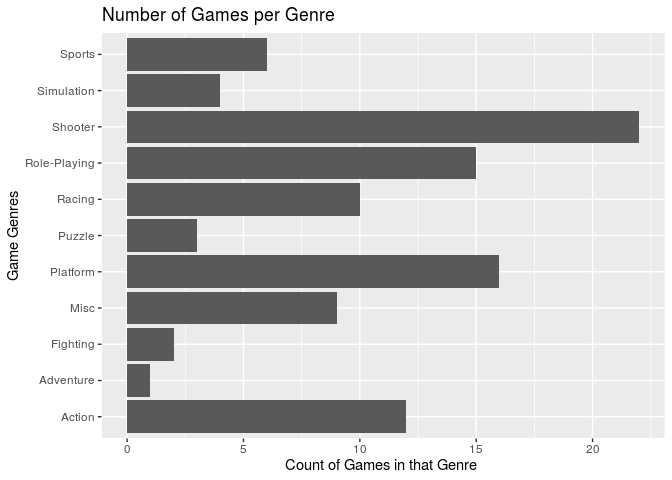
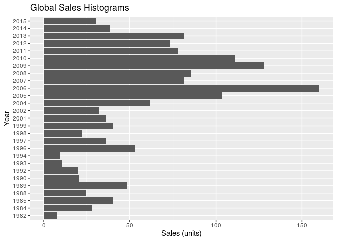

Video Games
================
Octopi
10/24/2019

### Section 1. Introduction

What are the criteria for a successful video game? In this project, we
will use data analysis to determine which qualities are likely to
improve the popularity and ranking of a video game.

The dataset came from vgchartz.com, an industry research firm that
publishes worldwide game hardware and software sales, as well as over
40,000 game titles. The data was generated by a scrape of this website,
selecting 11 variables and collecting data for video game sales. There
are 16,598 records in the dataset, with each case representing a
different video game. We have narrowed the data to represent only the
top 100 video games, as well as taken a random sample of 100 video games
to represent our “population” in hypothesis testing, bootstrap
simulations, etc.

The variables of the dataset are listed below:

Rank - Ranking of overall sales

Name - The game’s name

Platform - Platform on which the game was released (i.e. PC,PS4, etc.)

Year - Year of the game’s release

Genre - Genre of the game

Publisher - Publisher of the game

NA\_Sales - Sales in North America (in millions)

EU\_Sales - Sales in Europe (in millions)

JP\_Sales - Sales in Japan (in millions)

Other\_Sales - Sales in the rest of the world (in millions)

Global\_Sales - Total worldwide sales.

### Section 2. Exploratory data analysis

### Load packages & data

``` r
#load necessary packages
library(tidyverse) 
library(broom)
```

``` r
#load the datasets
set.seed(24601)
vgsales <- read_csv("/cloud/project/data/vgsales.csv")
vgsales_top_100 <- vgsales %>%
  head(100)
vgsales_random_100 <- sample_n(vgsales, 100)
```

``` r
#calculate proportion of top publishers by games sold 
Publisher_prop <- vgsales_top_100 %>%
  group_by(Publisher) %>%
  count(Publisher) %>%
  mutate(sales_proportion = n/nrow(vgsales_top_100))
Publisher_prop %>%
  arrange(desc(n))
```

    ## # A tibble: 11 x 3
    ## # Groups:   Publisher [11]
    ##    Publisher                       n sales_proportion
    ##    <chr>                       <int>            <dbl>
    ##  1 Nintendo                       52             0.52
    ##  2 Activision                     14             0.14
    ##  3 Take-Two Interactive            9             0.09
    ##  4 Sony Computer Entertainment     8             0.08
    ##  5 Microsoft Game Studios          6             0.06
    ##  6 Electronic Arts                 5             0.05
    ##  7 Ubisoft                         2             0.02
    ##  8 Atari                           1             0.01
    ##  9 Bethesda Softworks              1             0.01
    ## 10 Sega                            1             0.01
    ## 11 SquareSoft                      1             0.01

``` r
#calculate top five sales by publisher per country
NA_total <- vgsales_top_100 %>%
  group_by(Publisher) %>%
  summarise(sum = sum(NA_Sales)) %>%
  arrange(desc(sum))
NA_total
```

    ## # A tibble: 11 x 2
    ##    Publisher                      sum
    ##    <chr>                        <dbl>
    ##  1 Nintendo                    439.  
    ##  2 Activision                   87.0 
    ##  3 Take-Two Interactive         59.7 
    ##  4 Microsoft Game Studios       49   
    ##  5 Sony Computer Entertainment  30.4 
    ##  6 Ubisoft                      11.9 
    ##  7 Electronic Arts              10.5 
    ##  8 Atari                         7.28
    ##  9 Bethesda Softworks            5.03
    ## 10 Sega                          2.58
    ## 11 SquareSoft                    2.28

``` r
EU_total <- vgsales_top_100 %>%
  group_by(Publisher) %>%
  summarise(sum = sum(EU_Sales)) %>%
  arrange(desc(sum))
EU_total
```

    ## # A tibble: 11 x 2
    ##    Publisher                      sum
    ##    <chr>                        <dbl>
    ##  1 Nintendo                    246.  
    ##  2 Activision                   55.5 
    ##  3 Take-Two Interactive         40.5 
    ##  4 Sony Computer Entertainment  24.0 
    ##  5 Electronic Arts              23.0 
    ##  6 Microsoft Game Studios       16.5 
    ##  7 Ubisoft                       6.04
    ##  8 Sega                          3.9 
    ##  9 Bethesda Softworks            2.86
    ## 10 SquareSoft                    1.72
    ## 11 Atari                         0.45

``` r
JP_total <- vgsales_top_100 %>%
  group_by(Publisher) %>%
  summarise(sum = sum(JP_Sales)) %>%
  arrange(desc(sum)) 
JP_total
```

    ## # A tibble: 11 x 2
    ##    Publisher                      sum
    ##    <chr>                        <dbl>
    ##  1 Nintendo                    177.  
    ##  2 Sony Computer Entertainment  15.3 
    ##  3 SquareSoft                    3.63
    ##  4 Activision                    3.43
    ##  5 Take-Two Interactive          3.39
    ##  6 Sega                          0.66
    ##  7 Microsoft Game Studios        0.56
    ##  8 Electronic Arts               0.47
    ##  9 Bethesda Softworks            0.1 
    ## 10 Ubisoft                       0.01
    ## 11 Atari                         0

``` r
Global_total <- vgsales_top_100 %>%
  group_by(Publisher) %>%
  summarise(sum = sum(Global_Sales)) %>%
  arrange(desc(sum))
Global_total
```

    ## # A tibble: 11 x 2
    ##    Publisher                      sum
    ##    <chr>                        <dbl>
    ##  1 Nintendo                    920.  
    ##  2 Activision                  166.  
    ##  3 Take-Two Interactive        129.  
    ##  4 Sony Computer Entertainment  83.2 
    ##  5 Microsoft Game Studios       71.3 
    ##  6 Electronic Arts              39.8 
    ##  7 Ubisoft                      19.8 
    ##  8 Bethesda Softworks            8.84
    ##  9 Sega                          8.06
    ## 10 SquareSoft                    7.86
    ## 11 Atari                         7.81

We calculated for the top video game publishers globally and for North
America, Europe, and Japan. While Nintendo remained the lead publisher
for all of these locations, the other publishers changed ranking when we
looked at our three regions individually. This result suggests that
certain publishers may be more successful in different geographic
regions.

``` r
#plot bar graph representing the distribution of games per genre
ggplot(data = vgsales_top_100, mapping = aes(x = Genre))+
  geom_bar()+
  coord_flip() +
  xlab("Game Genres")+
  ylab("Count of Games in that Genre ")+
  ggtitle("Number of Games per Genre")
```

<!-- -->

Here, we have created a visualization for the distribtuion of the top
100 video games based on there genres. As you can see from the
visualization, our bar graph is unimodal, with shooter being the genre
of most copies sold.

``` r
#calculated the proportion of platforms 
platform_prop <- vgsales_top_100 %>%
  group_by(Platform) %>%
  count(Platform) %>%
  mutate(sales_proportion = n/nrow(vgsales_top_100))
platform_prop %>%
  arrange(desc(n))
```

    ## # A tibble: 17 x 3
    ## # Groups:   Platform [17]
    ##    Platform     n sales_proportion
    ##    <chr>    <int>            <dbl>
    ##  1 X360        16             0.16
    ##  2 Wii         15             0.15
    ##  3 DS          13             0.13
    ##  4 PS3          9             0.09
    ##  5 3DS          7             0.07
    ##  6 GB           6             0.06
    ##  7 PS2          6             0.06
    ##  8 PS           5             0.05
    ##  9 PS4          5             0.05
    ## 10 N64          4             0.04
    ## 11 NES          4             0.04
    ## 12 SNES         4             0.04
    ## 13 GBA          2             0.02
    ## 14 2600         1             0.01
    ## 15 PC           1             0.01
    ## 16 PSP          1             0.01
    ## 17 XB           1             0.01

Similarly, we calculated for the top genres and platforms. Since the
popularity of publishers changed based on geographic location, we are
curious to find whether the top genres and platforms will also change
based on where their sales occur.

### Section 3. Research questions

1.  What criteria (publishers, plaftorms, etc) make for successful video
    games in terms of global sales? What criteria make for successful
    video game publishers in terms of global sales?

2.  What are the overall trends of sales through time and space
    (geographic region) for video games released after 1980?

### Section 4. Data

``` r
#provided glimpse of our data
glimpse(vgsales_top_100)
```

    ## Observations: 100
    ## Variables: 11
    ## $ Rank         <dbl> 1, 2, 3, 4, 5, 6, 7, 8, 9, 10, 11, 12, 13, 14, 15, …
    ## $ Name         <chr> "Wii Sports", "Super Mario Bros.", "Mario Kart Wii"…
    ## $ Platform     <chr> "Wii", "NES", "Wii", "Wii", "GB", "GB", "DS", "Wii"…
    ## $ Year         <chr> "2006", "1985", "2008", "2009", "1996", "1989", "20…
    ## $ Genre        <chr> "Sports", "Platform", "Racing", "Sports", "Role-Pla…
    ## $ Publisher    <chr> "Nintendo", "Nintendo", "Nintendo", "Nintendo", "Ni…
    ## $ NA_Sales     <dbl> 41.49, 29.08, 15.85, 15.75, 11.27, 23.20, 11.38, 14…
    ## $ EU_Sales     <dbl> 29.02, 3.58, 12.88, 11.01, 8.89, 2.26, 9.23, 9.20, …
    ## $ JP_Sales     <dbl> 3.77, 6.81, 3.79, 3.28, 10.22, 4.22, 6.50, 2.93, 4.…
    ## $ Other_Sales  <dbl> 8.46, 0.77, 3.31, 2.96, 1.00, 0.58, 2.90, 2.85, 2.2…
    ## $ Global_Sales <dbl> 82.74, 40.24, 35.82, 33.00, 31.37, 30.26, 30.01, 29…

Below is the visualization for Global VideoGames based on the Year of
Release

``` r
vgsales_top_100 %>%
    group_by(Year) %>%
    summarize(Sales = sum(Global_Sales, na.rm = TRUE)) %>%
    ggplot(aes(x = Year, y = Sales)) +
    geom_col() +
  coord_flip() +
    labs(title = "Global Sales Histograms", x = "Year", y = "Sales (units)")
```

<!-- -->

Based on the above histogram, the year with the most

``` r
vgsales %>%
  count(Genre)
```

    ## # A tibble: 13 x 2
    ##    Genre            n
    ##    <chr>        <int>
    ##  1 Action        3217
    ##  2 Adventure     1150
    ##  3 Fighting       827
    ##  4 Misc          1683
    ##  5 Platform       873
    ##  6 Puzzle         549
    ##  7 Racing        1207
    ##  8 Role-Playing  1453
    ##  9 Shooter       1284
    ## 10 Simulation     845
    ## 11 Sports        2301
    ## 12 Strategy       646
    ## 13 <NA>             1
