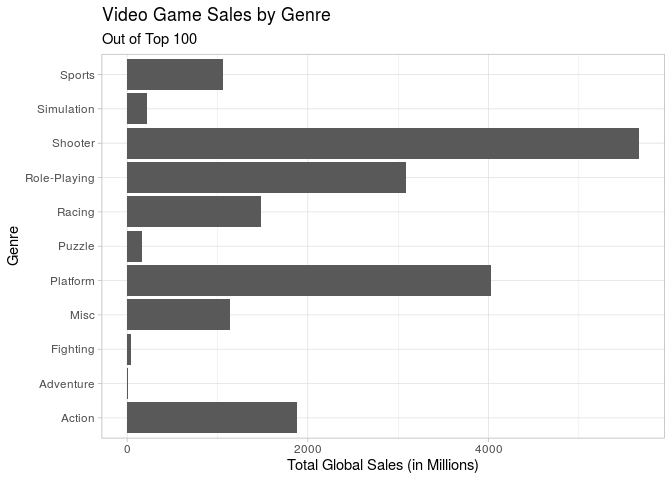
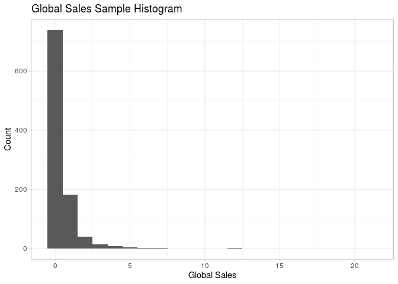

Video Game Sales
================
Team Octopi
12/13/19

### Introduction

What are the criteria for a successful video game? In this project, we
will use data analysis to determine which qualities are likely to
improve the success of a video game, which is based on the games
ranking. The videogame rankings in this dataset were determined by
sales.

The dataset came from vgchartz.com, an industry research firm that
publishes worldwide game hardware and software sales, as well as over
40,000 game titles. The data was generated by a scrape of this website,
selecting 11 variables and collecting data for video game sales. There
are 16,598 records in the dataset, with each case representing a
different video game. We have narrowed the data to represent only the
top 100 video games, as well as taken a random sample of 100 video games
to represent our “population” in hypothesis testing, bootstrap
simulations, etc.

The variables of the dataset are listed below:

Rank - Ranking of overall sales

Name - The game’s name

Platform - Platform on which the game was released (i.e. PC,PS4, etc.)

Year - Year of the game’s release

Genre - Genre of the game

Publisher - Publisher of the game

NA\_Sales - Sales in North America (in millions)

EU\_Sales - Sales in Europe (in millions)

JP\_Sales - Sales in Japan (in millions)

Other\_Sales - Sales in the rest of the world (in millions)

Global\_Sales - Total worldwide sales.

We are specifically interested in what factors affect the sales of video
games. By answering the questions below, we hope to find some answers.

1)  Do video games from certain publishers or on certain platforms tend
    to have higher sales in said publisher/platform’s region of origin?

We predict that the publisher’s place of origin will have higher video
game sales in that particular region, since that publisher may be more
recognized from the region of origin. We do not believe that the
platform’s region of origin will increase the sales in the origin
region, because it is unlikely most people know where the platforms are
produced, or care. We think this is really interesting because it will
tell us if the different video game users in different countries have
preferences for their own publishers and platforms.

2)  Gamers have a wide range of preferences in terms of genres.
    Additionally, even with modern games debuting every year, many
    gamers choose to purchase retro games instead. Are game sales in
    particular regions of the world affected by genre and/or when the
    game was originally released?

We predict that there will be more games sold in the more recent years,
but we are interested to see if the video games sold in the 20th century
are comparable to the 21st century, since video games were also very
popular in the late 1900’s. We also predict that there will be higher
sales of different genres around the world, because of cultural
differences.

### Exploratory Analysis

Below are the preliminary analyses of variables and
bivariate/multivariate relationships.

    ## # A tibble: 10 x 3
    ##    Publisher                    count   freq
    ##    <chr>                        <int>  <dbl>
    ##  1 Electronic Arts               1341 0.0836
    ##  2 Activision                     964 0.0601
    ##  3 Ubisoft                        903 0.0563
    ##  4 Namco Bandai Games             902 0.0562
    ##  5 Konami Digital Entertainment   818 0.0510
    ##  6 THQ                            712 0.0444
    ##  7 Nintendo                       697 0.0435
    ##  8 Sony Computer Entertainment    677 0.0422
    ##  9 Sega                           626 0.0390
    ## 10 Take-Two Interactive           410 0.0256

From the results above, EA has published the most video games from this
data set, with Activision and Ubisoft following. However, each publisher
accounts for a small amount of the total video game market in the data
set, but filtering for the top 100 may show the proportion of publishers
for the top video games.

    ## # A tibble: 11 x 3
    ##    Publisher                   count  freq
    ##    <chr>                       <int> <dbl>
    ##  1 Nintendo                       52  0.52
    ##  2 Activision                     14  0.14
    ##  3 Take-Two Interactive            9  0.09
    ##  4 Sony Computer Entertainment     8  0.08
    ##  5 Microsoft Game Studios          6  0.06
    ##  6 Electronic Arts                 5  0.05
    ##  7 Ubisoft                         2  0.02
    ##  8 Atari                           1  0.01
    ##  9 Bethesda Softworks              1  0.01
    ## 10 Sega                            1  0.01
    ## 11 SquareSoft                      1  0.01

<!-- -->

Figure 1

The results above show the most popular publishers among the top 100
video games in terms of global sales. As shown, Nintendo by far has the
most video games in the top 100, with Activision coming in second. This
shows that although Nintendo may not have made as many video games as
other publishers, they have the most popular video games.

    ## # A tibble: 10 x 2
    ##    Publisher                    Sales
    ##    <chr>                        <dbl>
    ##  1 Nintendo                     1784.
    ##  2 Electronic Arts              1093.
    ##  3 Activision                    721.
    ##  4 Sony Computer Entertainment   607.
    ##  5 Ubisoft                       473.
    ##  6 Take-Two Interactive          399.
    ##  7 THQ                           340.
    ##  8 Konami Digital Entertainment  278.
    ##  9 Sega                          271.
    ## 10 Namco Bandai Games            253.

<!-- -->

Figure 2

Previously, we analyzed publishers based on the amount of video games
they have produced. Now, upon analysis of the total sales for each
publisher, Nintendo is clearly the leader, followed by EA and
Activision. The graph above displays total sales by publisher out of the
top 100 video games, and Nintendo is clearly the leader, followed by
Activision and Take-Two. EA had the second highest total sales out of
the whole data set but 6th out of the top 100, indicating that the high
amounts of video games produced drove total sales up even sales for
their video games that made the top 100 remained relatively small.

    ## # A tibble: 17 x 3
    ##    Platform count  freq
    ##    <chr>    <int> <dbl>
    ##  1 X360        16  0.16
    ##  2 Wii         15  0.15
    ##  3 DS          13  0.13
    ##  4 PS3          9  0.09
    ##  5 3DS          7  0.07
    ##  6 GB           6  0.06
    ##  7 PS2          6  0.06
    ##  8 PS           5  0.05
    ##  9 PS4          5  0.05
    ## 10 N64          4  0.04
    ## 11 NES          4  0.04
    ## 12 SNES         4  0.04
    ## 13 GBA          2  0.02
    ## 14 2600         1  0.01
    ## 15 PC           1  0.01
    ## 16 PSP          1  0.01
    ## 17 XB           1  0.01

<!-- -->

Figure 3

Looking at the platforms that the video games are released on, XBOX 360,
Wii, and DS have the most games out of the top 100 video games. The
graph above shows that the top video games were published on a variety
of platforms, not just two or three.

    ## # A tibble: 31 x 2
    ##    Platform Sales
    ##    <chr>    <dbl>
    ##  1 PS2      1233.
    ##  2 X360      969.
    ##  3 PS3       949.
    ##  4 Wii       910.
    ##  5 DS        818.
    ##  6 PS        727.
    ##  7 GBA       313.
    ##  8 PSP       291.
    ##  9 PS4       278 
    ## 10 GB        254.
    ## # … with 21 more rows

<!-- -->

Figure 4

By total sales out of the whole data set, PS2 had the highest amount of
total sales, followed by XBOX 360 and PS3. However, in the graph above
that depicts the platforms of the top 100 video games, Wii is by far the
leader in global sales. This may mean that the Wii had a relatively low
amount of games compared to games released on PS2, but when considering
the video games that made the top 100, games released on the Wii had a
higher amount of sales than the games released on PS2.

    ## # A tibble: 13 x 2
    ##    Genre        count
    ##    <chr>        <int>
    ##  1 Action        3217
    ##  2 Sports        2301
    ##  3 Misc          1683
    ##  4 Role-Playing  1453
    ##  5 Shooter       1284
    ##  6 Racing        1207
    ##  7 Adventure     1150
    ##  8 Platform       873
    ##  9 Simulation     845
    ## 10 Fighting       827
    ## 11 Strategy       646
    ## 12 Puzzle         549
    ## 13 <NA>             1

Next, we look at video game releases by genre, with Action video games
having the highest amount, followed by Sports, Misc, and Role-Playing.

    ## # A tibble: 11 x 3
    ##    Genre        count  freq
    ##    <chr>        <int> <dbl>
    ##  1 Shooter         22  0.22
    ##  2 Platform        16  0.16
    ##  3 Role-Playing    15  0.15
    ##  4 Action          12  0.12
    ##  5 Racing          10  0.1 
    ##  6 Misc             9  0.09
    ##  7 Sports           6  0.06
    ##  8 Simulation       4  0.04
    ##  9 Puzzle           3  0.03
    ## 10 Fighting         2  0.02
    ## 11 Adventure        1  0.01

<!-- -->

Figure 5

However, looking at the top 100 video games, we can tell that video
games in the genre Shooter had the most games in the top 100, followed
by platform and Role-Playing. This may mean that although the total
amount of Shooter games is relatively low, those games are more popular
and dominate the list of top 100 video games. This graph reflects that
observation and shows the breakdown of the genres that make up the top
100 video games.

    ## # A tibble: 12 x 2
    ##    Genre        Sales
    ##    <chr>        <dbl>
    ##  1 Action       1722.
    ##  2 Sports       1309.
    ##  3 Shooter      1026.
    ##  4 Role-Playing  924.
    ##  5 Platform      829.
    ##  6 Misc          797.
    ##  7 Racing        726.
    ##  8 Fighting      444.
    ##  9 Simulation    390.
    ## 10 Puzzle        242.
    ## 11 Adventure     233.
    ## 12 Strategy      173.

<!-- -->

Figure 6

Next, we look at the total amount of sales instead of the total number
of video games. From the whole data set, Action was the genre with the
largest amount of sales, followed by Sports and Shooter. However, from
the top 100 video games, the genre of Shooter generated the most sales,
followed by Platform and Role-Playing
games.

<!-- -->

Figure 7

From this graph, we can see that sales by region were around the same
from 1980 to 1995. However, after 1995, total sales from North American
increased much more than total sales in other regions. We can also see
the overall trend of sales peaking in 2010 before dropping after 2010.

### Research Question 1

    ## # A tibble: 6 x 2
    ##   term             estimate
    ##   <chr>               <dbl>
    ## 1 (Intercept)        0.158 
    ## 2 OriginJP           0.0766
    ## 3 OriginNA           0.189 
    ## 4 OriginOther       -0.0687
    ## 5 plat_originNA     -0.0640
    ## 6 plat_originOther   0.167

    ## # A tibble: 6 x 2
    ##   term             estimate
    ##   <chr>               <dbl>
    ## 1 (Intercept)        0.123 
    ## 2 OriginJP           0.0185
    ## 3 OriginNA           0.0646
    ## 4 OriginOther       -0.0645
    ## 5 plat_originNA     -0.0499
    ## 6 plat_originOther   0.0599

    ## # A tibble: 6 x 2
    ##   term             estimate
    ##   <chr>               <dbl>
    ## 1 (Intercept)       0.0287 
    ## 2 OriginJP          0.159  
    ## 3 OriginNA         -0.00724
    ## 4 OriginOther       0.00562
    ## 5 plat_originNA    -0.0201 
    ## 6 plat_originOther -0.0318

From the coefficients in the linear model, North American video game
sales appear to be slightly positively affected by whether the publisher
of the game is from either Japan or North America, moreso for the
latter. The sales seem to be slightly negatively affected if the game’s
platform is was released first in North America, and positively affected
if the game’s platform was released first in a location outside of
Europe, North America, and Japan.

European video game sales appear to have the same positive and negative
trends as with North American sales, albeit with different magnitudes of
intercepts.

Japanese video game sales appear to be positively affected when the
game’s publisher is from Japan and negatively affected is the game’s
publisher is from North America. Additionally, the sales seem to be
negatively affected if the game’s platform was released first in North
America or in a location outside of Europe, North America, and Japan.

### Research Question 2

Our next bit of analysis centers around our second research question of
whether or not a games release year affects the sales it receives. In
Figure 7 we created a dot plot depicting the total sales achieved by
games in each release year by region, but we wanted to explore this
concept a little deeper. Since our data set maps the amount of global
sales a video game recieves to success, we wanted to know if a games
release year had any affect on its global sales. We decided to explore
this by conducting a permutation hypothesis test to infer independence
between a games release year and global sales it receives.

To begin, we filtered our data set for unavailable years and used the
case\_when function to mutate a new *centurygame* variable, which
represents the century in which a video game was released (all games
released before 1999 are 20th century games and all games released after
1999 are 21st century games). This was done to allow us to separate our
data into two groups to be tested, as well as to make a broader
conclusion as to whether older or newer games achieved higher median
sales.

<!-- -->

After this, we created a histogram to see which summary statistic
(between mean and median) would be most relevant in inferring
independence between a game’s release year and the amount of global
sales it receives. From our histogram we can see that the data is
overall highly skewed right, meaning that our median would be a safer
option in comparison to our mean.

<!-- -->

We then decided to generate a random sample without replacement of 1000
videogames to represent our sample population. We chose a size of 1000
because it was less than 10% of our actual population, which follows the
guidelines of the central limit theorem’s condition for inferring
independence. We then created a histogram to see if our sample data was
accurately representative of our original data set. Since both
histograms looked relatively similar, we decided to proceed with our
sample.

We were then ready to generate our two hypotheses to be tested, which
are as follows:

H0: Our null hypothesis is that the difference in our median global
sales between 20th and 21st century games is zero (meaning that year of
release and global sales are independent).

HA: Our alternative hypothesis is that there is a non-zero difference in
the median global sales of 20th and 21st century games (meaning that
year of release and global sales are dependent).

We then began conducting our hypothesis test below:

    ## # A tibble: 1 x 1
    ##    stat
    ##   <dbl>
    ## 1 0.190

First we coded to find the observed median difference between 20th and
21st century games. The observed difference in medians (in order of 20th
century - 21st century) was 0.19.

<!-- -->

    ## # A tibble: 1 x 1
    ##   p_value
    ##     <dbl>
    ## 1       0

Above we conducted a hypothesis test by generating a permutation of 1000
reps calculating for the difference in medians to create a null
distribution. This is visualized above. We then calculated a two-tailed
p-value represented as the proportion of our calculated differences that
were more extreme than our observed difference both in the negative and
positive directions. Our calculated p-value was 0 which is less than our
alpha value of .05, allowing us to reject the null hypothesis in favor
of our alternative hypothesis. This means that our data provides
convincing evidence that there is a statistically significant non-zero
difference between the median global sales of 20th and 21st century
games, suggesting dependence between a game’s release year and the
amount of global sales it receives.

    ## # A tibble: 1 x 2
    ##   `2.5%` `97.5%`
    ##    <dbl>   <dbl>
    ## 1  0.135    0.34

<!-- -->

Since we can infer statistical significance from our data, we decided to
calculate a 95% confidence interval to estimate what our difference in
global sales between 20th and 21st century games would be. This was
calculated above and visualized above. From our confidence interval, we
can say that we are 95% confident that the difference in median globals
sales of 20th and 21st century games lies somewhere between the interval
of 0.135 and 0.315125. Given that our order is 20th - 21st century, and
that our confidence interval lies on the positive end of the spectrum,
we can conclude that 20th century games are expected to have a higher
amount of global sales in comparison to 21st century games. This makes
sense in the context of our data, as 20th century games have been around
for a longer period of time, allowing to accumulate higher global sales.

Once we were better able to see as to whether or not a games release
year affected a game’s global sales, we decided to look deeper into how
each country specifically views the various criteria for video games,
i.e. if certain criteria affect the total sales in one country more so
than in others. To show this, we decided to create linear models of
total sales based on video game criteria (genre, publisher, platform,
and centurygame) for each country.

In our preliminary creation of our linear models, we began to notice
that since each criteria was categorical, we were going to have an
unreasonable amount of dummy variables to analyze in our linear models.
Because of this, we decided to narrow down each of the criteria into
their top three forms based on the total amount of global sales each
form received.

    ## # A tibble: 3 x 2
    ##   Publisher       Sales
    ##   <chr>           <dbl>
    ## 1 Nintendo        1784.
    ## 2 Electronic Arts 1093.
    ## 3 Activision       721.

    ## # A tibble: 3 x 2
    ##   Platform Sales
    ##   <chr>    <dbl>
    ## 1 PS2      1233.
    ## 2 X360      969.
    ## 3 PS3       949.

    ## # A tibble: 3 x 2
    ##   Genre   Sales
    ##   <chr>   <dbl>
    ## 1 Action  1722.
    ## 2 Sports  1309.
    ## 3 Shooter 1026.

From our code above we can see that the top three publishers were
Nintendo, Electronic Arts, and Activision, our top three platforms were
PS2, X360, and PS3, and our top three Genres were Action, Sports, and
Shooter.

From here we mutated our three criteria in our random sample dataset to
be labeled as their most popular version if they are as such, and
“other” if they are not.

Once this was done, we began creating our linear models for each
country:

    ## # A tibble: 20 x 2
    ##    term                      estimate
    ##    <chr>                        <dbl>
    ##  1 (Intercept)                 0.245 
    ##  2 PublisherActivision         0.0663
    ##  3 PublisherElectronic Arts    0.304 
    ##  4 PublisherNintendo           0.618 
    ##  5 centurygame21st            -0.113 
    ##  6 GenreAction                -0.0321
    ##  7 GenreShooter                0.169 
    ##  8 GenreSports                -0.0606
    ##  9 PlatformPS2                 0.0745
    ## 10 PlatformPS3                 0.130 
    ## 11 PlatformX360                0.208 
    ## 12 GenreAction:PlatformPS2     0.0510
    ## 13 GenreShooter:PlatformPS2    0.0533
    ## 14 GenreSports:PlatformPS2     0.144 
    ## 15 GenreAction:PlatformPS3     0.241 
    ## 16 GenreShooter:PlatformPS3   -0.262 
    ## 17 GenreSports:PlatformPS3     0.104 
    ## 18 GenreAction:PlatformX360    0.294 
    ## 19 GenreShooter:PlatformX360   1.13  
    ## 20 GenreSports:PlatformX360    0.258

    ## # A tibble: 20 x 2
    ##    term                      estimate
    ##    <chr>                        <dbl>
    ##  1 (Intercept)                0.0562 
    ##  2 PublisherActivision        0.0203 
    ##  3 PublisherElectronic Arts   0.239  
    ##  4 PublisherNintendo          0.384  
    ##  5 centurygame21st            0.00868
    ##  6 GenreAction               -0.0174 
    ##  7 GenreShooter               0.0165 
    ##  8 GenreSports               -0.0365 
    ##  9 PlatformPS2                0.0671 
    ## 10 PlatformPS3                0.171  
    ## 11 PlatformX360               0.117  
    ## 12 GenreAction:PlatformPS2    0.0232 
    ## 13 GenreShooter:PlatformPS2   0.0336 
    ## 14 GenreSports:PlatformPS2   -0.0188 
    ## 15 GenreAction:PlatformPS3    0.497  
    ## 16 GenreShooter:PlatformPS3  -0.0958 
    ## 17 GenreSports:PlatformPS3    0.0112 
    ## 18 GenreAction:PlatformX360   0.0937 
    ## 19 GenreShooter:PlatformX360  0.421  
    ## 20 GenreSports:PlatformX360  -0.176

    ## # A tibble: 20 x 2
    ##    term                      estimate
    ##    <chr>                        <dbl>
    ##  1 (Intercept)                0.182  
    ##  2 PublisherActivision       -0.0480 
    ##  3 PublisherElectronic Arts  -0.0270 
    ##  4 PublisherNintendo          0.728  
    ##  5 centurygame21st           -0.136  
    ##  6 GenreAction               -0.0297 
    ##  7 GenreShooter              -0.102  
    ##  8 GenreSports               -0.00413
    ##  9 PlatformPS2                0.0496 
    ## 10 PlatformPS3                0.0184 
    ## 11 PlatformX360              -0.0299 
    ## 12 GenreAction:PlatformPS2    0.127  
    ## 13 GenreShooter:PlatformPS2   0.0183 
    ## 14 GenreSports:PlatformPS2   -0.0298 
    ## 15 GenreAction:PlatformPS3    0.0817 
    ## 16 GenreShooter:PlatformPS3   0.0558 
    ## 17 GenreSports:PlatformPS3   -0.0438 
    ## 18 GenreAction:PlatformX360   0.0331 
    ## 19 GenreShooter:PlatformX360  0.120  
    ## 20 GenreSports:PlatformX360   0.00953

Once our linear models had been created, we decided to use backwards
selection based on AIC to see which of our predictors were the most
important when it comes to their effect on sales by country.

    ## # A tibble: 20 x 2
    ##    term                      estimate
    ##    <chr>                        <dbl>
    ##  1 (Intercept)                 0.245 
    ##  2 PublisherActivision         0.0663
    ##  3 PublisherElectronic Arts    0.304 
    ##  4 PublisherNintendo           0.618 
    ##  5 centurygame21st            -0.113 
    ##  6 GenreAction                -0.0321
    ##  7 GenreShooter                0.169 
    ##  8 GenreSports                -0.0606
    ##  9 PlatformPS2                 0.0745
    ## 10 PlatformPS3                 0.130 
    ## 11 PlatformX360                0.208 
    ## 12 GenreAction:PlatformPS2     0.0510
    ## 13 GenreShooter:PlatformPS2    0.0533
    ## 14 GenreSports:PlatformPS2     0.144 
    ## 15 GenreAction:PlatformPS3     0.241 
    ## 16 GenreShooter:PlatformPS3   -0.262 
    ## 17 GenreSports:PlatformPS3     0.104 
    ## 18 GenreAction:PlatformX360    0.294 
    ## 19 GenreShooter:PlatformX360   1.13  
    ## 20 GenreSports:PlatformX360    0.258

    ## # A tibble: 19 x 2
    ##    term                      estimate
    ##    <chr>                        <dbl>
    ##  1 (Intercept)                 0.0634
    ##  2 PublisherActivision         0.0207
    ##  3 PublisherElectronic Arts    0.239 
    ##  4 PublisherNintendo           0.383 
    ##  5 GenreAction                -0.0166
    ##  6 GenreShooter                0.0157
    ##  7 GenreSports                -0.0369
    ##  8 PlatformPS2                 0.0686
    ##  9 PlatformPS3                 0.173 
    ## 10 PlatformX360                0.119 
    ## 11 GenreAction:PlatformPS2     0.0224
    ## 12 GenreShooter:PlatformPS2    0.0344
    ## 13 GenreSports:PlatformPS2    -0.0184
    ## 14 GenreAction:PlatformPS3     0.496 
    ## 15 GenreShooter:PlatformPS3   -0.0950
    ## 16 GenreSports:PlatformPS3     0.0117
    ## 17 GenreAction:PlatformX360    0.0928
    ## 18 GenreShooter:PlatformX360   0.422 
    ## 19 GenreSports:PlatformX360   -0.176

    ## # A tibble: 8 x 2
    ##   term                     estimate
    ##   <chr>                       <dbl>
    ## 1 (Intercept)                0.169 
    ## 2 PublisherActivision       -0.0528
    ## 3 PublisherElectronic Arts  -0.0271
    ## 4 PublisherNintendo          0.732 
    ## 5 centurygame21st           -0.135 
    ## 6 PlatformPS2                0.0691
    ## 7 PlatformPS3                0.0382
    ## 8 PlatformX360              -0.0130

After performing our backwards selection, we can see that in North
America all criteria seemed to be viewed as important, in Europe all but
the century in which the game was released are viewed as important, and
in Japan all but the genre (and simultaneously all interactions between
genre and platform) of the video game are viewed as important.

Even after our backwards selection for our models, we were still left
with very many variables to interpret, so we decided to focus on those
variables whose p-values were statistically significant depending on its
relationship to our alpha value of .05.

    ## # A tibble: 8 x 3
    ##   term                     estimate  p.value
    ##   <chr>                       <dbl>    <dbl>
    ## 1 (Intercept)                0.169  2.66e-12
    ## 2 PublisherActivision       -0.0528 1.14e- 1
    ## 3 PublisherElectronic Arts  -0.0271 3.98e- 1
    ## 4 PublisherNintendo          0.732  7.76e-60
    ## 5 centurygame21st           -0.135  2.51e- 7
    ## 6 PlatformPS2                0.0691 6.48e- 3
    ## 7 PlatformPS3                0.0382 2.25e- 1
    ## 8 PlatformX360              -0.0130 7.05e- 1

    ## # A tibble: 19 x 3
    ##    term                      estimate      p.value
    ##    <chr>                        <dbl>        <dbl>
    ##  1 (Intercept)                 0.0634 0.00277     
    ##  2 PublisherActivision         0.0207 0.708       
    ##  3 PublisherElectronic Arts    0.239  0.00000926  
    ##  4 PublisherNintendo           0.383  0.0000000314
    ##  5 GenreAction                -0.0166 0.715       
    ##  6 GenreShooter                0.0157 0.818       
    ##  7 GenreSports                -0.0369 0.452       
    ##  8 PlatformPS2                 0.0686 0.204       
    ##  9 PlatformPS3                 0.173  0.0182      
    ## 10 PlatformX360                0.119  0.166       
    ## 11 GenreAction:PlatformPS2     0.0224 0.835       
    ## 12 GenreShooter:PlatformPS2    0.0344 0.837       
    ## 13 GenreSports:PlatformPS2    -0.0184 0.870       
    ## 14 GenreAction:PlatformPS3     0.496  0.0000282   
    ## 15 GenreShooter:PlatformPS3   -0.0950 0.618       
    ## 16 GenreSports:PlatformPS3     0.0117 0.945       
    ## 17 GenreAction:PlatformX360    0.0928 0.543       
    ## 18 GenreShooter:PlatformX360   0.422  0.0128      
    ## 19 GenreSports:PlatformX360   -0.176  0.227

    ## # A tibble: 20 x 3
    ##    term                      estimate  p.value
    ##    <chr>                        <dbl>    <dbl>
    ##  1 (Intercept)                 0.245  3.92e- 6
    ##  2 PublisherActivision         0.0663 3.52e- 1
    ##  3 PublisherElectronic Arts    0.304  1.30e- 5
    ##  4 PublisherNintendo           0.618  6.12e-12
    ##  5 centurygame21st            -0.113  3.97e- 2
    ##  6 GenreAction                -0.0321 5.87e- 1
    ##  7 GenreShooter                0.169  5.60e- 2
    ##  8 GenreSports                -0.0606 3.38e- 1
    ##  9 PlatformPS2                 0.0745 2.89e- 1
    ## 10 PlatformPS3                 0.130  1.71e- 1
    ## 11 PlatformX360                0.208  6.05e- 2
    ## 12 GenreAction:PlatformPS2     0.0510 7.12e- 1
    ## 13 GenreShooter:PlatformPS2    0.0533 8.04e- 1
    ## 14 GenreSports:PlatformPS2     0.144  3.20e- 1
    ## 15 GenreAction:PlatformPS3     0.241  1.13e- 1
    ## 16 GenreShooter:PlatformPS3   -0.262  2.85e- 1
    ## 17 GenreSports:PlatformPS3     0.104  6.29e- 1
    ## 18 GenreAction:PlatformX360    0.294  1.35e- 1
    ## 19 GenreShooter:PlatformX360   1.13   2.55e- 7
    ## 20 GenreSports:PlatformX360    0.258  1.70e- 1

From our printed p-values above, we can see that although some variables
were left in our selected models, they lacked statistical significance
(meaning that they had very large p-values). This was the case for
example with our *Genre* variables, which again were thrown out
completely in the linear model for Japan, and whose p-values are very
high in our linear models for both North America and Europe.

Interestingly enough the most statistically significant predictors
across each country seems to be the *PublisherNintendo* variable, with
the slope of this variable in Japan, Europe, and North America being
0.731694, 0.3825312, and 0.6175151 respectively.

The interpretation of these slopes are as follows:

In North America, the slope of the *PublisherNintendo* variable can be
interpreted as, holding all else constant, the slope of the linear
regression line would be the same but with an expected intercept
increase of 0.6175151. This means that on average, if a games publisher
is Nintendo, we can expect its overall sales in North America to be
increased by a value of 0.6175151.

In Europe, the slope of the *PublisherNintendo* variable can be
interpreted as, holding all else constant, the slope of the linear
regression line would be the same but with an expected intercept
increase of 0.3825312. This means that on average, if a games publisher
is Nintendo, we can expect its overall sales in Europe to be increased
by a value of 0.3825312.

In Japan, the slope of the *PublisherNintendo* variable can be
interpreted as, holding all else constant, the slope of the linear
regression line would be the same but with an expected intercept
increase of 0.731694. This means that on average, if a games publisher
is Nintendo, we can expect its overall sales in Japan to be increased by
a value of 0.731694.

That being said, there were a few differences across each country when
it came to what variables were deemed statistically significant. Take
for example the *PlatformPS3* variable, which is deemed statistically
significant in both Europe and North America, but not so in Japan.

In North America, the slope of the *PlatformPS3* variable can be
interpreted as, holding all else constant, the slope of the linear
regression line would be the same but with an expected intercept
increase of 0.1296441. This means that on average, if a games platform
is PS3, we can expect its overall sales in North America to be increased
by a value of 0.1296441.

In Europe, the slope of the *PlatformPS3* variable can be interpreted
as, holding all else constant, the slope of the linear regression line
would be the same but with an expected intercept increase of 0.1729169.
This means that on average, if a games platform is PS3, we can expect
its overall sales in Europe to be increased by a value of 0.1729169.

As for the *centurygame21st* variable, Europe did not deem it as
statistically significant, as it was thrown out during backward
selection of its linear model. However, *centurygame21st* was
statistically significant in both Japan and North America, with p-values
lower than our alpha value of .05 (although just barely in North
America).

In Japan, the slope of the *centurygame21st* variable can be interpreted
as, holding all else constant, the slope of the linear regression line
would be the same but with an expected intercept decrease of 0.1345716
(this is because the value associated with this slope is negative). This
means that on average, if a was released in the 21st century, we can
expect its overall sales in Japan to be decreased by a value of
0.1345716 vs if it were released in the 20th century.

In North America, the slope of the *centurygame21st* variable can be
interpreted as, holding all else constant, the slope of the linear
regression line would be the same but with an expected intercept
decrease of 0.1132006 (this is because the value associated with this
slope is negative). This means that on average, if a was released in the
21st century, we can expect its overall sales in North America to be
decreased by a value of 0.1132006 vs if it were released in the 20th
century.

This actually lines up with the findings from our hypothesis test
conducted earlier, showing how 20th century games are estimated to have
higher global sales than 21st century games.

    ## [1] 0.2720919

    ## [1] 0.1524517

    ## [1] 0.1130701

We produced the r-squared values from our selected linear models above,
and they are interpreted as follows:

With an r-squared value of 0.2720919, we can say that roughly 27.2% of
the variability in Japanese sales can be explained by the top three
platforms and publishers, as well as the century in which the game was
released.

With an r-squared value of 0.1524517, we can say that roughly 15.2% of
the variability in North American sales can be explained by the top
three platforms, genres, and publishers, as well as the century in which
the game was released.

With an r-squared value of 0.1130701, we can say that roughly 11.3% of
the variability in European sales can be explained by the top three
platforms, genres, and publishers of the game.

Unfortunately, given these results our linear models we created did not
really have relatively strong fits for our data set. We decided to test
this further by visualizing residual plots for our linear models. We
augmented these models so as to give us a tidy regression
output.

<!-- --><!-- --><!-- -->

From our visualized residual plots above, we can see that for each
model, it seems as though the higher the predicted sales in each country
gets, the less fit our linear model becomes. The residuals on the lower
endpoints of our graph are not far off from our augmented linear model,
but as the predicted sales value increases, the residuals stray further
and further from the line.

### Limitations

One of the primary limitations for this analysis is that sales are
cumulative to present day. This means that popular games released in the
previous year or two have not had much time to attain more sales, unlike
games released 5 or 6 years ago which have had a lot more time to attain
more sales. This skews the data on sales, as games released 4-5 years
ago may seem more popular than games released 1-2 years ago, when that
may not be the actual case given the time frame for the recorded sales.

In addition, there is no data on the combination of games between
certain platforms. For example, games released on multiple platforms are
listed as seperate games due to the differing platforms. A certain game
may have been released on both the PS3 and XBOX 360 and qualifies as two
separate observations in the data set when they really should be one,
with the figures for sales combined between them. This makes it harder
to analyze the popularity of games or attributes of games, as a shooter
game might qualify as two observations in the top 100 when it should be
one, therefore skewing the data. However, this does allow for further
analysis on platforms, as the popularity in terms of total sales can be
separated into different platforms.

Finally, when generating linear models, there were variables with more
than 10-20 categories. This almost makes it impossible to describe the
correct coefficients for each category due to the sheer amount of
categories in variables such as platform, genre, and publisher. We had
to narrow down these variables into the top 3 categories by sales for
each variable, along with “other”, to make our model more streamlined.
This does sacrifice some specificity for the linear model due to less
variables, but makes the model easier to read and more focused on the
top performing categories.

### Conclusion

We started off this project with two research questions that we believed
to be interesting and answerable using inference methods in our data
analysis. After further analysis, our results and conclusions will be
described
    below.

    In the data analysis for our first research question, we explored how having a platform or publisher originate from your own region affect the sales of those games in that given region. We had to mutate a new variable called “origin” that would include the origin of region for the publisher of the game, in addition to a new variable called “plat_origin” that included the origin of the platform for the game. We performed this using a linear regression, creating linear regression models for each region and determining if the publisher origin or the platform origin had any influence on sales, as determined by the coefficient. For instance, the model for Japanese sales had a fairly high coefficient if the publisher was from Japan, meaning that publishers in Japan had higher success in Japan compared to other publishers. The same can be said for the North American model. However, in Europe, the model did not show much difference between the baseline (publisher from Europe), as the coefficients for publishers from North America or Japan were relatively small. Since we had to manually enter the region for each publisher and platform, it is clear that this may pose a problem if this project were to be replicated. It was tedious to enter the region for each publisher and platform. 

In the data analysis for our second research question, we explored the
various qualities of video games and the impact that they made on a
game’s overall global and region-specific sales. These qualities
included Publisher, Genre, Platform, and the games release year. We
performed this via hypothesis test and analysis of linear regression
models. We began by asking the question as to whether or not the year a
given game was released in had any effect on the amount of global sales
it receives. Our approach to answering this was to conduct a permutation
hypothesis test to infer independence between a games release year and
global sales it receives. Since there were so many release years in our
data set, we decided to generalize them into two categories: 20th and
21st century games. Labeled centurygame, we used this as our explanatory
variable by which we separated our data sets. Once this was done we were
able to formulate our two hypotheses. Our null hypothesis was that the
difference in our median global sales between 20th and 21st century
games is zero (meaning that year of release and global sales are
independent), while our alternative hypothesis was that there is a
non-zero difference in the median global sales of 20th and 21st century
games (meaning that year of release and global sales are dependent). We
used a random sample of size 1000 (without replacement; in compliance
with the central limit theorems guidelines for inferring independence)
to conduct our hypothesis test and were given a p-value less than our
alpha of .05. This means that we were able to reject the null hypothesis
in favor of the alternative, meaning that our data provides convincing
evidence that there is a statistically significant non-zero difference
between the median global sales of 20th and 21st century games,
suggesting dependence between a game’s release year and the amount of
global sales it receives. We then developed a 95% confidence interval
showing that our difference would always be in a positive range, meaning
that it is expected for 20th century games to make higher global sales
than 21st century games.  
These findings were further solidified upon fitting linear models which
mapped the dependence of region specific sales to all of the qualities
of a video game (genre, publisher, platform, and centurygame). In our
preliminary creation of our linear models, we began to notice that since
each quality was categorical, we were going to have an unreasonable
amount of dummy variables to analyze in our linear models. Because of
this, we decided to narrow down each of the criteria into their top
three forms based on the total amount of global sales each form received
(excluding centurygame, as it only had two categories). We then created
our three linear models (one for Japan, one for North America, and one
for Europe) and used backwards selection to determine which variables
had the most effect on the region specific sales. After performing our
backwards selection, we saw that in North America all criteria seemed to
be viewed as important, in Europe all but the century in which the game
was released are viewed as important, and in Japan all but the genre
(and simultaneously all interactions between genre and platform) of the
video games are viewed as important. We also found that a game being
released in the 21st century had negative effects on the slopes of our
linear models, indicating that 20th century games were more favorable.
Once we finished this we decided to create residual plots to determine
how fit our models were to the data, but they unfortunately did not fit
well (this was also evident from our r.squared values). Some critiques
to our methods would include our decision to separate the game’s release
year into two categories, largely generalizing the results of our
hypothesis test in relation to our initial question of how much a games
release year affected the global sales it receives. Yet another critique
would be our decision to narrow our qualities into their top three
groups of each kind, which again largely generalizes our results in the
context of our actual population size.

When we started the project, we tried to tackle two big research
questions that had many components to them. This only allowed us to
answer the questions at a surface level and prevented us from being able
to dig deep into the analyses and conclusions. We were only able to
answer according to certain components of these broad questions, leaving
other important components out of our analyses. Additionally, the
questions were not able to be correctly answered using the inference
methods we chose. By the time we got to the writeup, it was more clear
to us what research questions we needed to answer and what components we
could/could not analyze.

If we were able to start over with the project, we would have chosen to
answer the more distinct research questions that we chose instead of
spending time on the broader ones with many moving components. We would
have also paid more attention to making visuals, because at the end of
the project we realized how helpful they were in helping others
understand the analysis that we performed. If we were to continue with
this project, it would be interesting to see how video games have
changed in terms of the popularity of genres, publishers, and platforms
across different countries from this decade and the last, since we are
coming up on the end of the decade. We could also try to make
predictions and extend upon our analysis we performed, predicting what
we think the popularity of video games will look like for the decade to
come. Additionally, it would be interesting to see if the action/shooter
genre is the most popular in the U.S., due to the controversial topic of
videogame violence and aggression that has swept the U.S. over the
years.
